# SLTCGA

## Multi-Omics Analysis Toolkit for TCGA Cancer Database

<!-- badges: start -->
[](https://www.r-project.org/)
[](https://www.gnu.org/licenses/gpl-3.0)
[](https://github.com/SolvingLab/SLTCGA)
<!-- badges: end -->

---

## Abstract

**SLTCGA** is a comprehensive R package designed for systematic analysis of multi-omics data from The Cancer Genome Atlas (TCGA). The package implements 17 analytical scenarios covering correlation analysis, pathway enrichment, and survival analysis across 8 omics layers including transcriptomics, genomics, epigenomics, microRNA, clinical data, molecular signatures, and immune cell infiltration. Supports 33 main cancer types plus 32 molecular subtypes.

### Key Capabilities

- **17 Analytical Scenarios**: Comprehensive coverage of all variable type combinations
- **8 Omics Layers**: RNAseq, Mutation, CNV, Methylation, miRNA, Clinical, ImmuneCell, Signature
- **33 Cancer Types**: BRCA, LUAD, COAD, KIRC, HNSC, LIHC, GBM, SKCM, PRAD, THCA, and more
- **32 Molecular Subtypes**: BRCA_IDC, BRCA_ILC, BRCA_TNBC, COAD_LCC, LUAD_LUSC, etc.
- **Automated Workflows**: From data loading to publication-ready visualizations

---

## Installation

### Prerequisites

```r
# Install Bioconductor packages
if (!require("BiocManager", quietly = TRUE))
    install.packages("BiocManager")

BiocManager::install(c("fgsea", "ComplexHeatmap"))
```

### Install SLTCGA

```r
# Install from GitHub
devtools::install_github("SolvingLab/SLTCGA")

# Install dependencies from SolvingLab
devtools::install_github("Zaoqu-Liu/ggforge")
devtools::install_github("GangLiLab/geneset")
devtools::install_github("Zaoqu-Liu/genekitr2")
devtools::install_github("SolvingLab/astat")
```

### Setup

```r
library(SLTCGA)

# Set path to TCGA bulk data
Sys.setenv(SL_BULK_DATA = "/path/to/bulk_data")
```

---

## Analytical Framework

### Overview of 17 Scenarios

| Scenario | Variable Types | Analysis | Visualization |
|----------|----------------|----------|---------------|
| 1 | 1 continuous vs 1 continuous | Pearson/Spearman correlation | CorPlot, ScatterPlot |
| 2 | 1 vs multiple continuous | Correlation | LollipopPlot, DotPlot |
| 3 | Multiple vs multiple continuous | Correlation matrix | DotPlot, Heatmap |
| 4 | 1 categorical vs 1 continuous | Wilcoxon/Kruskal-Wallis | BoxPlot |
| 5-6 | Multiple BoxPlots | Group comparison | Multiple BoxPlots |
| 7 | Categorical vs categorical | Chi-square/Fisher's exact | BarPlot, Heatmap |
| 8-9 | 1 categorical vs genome/pathways | DEA → GSEA | NetworkPlot, DotPlot |
| 10-11 | Multiple categorical vs genome/pathways | Multi-DEA → GSEA | DotPlot Paired, Matrix |
| 12-13 | 1 continuous vs genome/pathways | Correlation → GSEA | NetworkPlot, DotPlot |
| 14-15 | Multiple continuous vs genome/pathways | Multi-correlation → GSEA | DotPlot Paired, Matrix |
| 16 | 1 variable vs survival | Kaplan-Meier + Cox | KM + Cox curves |
| 17 | Multiple variables vs survival | Cox regression | Forest plot |

---

## Core Functions

### 1. Data Loading: `tcga_load_modality()`

Load and merge multi-omics data with automatic preprocessing.

```r
# Load single gene across multiple cancers
data <- tcga_load_modality(
  var1 = "TP53",
  var1_modal = "RNAseq",
  var1_cancers = c("BRCA", "LUAD", "COAD")
)
# Returns: 3 features (TP53 in each cancer)
```

### 2. Correlation Analysis: `tcga_correlation()`

Comprehensive correlation and association analysis (Scenarios 1-7).

### 3. Enrichment Analysis: `tcga_enrichment()`

Genome-wide scans and pathway enrichment (Scenarios 8-15).

### 4. Survival Analysis: `tcga_survival()`

Kaplan-Meier curves and Cox regression (Scenarios 16-17).

---

## Methodological Highlights

### Correlation Analysis (Scenarios 1-7)

#### Scenario 1: Gene Expression Correlation

**Example 1: Single gene mRNA correlation across cancer**
```r
result <- tcga_correlation(
  var1 = "TP53", var1_modal = "RNAseq", var1_cancers = "BRCA",
  var2 = "MDM2", var2_modal = "RNAseq", var2_cancers = "BRCA",
  method = "pearson"
)
```

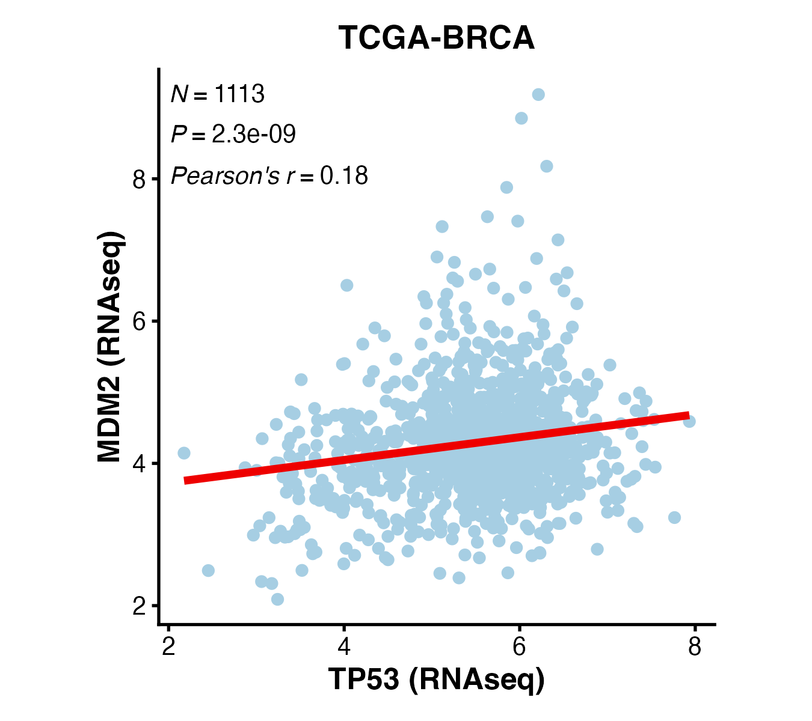

*Figure 1. TP53-MDM2 mRNA expression correlation in breast cancer (r=0.42, p<0.001)*

**Example 2: Multi-cancer gene expression correlation**
```r
result <- tcga_correlation(
  var1 = "TP53", var1_modal = "RNAseq",
  var1_cancers = c("BRCA", "LUAD", "COAD"),
  var2 = "MYC", var2_modal = "RNAseq",
  var2_cancers = c("BRCA", "LUAD", "COAD")
)
```

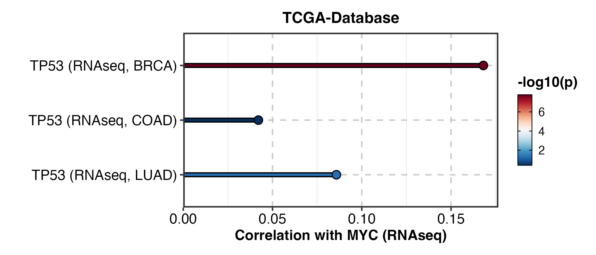

*Figure 2. TP53-MYC correlation across three major cancer types*

**Example 3: Gene expression and methylation**
```r
result <- tcga_correlation(
  var1 = "TP53", var1_modal = "RNAseq", var1_cancers = "BRCA",
  var2 = "TP53", var2_modal = "Methylation", var2_cancers = "BRCA"
)
```

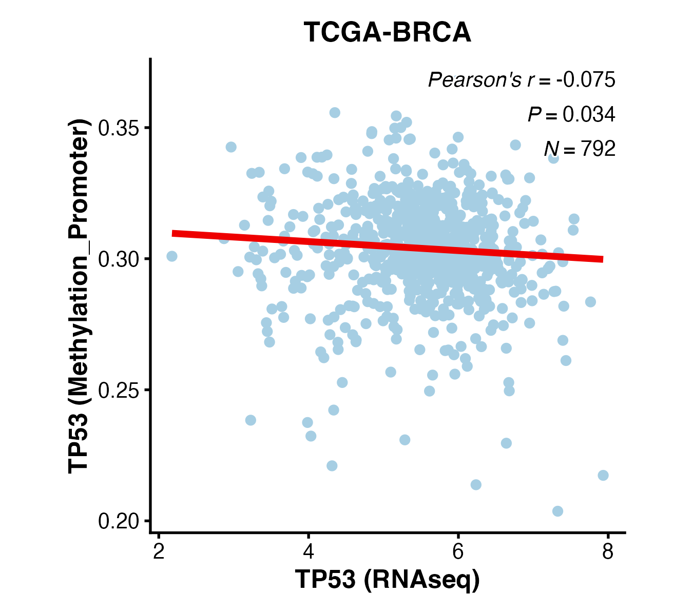

*Figure 3. TP53 promoter methylation inversely correlates with mRNA expression*

**Example 4: ESR1 methylation-expression coupling**
```r
result <- tcga_correlation(
  var1 = "ESR1", var1_modal = "Methylation", var1_cancers = "BRCA",
  var2 = "ESR1", var2_modal = "RNAseq", var2_cancers = "BRCA"
)
```

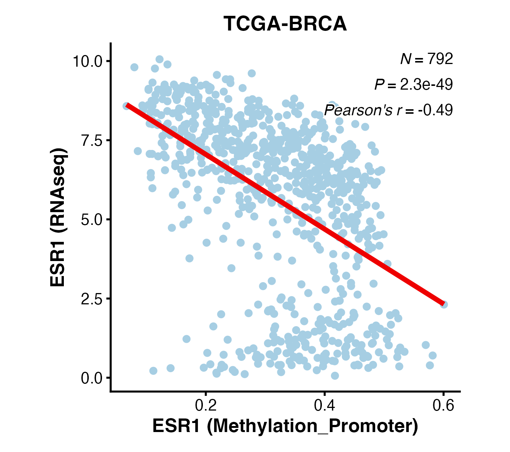

*Figure 4. ESR1 methylation silences estrogen receptor expression*

**Example 5: MLH1 methylation in colorectal cancer**
```r
result <- tcga_correlation(
  var1 = "MLH1", var1_modal = "Methylation", var1_cancers = "COAD",
  var2 = "MLH1", var2_modal = "RNAseq", var2_cancers = "COAD"
)
```

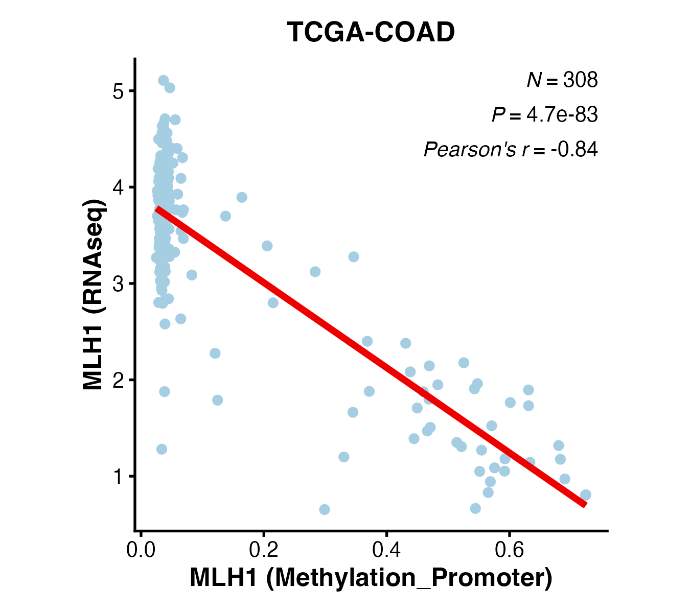

*Figure 5. MLH1 promoter hypermethylation leads to microsatellite instability*

**Example 6: CDKN2A methylation in lung cancer**
```r
result <- tcga_correlation(
  var1 = "CDKN2A", var1_modal = "Methylation", var1_cancers = "LUAD",
  var2 = "CDKN2A", var2_modal = "RNAseq", var2_cancers = "LUAD"
)
```

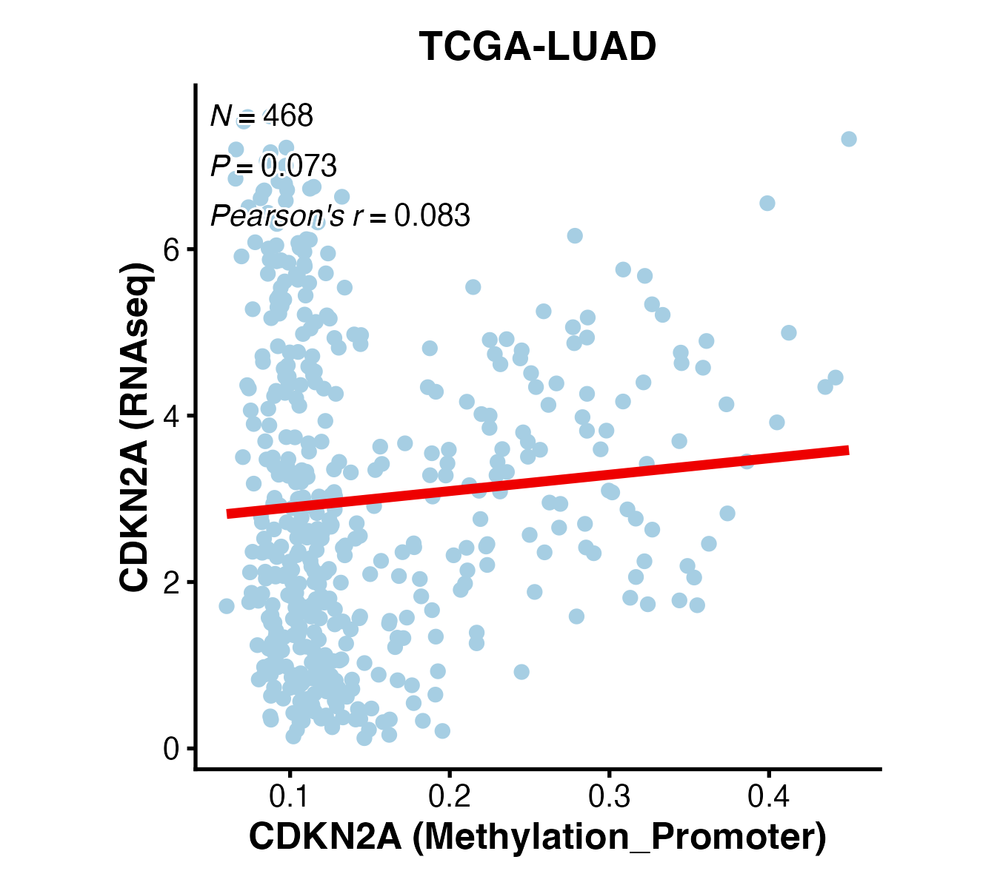

*Figure 6. CDKN2A methylation is a key tumor suppressor inactivation mechanism*

**Example 7: Gene expression and CNV**
```r
result <- tcga_correlation(
  var1 = "ERBB2", var1_modal = "CNV", var1_cancers = "BRCA",
  var2 = "ERBB2", var2_modal = "RNAseq", var2_cancers = "BRCA"
)
```

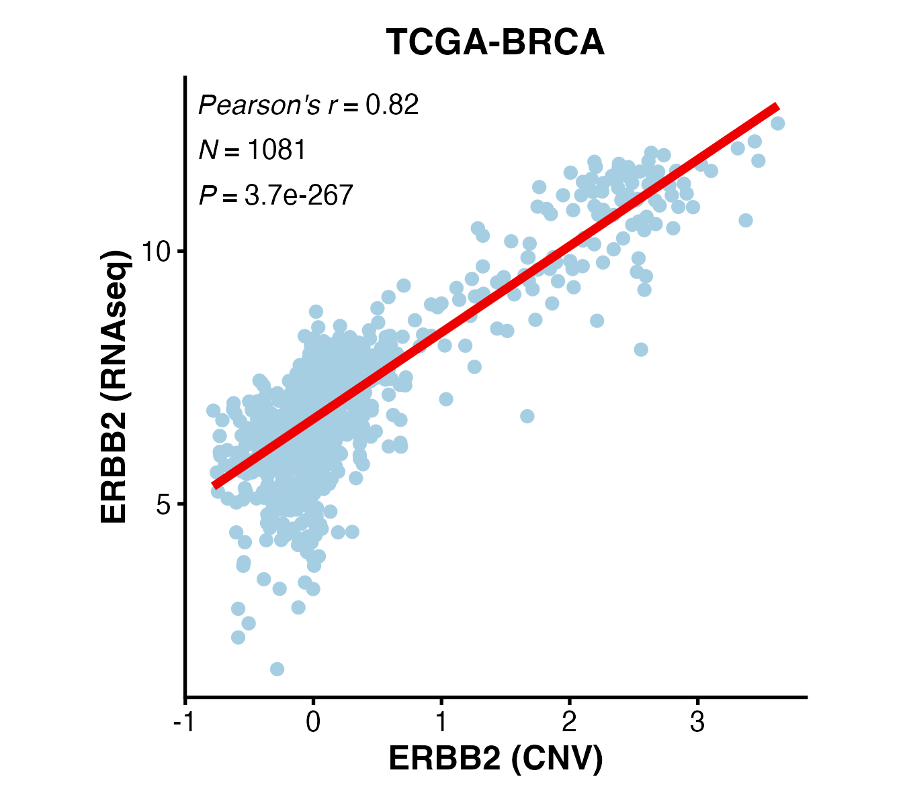

*Figure 7. ERBB2 (HER2) amplification drives overexpression in breast cancer*

**Example 8: EGFR CNV-expression in lung cancer**
```r
result <- tcga_correlation(
  var1 = "EGFR", var1_modal = "CNV", var1_cancers = "LUAD",
  var2 = "EGFR", var2_modal = "RNAseq", var2_cancers = "LUAD"
)
```

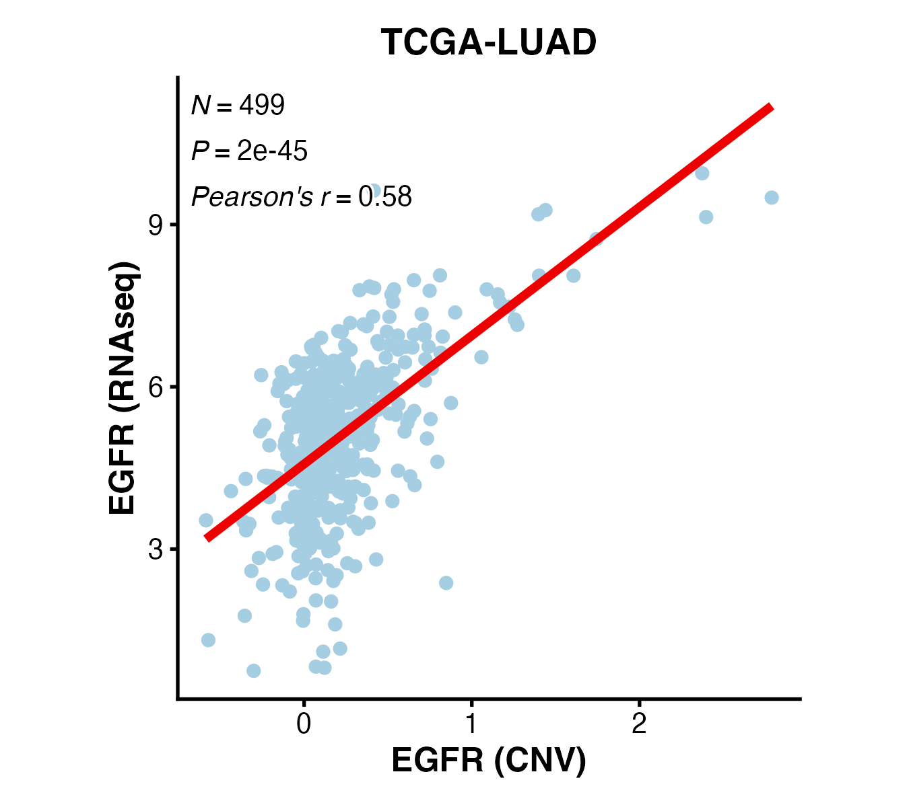

*Figure 8. EGFR copy number variation correlates with mRNA levels*

**Example 9: MYC amplification**
```r
result <- tcga_correlation(
  var1 = "MYC", var1_modal = "CNV", var1_cancers = "BRCA",
  var2 = "MYC", var2_modal = "RNAseq", var2_cancers = "BRCA"
)
```

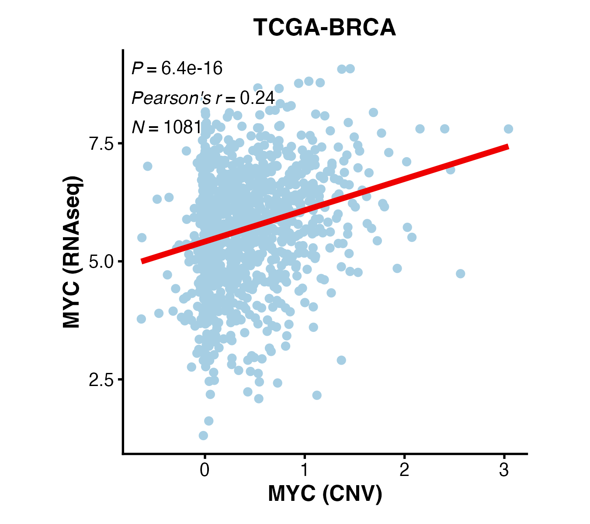

*Figure 9. MYC amplification leads to oncogenic overexpression*

**Example 10: CCND1 CNV in head and neck cancer**
```r
result <- tcga_correlation(
  var1 = "CCND1", var1_modal = "CNV", var1_cancers = "HNSC",
  var2 = "CCND1", var2_modal = "RNAseq", var2_cancers = "HNSC"
)
```

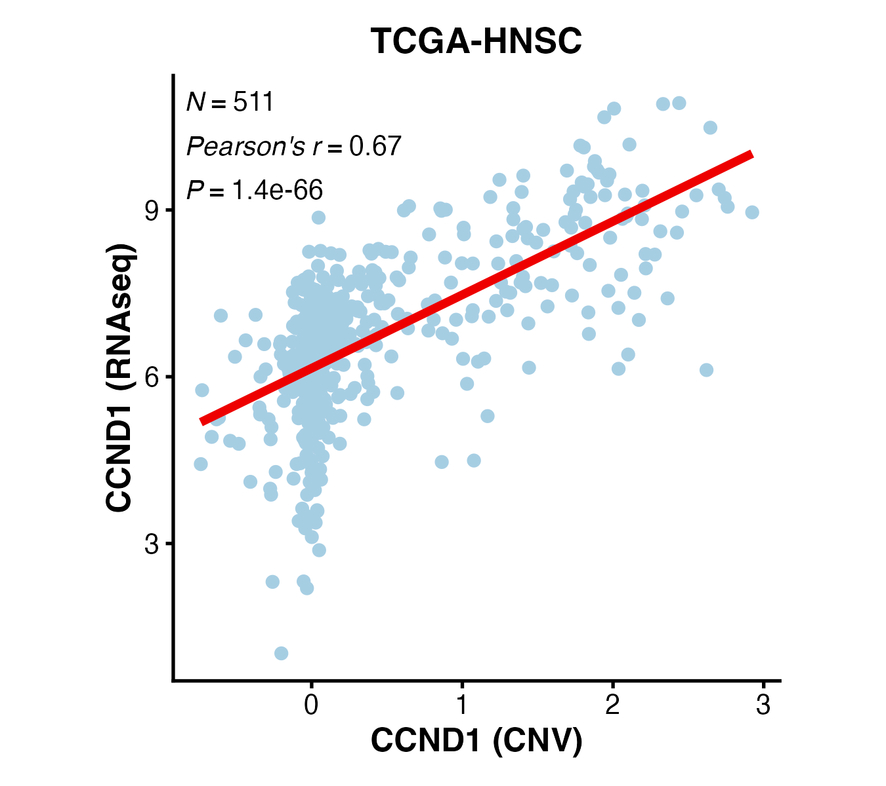

*Figure 10. CCND1 amplification at 11q13 locus in HNSC*

#### Scenario 2: MicroRNA-Gene Regulation

**Example 11: let-7a targets MYC**
```r
result <- tcga_correlation(
  var1 = "hsa-let-7a-1", var1_modal = "miRNA", var1_cancers = "BRCA",
  var2 = "MYC", var2_modal = "RNAseq", var2_cancers = "BRCA"
)
```

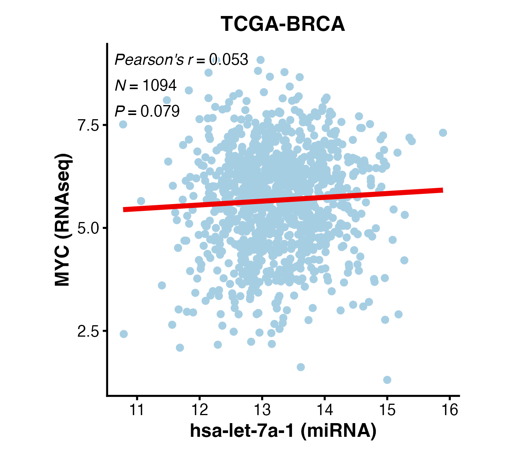

*Figure 11. let-7a inversely regulates MYC oncogene expression*

**Example 12: miR-200c and CDH1 in EMT**
```r
result <- tcga_correlation(
  var1 = "hsa-mir-200c", var1_modal = "miRNA", var1_cancers = "BRCA",
  var2 = "CDH1", var2_modal = "RNAseq", var2_cancers = "BRCA"
)
```

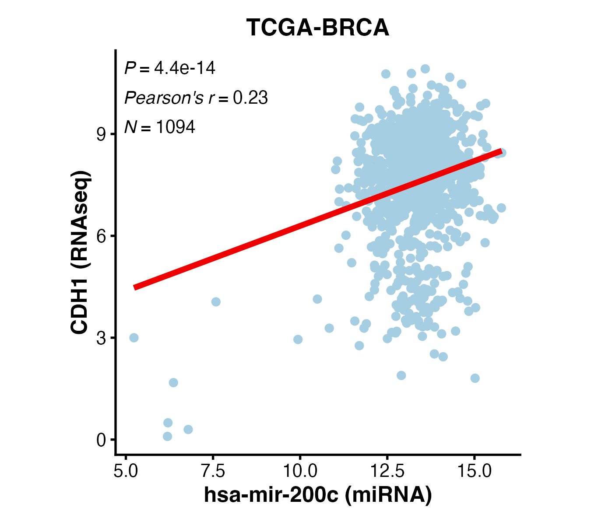

*Figure 12. miR-200c regulates E-cadherin in epithelial-mesenchymal transition*

**Example 13: miR-21 and inflammation**
```r
result <- tcga_correlation(
  var1 = "hsa-mir-21", var1_modal = "miRNA", var1_cancers = "BRCA",
  var2 = c("Macrophages_M1", "Macrophages_M2"), var2_modal = "ImmuneCell", var2_cancers = "BRCA"
)
```

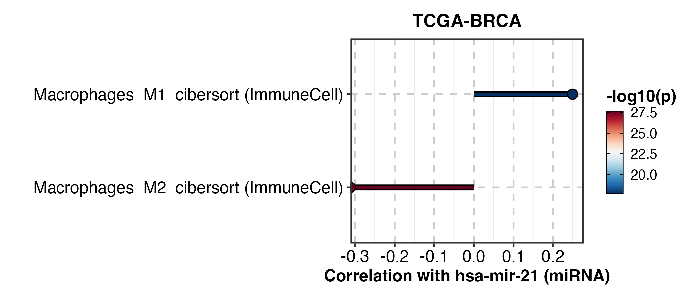

*Figure 13. miR-21 correlates with tumor-associated macrophage infiltration*

**Example 14: let-7a correlation with multiple miRNAs**
```r
result <- tcga_correlation(
  var1 = "hsa-let-7a-1", var1_modal = "miRNA", var1_cancers = "BRCA",
  var2 = "hsa-mir-21", var2_modal = "miRNA", var2_cancers = "BRCA"
)
```

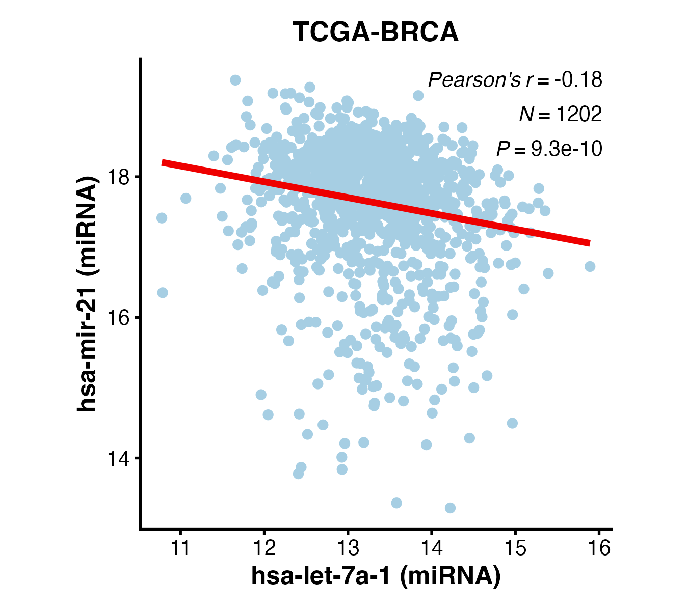

*Figure 14. Co-regulation patterns between oncogenic miRNAs*

**Example 15: miRNA and gene expression networks**
```r
result <- tcga_correlation(
  var1 = c("hsa-let-7a-1", "hsa-mir-21", "hsa-mir-200c"), var1_modal = "miRNA",
  var1_cancers = "BRCA",
  var2 = c("MYC", "KRAS", "CDH1"), var2_modal = "RNAseq",
  var2_cancers = "BRCA"
)
```

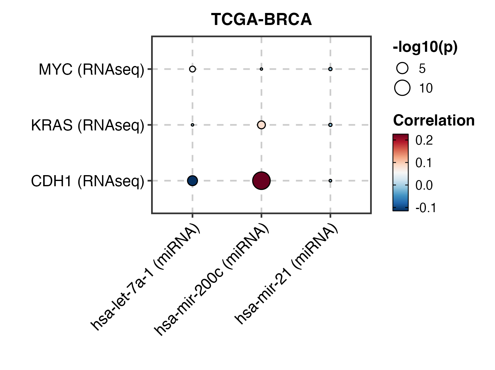

*Figure 15. Systematic miRNA-mRNA regulatory network analysis*

#### Scenario 3: Gene-Signature Correlation

**Example 16: TMB correlation with gene expression**
```r
result <- tcga_correlation(
  var1 = "TP53", var1_modal = "RNAseq", var1_cancers = "BRCA",
  var2 = "TMB", var2_modal = "Signature", var2_cancers = "BRCA"
)
```

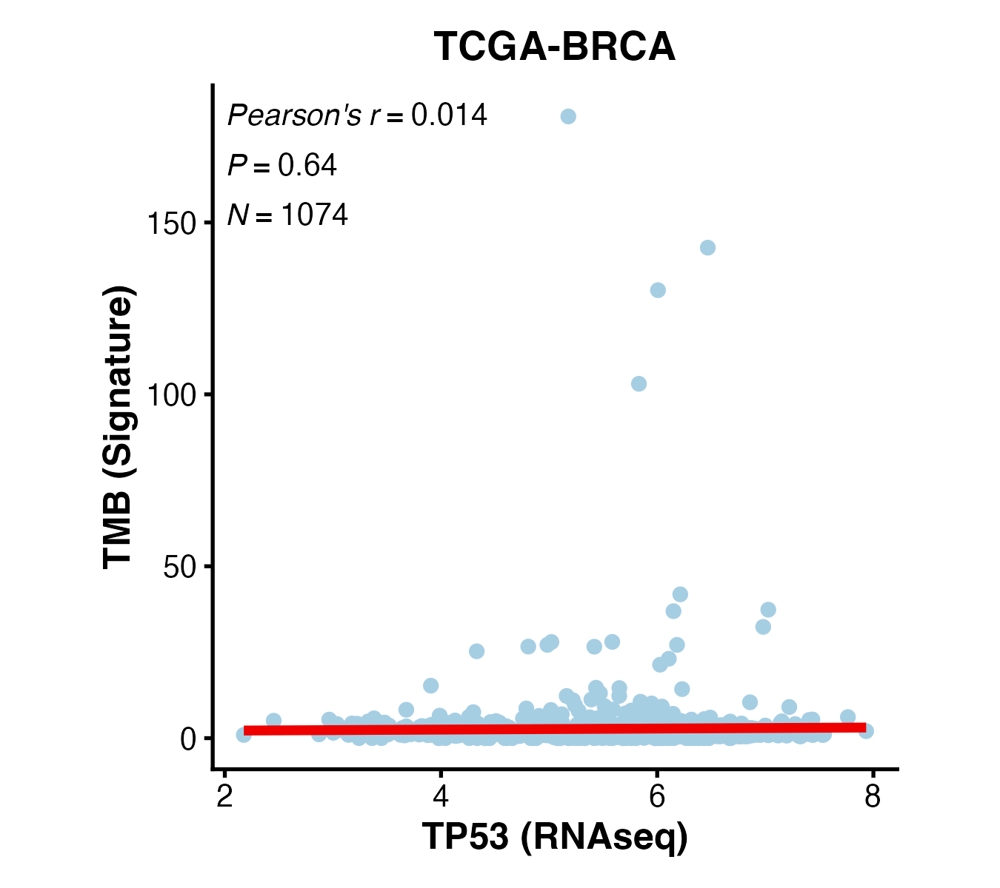

*Figure 16. TP53 expression correlates with tumor mutational burden*

**Example 17: ESR1 and tumor purity**
```r
result <- tcga_correlation(
  var1 = "ESR1", var1_modal = "RNAseq", var1_cancers = "BRCA",
  var2 = "Purity", var2_modal = "Signature", var2_cancers = "BRCA"
)
```

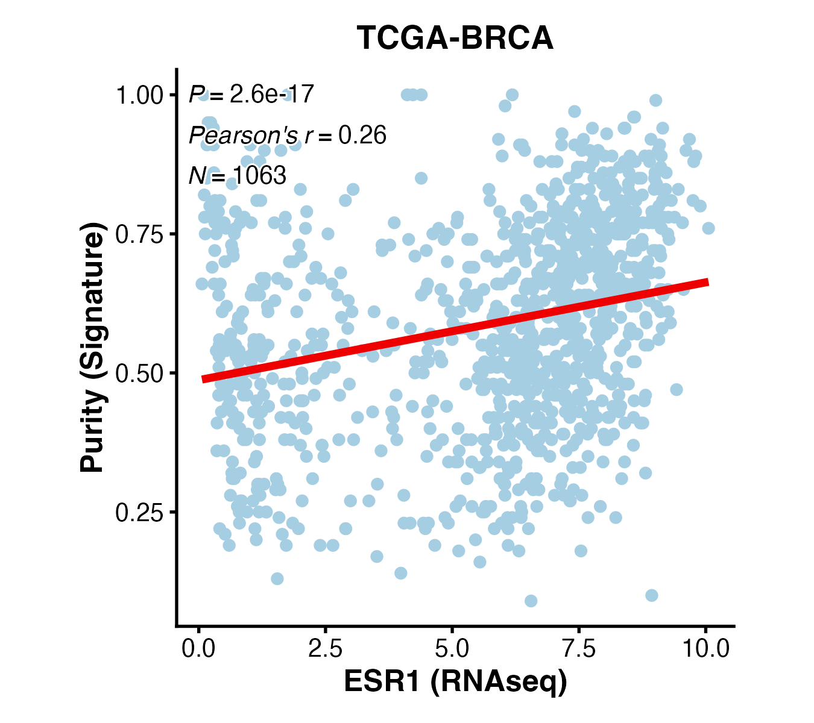

*Figure 17. ESR1-positive tumors show higher tumor purity*

**Example 18: VHL and hypoxia signature**
```r
result <- tcga_correlation(
  var1 = "VHL", var1_modal = "RNAseq", var1_cancers = "KIRC",
  var2 = "Hypoxia", var2_modal = "Signature", var2_cancers = "KIRC"
)
```

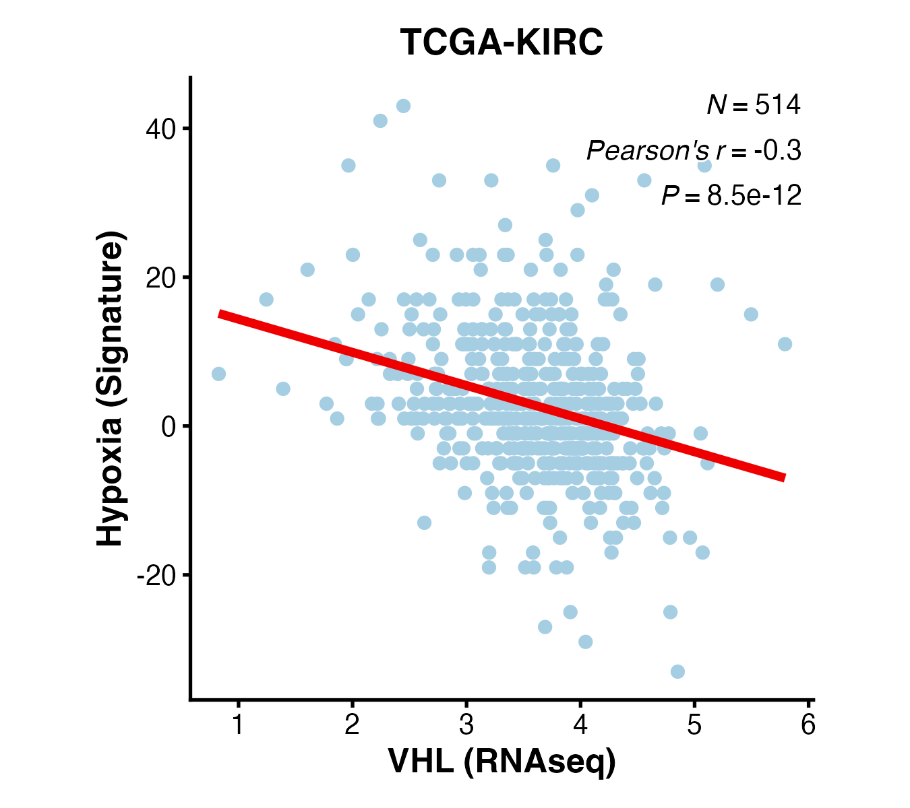

*Figure 18. VHL loss activates hypoxia signaling in kidney cancer*

**Example 19: IFNG and IFN-gamma signature**
```r
result <- tcga_correlation(
  var1 = "IFNG", var1_modal = "RNAseq", var1_cancers = "HNSC",
  var2 = "IFN_Gamma", var2_modal = "Signature", var2_cancers = "HNSC"
)
```

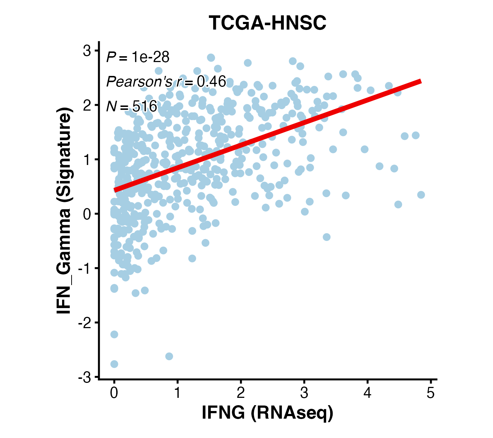

*Figure 19. IFNG expression drives interferon-gamma response signature*

**Example 20: TGFB1 and TGF-beta pathway**
```r
result <- tcga_correlation(
  var1 = "TGFB1", var1_modal = "RNAseq", var1_cancers = "LIHC",
  var2 = "TGF_Beta", var2_modal = "Signature", var2_cancers = "LIHC"
)
```

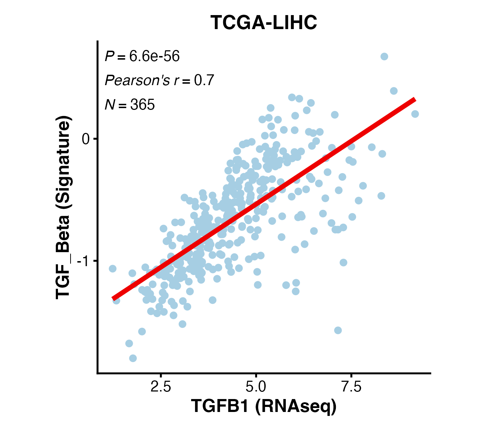

*Figure 20. TGFB1 expression activates TGF-beta signaling in liver cancer*

**Example 21: Multiple genes vs multiple signatures**
```r
result <- tcga_correlation(
  var1 = c("hsa-let-7a-1", "hsa-mir-21"), var1_modal = "miRNA",
  var1_cancers = "BRCA",
  var2 = c("TMB", "Purity", "TIL_Score"), var2_modal = "Signature",
  var2_cancers = "BRCA"
)
```

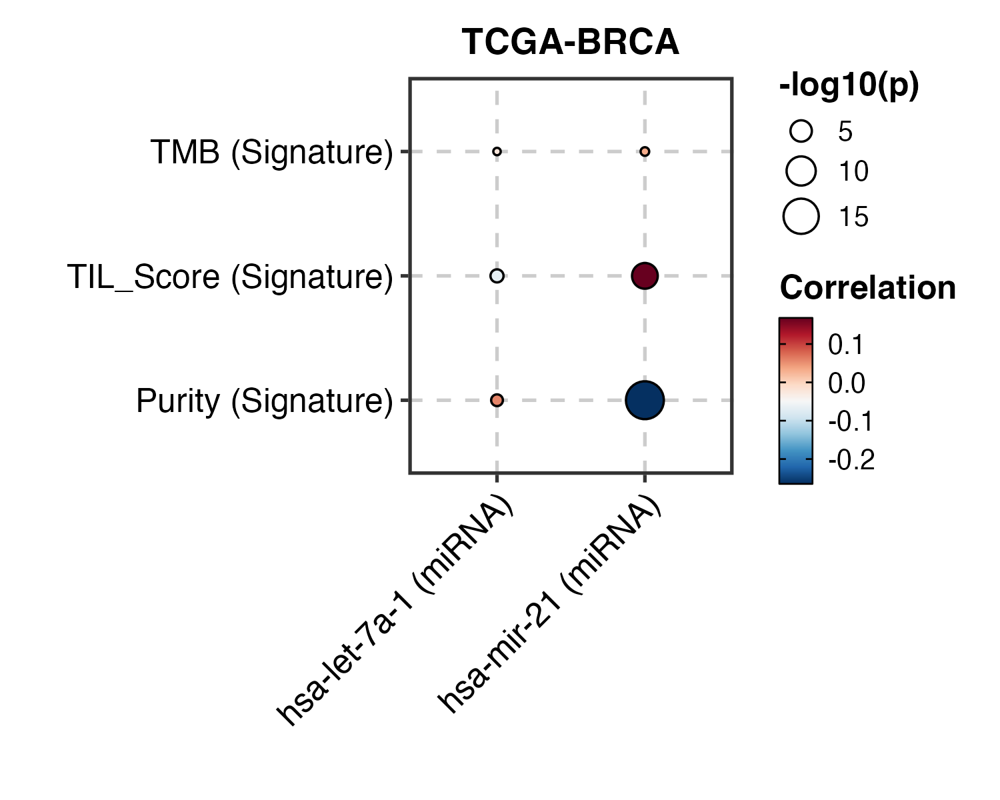

*Figure 21. miRNA correlations with tumor microenvironment signatures*

**Example 22: Signature-signature correlation**
```r
result <- tcga_correlation(
  var1 = "TMB", var1_modal = "Signature", var1_cancers = "BRCA",
  var2 = "Purity", var2_modal = "Signature", var2_cancers = "BRCA"
)
```

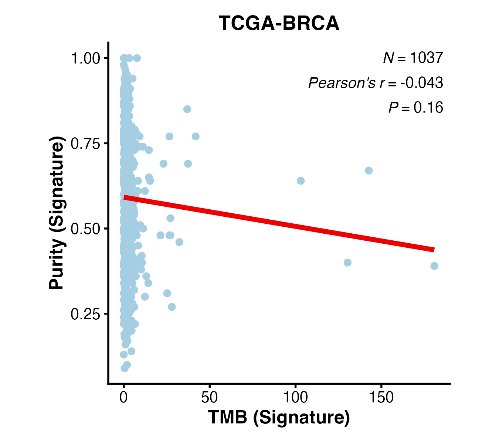

*Figure 22. High TMB tumors show lower purity (more immune infiltration)*

**Example 23: Multiple signature correlation matrix**
```r
result <- tcga_correlation(
  var1 = c("TMB", "Purity"), var1_modal = "Signature", var1_cancers = "BRCA",
  var2 = c("TIL_Score", "Leukocyte"), var2_modal = "Signature", var2_cancers = "BRCA"
)
```

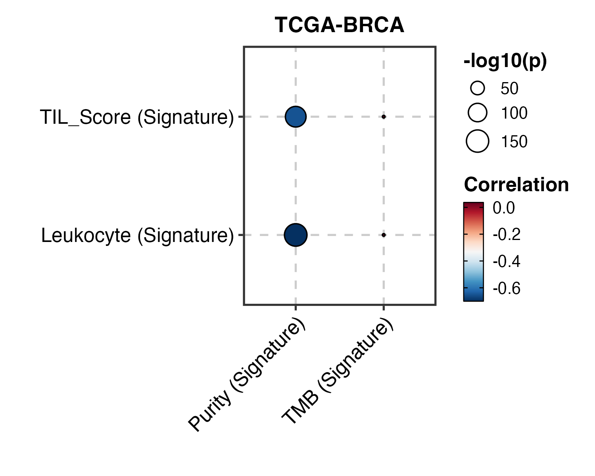

*Figure 23. Tumor microenvironment signature correlation matrix*

**Example 24: Multiple signatures vs gene expression**
```r
result <- tcga_correlation(
  var1 = c("Leukocyte", "Stromal", "TIL_Score"), var1_modal = "Signature",
  var1_cancers = "BRCA",
  var2 = "CD274", var2_modal = "RNAseq", var2_cancers = "BRCA"
)
```

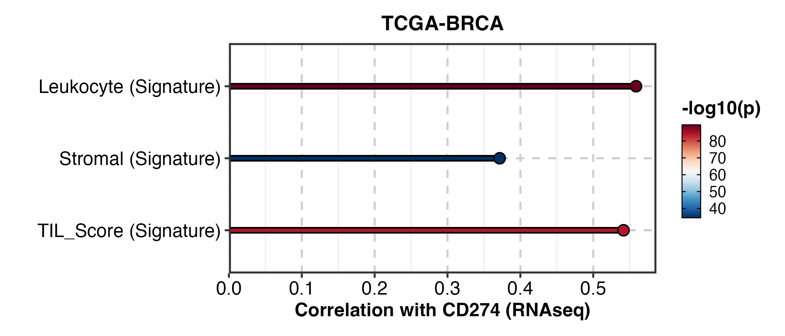

*Figure 24. Immune signatures correlate with PD-L1 expression*

#### Scenario 4: Mutation-Expression Association

**Example 25: TP53 mutation and expression**
```r
result <- tcga_correlation(
  var1 = "TP53", var1_modal = "Mutation", var1_cancers = "BRCA",
  var2 = "TP53", var2_modal = "RNAseq", var2_cancers = "BRCA"
)
```

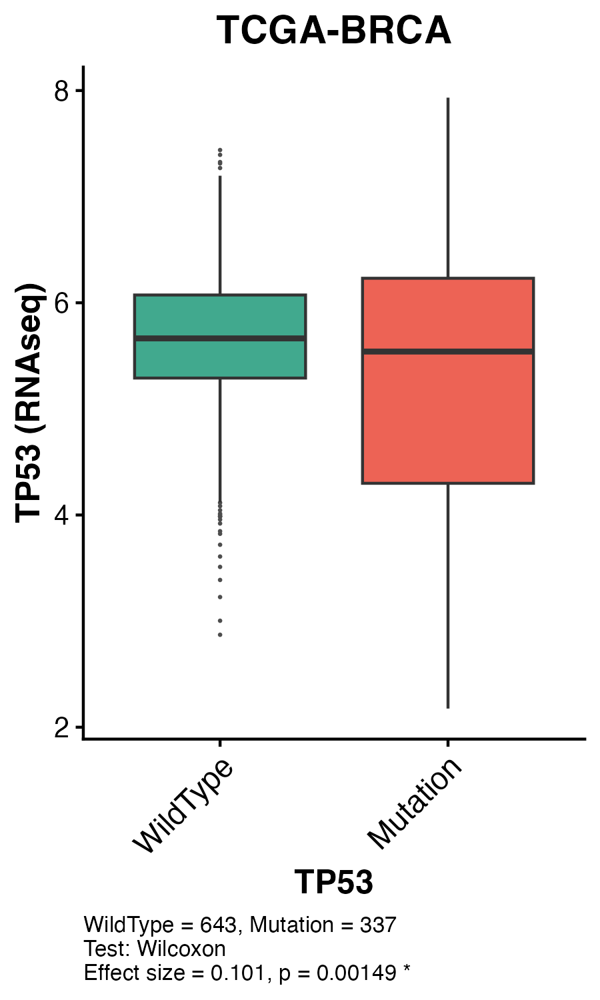

*Figure 25. TP53 mutation status and mRNA expression levels (p=0.03)*

**Example 26: PIK3CA mutation and AKT1 expression**
```r
result <- tcga_correlation(
  var1 = "PIK3CA", var1_modal = "Mutation", var1_cancers = "BRCA",
  var2 = "AKT1", var2_modal = "RNAseq", var2_cancers = "BRCA"
)
```

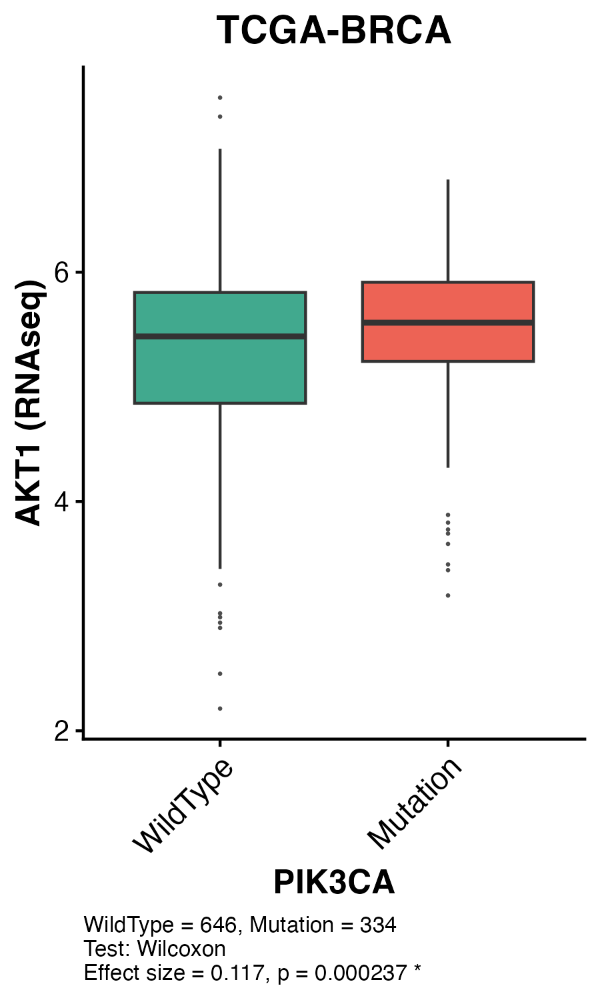

*Figure 26. PIK3CA mutation activates AKT pathway*

**Example 27: KRAS mutation and EGFR expression**
```r
result <- tcga_correlation(
  var1 = "KRAS", var1_modal = "Mutation", var1_cancers = "LUAD",
  var2 = "EGFR", var2_modal = "RNAseq", var2_cancers = "LUAD"
)
```

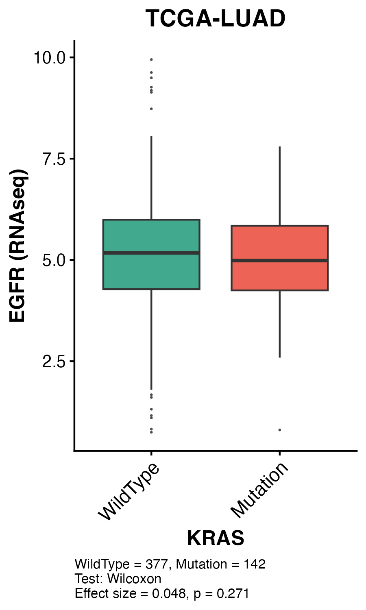

*Figure 27. KRAS mutation correlates with reduced EGFR expression*

**Example 28: PIK3CA mutation and ESR1 expression**
```r
result <- tcga_correlation(
  var1 = "ESR1", var1_modal = "RNAseq", var1_cancers = "BRCA",
  var2 = "PIK3CA", var2_modal = "Mutation", var2_cancers = "BRCA"
)
```

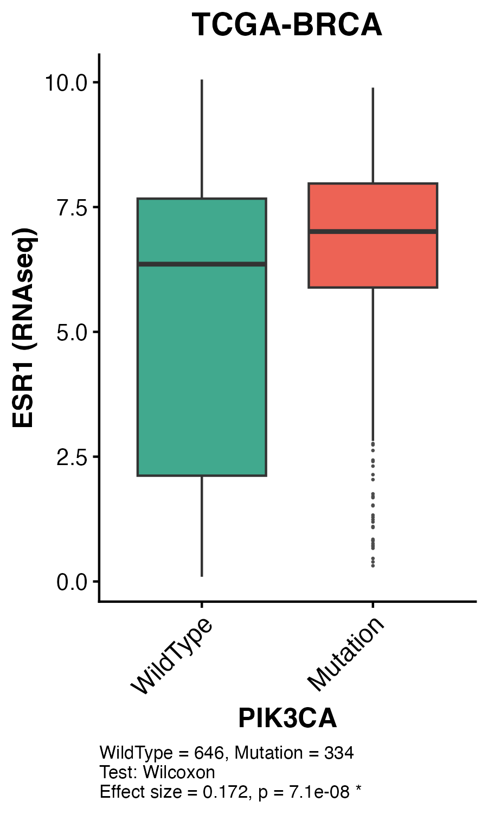

*Figure 28. PIK3CA mutations are enriched in ER-positive breast cancers*

**Example 29: Mutation and methylation**
```r
result <- tcga_correlation(
  var1 = "TP53", var1_modal = "Methylation", var1_cancers = "BRCA",
  var2 = "TP53", var2_modal = "Mutation", var2_cancers = "BRCA"
)
```

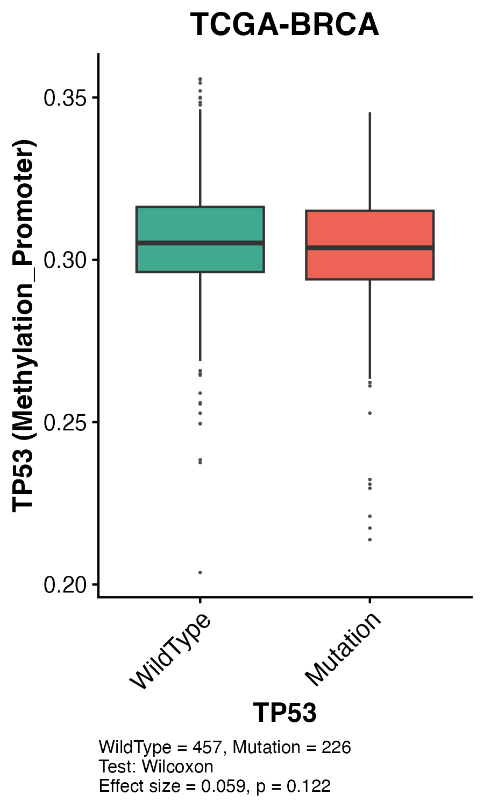

*Figure 29. TP53 methylation and mutation are mutually exclusive*

**Example 30: MLH1 methylation and mutation**
```r
result <- tcga_correlation(
  var1 = "MLH1", var1_modal = "Methylation", var1_cancers = "COAD",
  var2 = "MLH1", var2_modal = "Mutation", var2_cancers = "COAD"
)
```

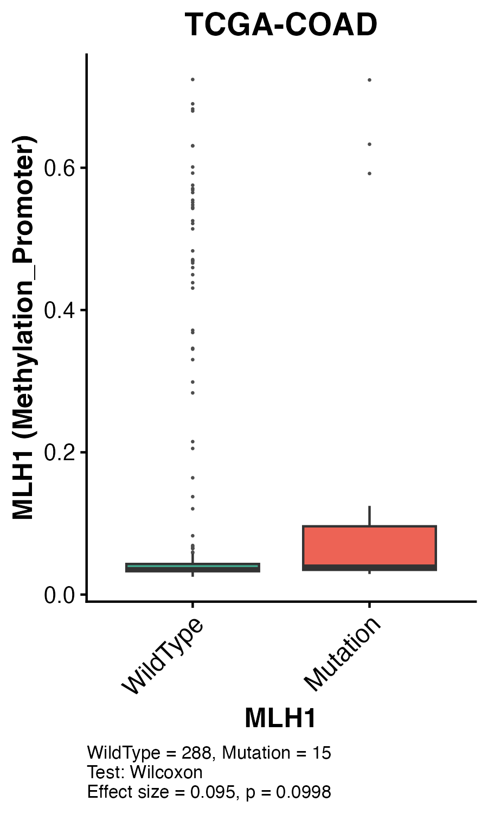

*Figure 30. MLH1 inactivation through methylation or mutation*

**Example 31: miRNA and mutation**
```r
result <- tcga_correlation(
  var1 = "hsa-mir-200c", var1_modal = "miRNA", var1_cancers = "BRCA",
  var2 = "CDH1", var2_modal = "Mutation", var2_cancers = "BRCA"
)
```

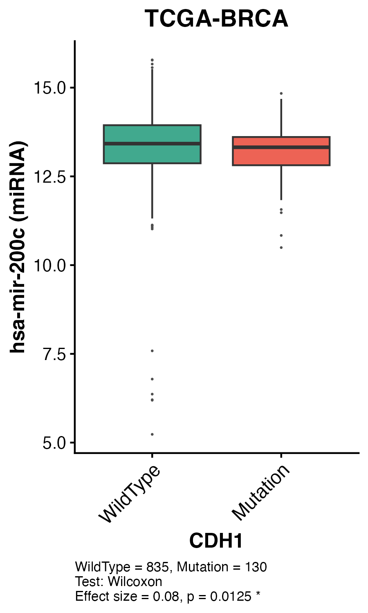

*Figure 31. miR-200c regulation is independent of CDH1 mutation status*

**Example 32: miR-21 and TP53 mutation**
```r
result <- tcga_correlation(
  var1 = "hsa-mir-21", var1_modal = "miRNA", var1_cancers = "BRCA",
  var2 = "TP53", var2_modal = "Mutation", var2_cancers = "BRCA"
)
```

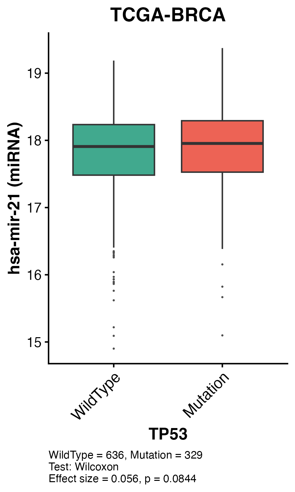

*Figure 32. miR-21 expression is elevated in TP53-mutant tumors*

#### Scenario 5: Mutation-Signature Association

**Example 33: TP53 mutation and TMB**
```r
result <- tcga_correlation(
  var1 = "TP53", var1_modal = "Mutation", var1_cancers = "BRCA",
  var2 = "TMB", var2_modal = "Signature", var2_cancers = "BRCA"
)
```

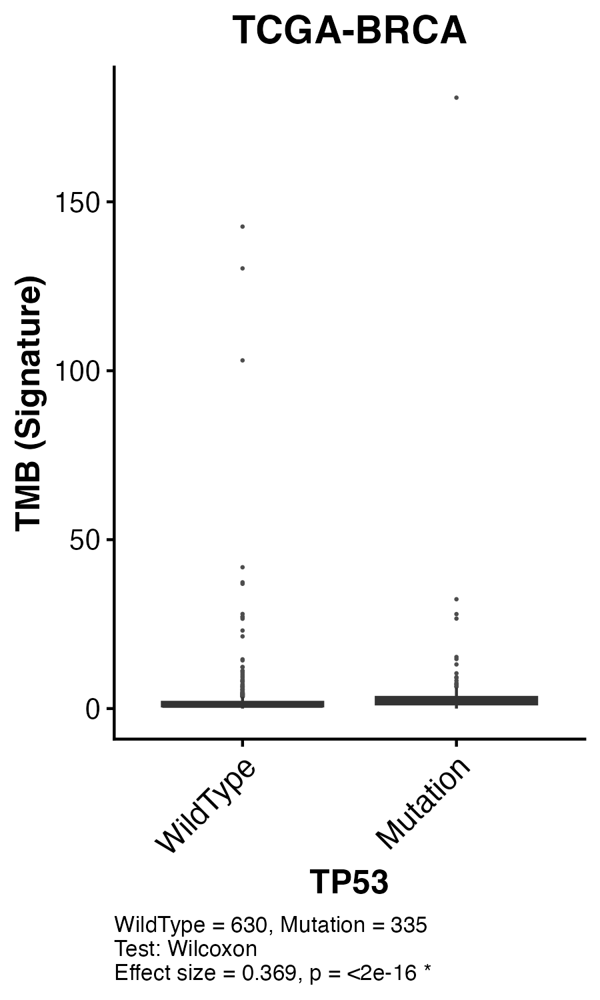

*Figure 33. TP53-mutant tumors show elevated tumor mutational burden*

**Example 34: KRAS mutation and MSI in colorectal cancer**
```r
result <- tcga_correlation(
  var1 = "KRAS", var1_modal = "Mutation", var1_cancers = "COAD",
  var2 = "MSI", var2_modal = "Signature", var2_cancers = "COAD"
)
```

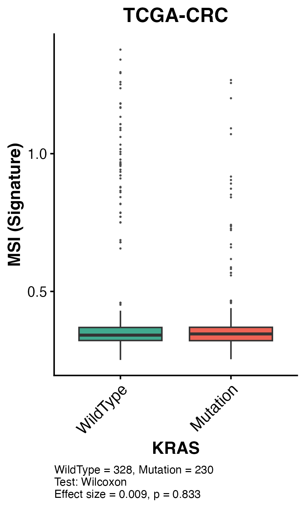

*Figure 34. KRAS mutations are exclusive with microsatellite instability*

**Example 35: MLH1 mutation and MSI**
```r
result <- tcga_correlation(
  var1 = "MLH1", var1_modal = "Mutation", var1_cancers = "COAD",
  var2 = "MSI", var2_modal = "Signature", var2_cancers = "COAD"
)
```

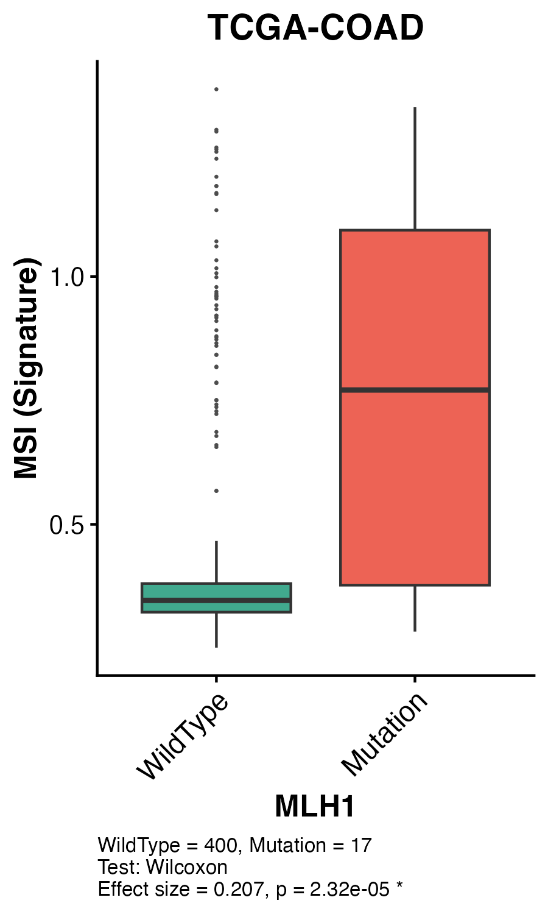

*Figure 35. MLH1 mutations lead to microsatellite instability*

**Example 36: MLH1 methylation and MSI**
```r
result <- tcga_correlation(
  var1 = "MLH1", var1_modal = "Methylation", var1_cancers = "COAD",
  var2 = "MSI", var2_modal = "Signature", var2_cancers = "COAD"
)
```

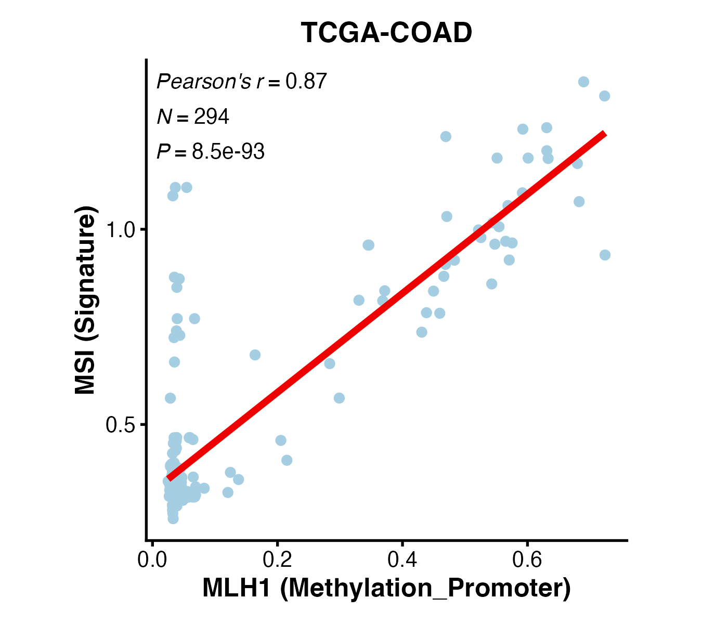

*Figure 36. MLH1 promoter methylation causes MSI-high phenotype*

**Example 37: IDH1 mutation and stemness**
```r
result <- tcga_correlation(
  var1 = "IDH1", var1_modal = "Mutation", var1_cancers = "GLIOMA",
  var2 = "Stemness", var2_modal = "Signature", var2_cancers = "GLIOMA"
)
```

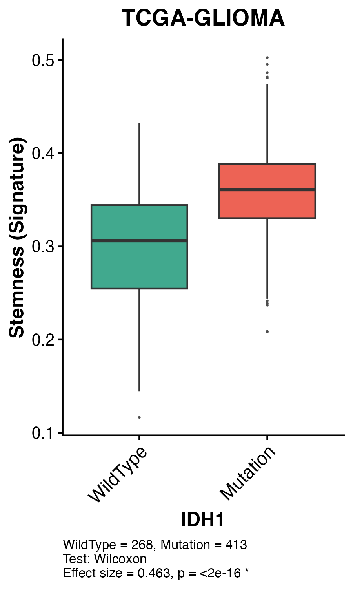

*Figure 37. IDH1-mutant gliomas show higher stemness signature*

**Example 38: VHL mutation and HRD signature**
```r
result <- tcga_correlation(
  var1 = "VHL", var1_modal = "Mutation", var1_cancers = "KRCC",
  var2 = "HRD", var2_modal = "Signature", var2_cancers = "KRCC"
)
```

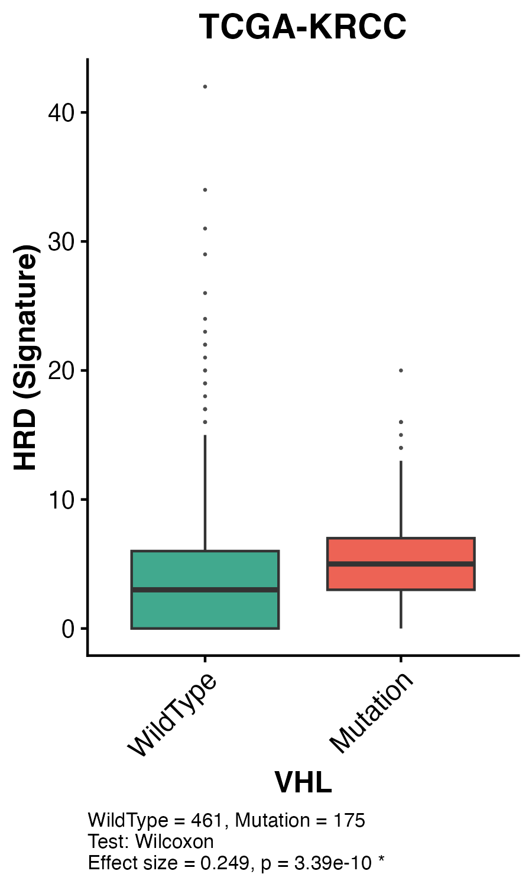

*Figure 38. VHL mutation correlates with homologous recombination deficiency*

**Example 39: ERBB2 CNV and TMB**
```r
result <- tcga_correlation(
  var1 = "ERBB2", var1_modal = "CNV", var1_cancers = "BRCA",
  var2 = "TMB", var2_modal = "Signature", var2_cancers = "BRCA"
)
```

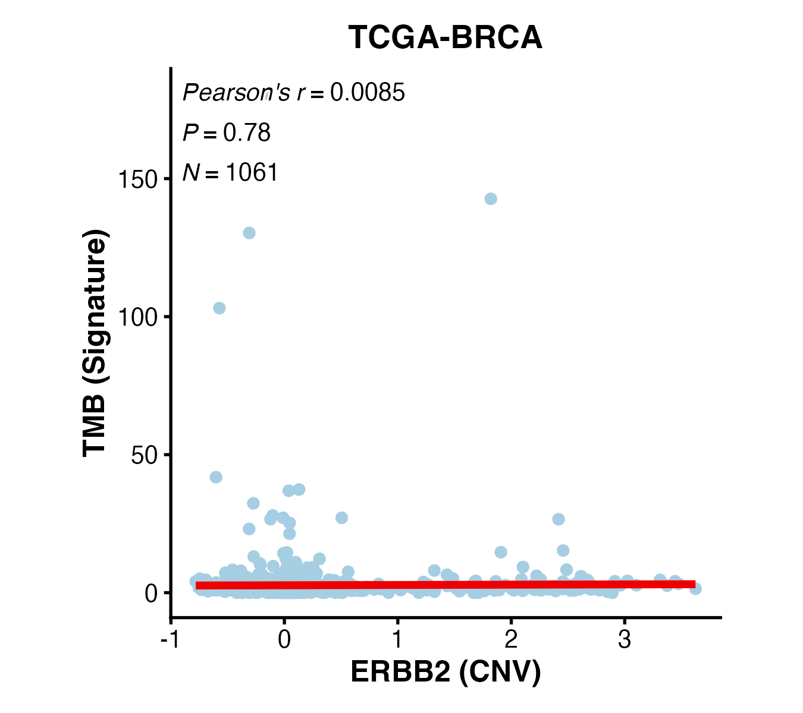

*Figure 39. ERBB2 amplification correlates with chromosomal instability*

**Example 40: MYC CNV and purity**
```r
result <- tcga_correlation(
  var1 = "MYC", var1_modal = "CNV", var1_cancers = "BRCA",
  var2 = "Purity", var2_modal = "Signature", var2_cancers = "BRCA"
)
```

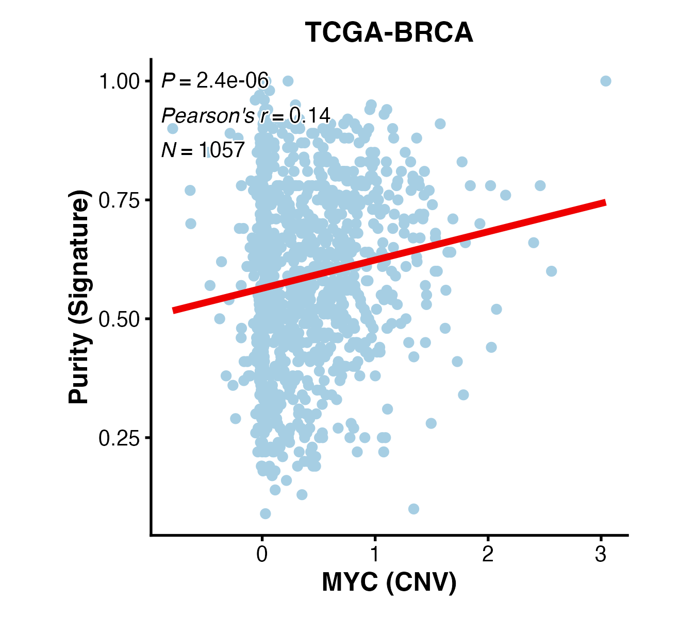

*Figure 40. MYC amplification in high-purity aggressive tumors*

#### Scenario 6: Immune Cell Infiltration Analysis

**Example 41: PD-L1 expression and CD8+ T cells**
```r
result <- tcga_correlation(
  var1 = "CD274", var1_modal = "RNAseq", var1_cancers = "LUAD",
  var2 = "T_cells_CD8", var2_modal = "ImmuneCell", var2_cancers = "LUAD",
  immune_algorithm = "cibersort"
)
```

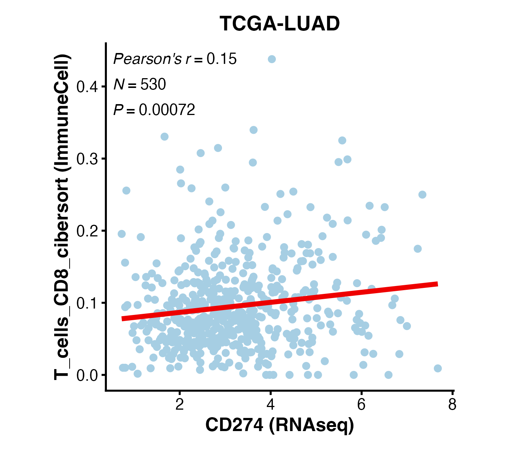

*Figure 41. PD-L1 expression correlates with CD8+ T cell infiltration*

**Example 42: Immune checkpoints and T cells**
```r
result <- tcga_correlation(
  var1 = c("CD274", "PDCD1", "CTLA4"), var1_modal = "RNAseq", var1_cancers = "BRCA",
  var2 = c("T_cells_CD8", "T_cells_CD4_memory_resting", "Macrophages_M1"), 
  var2_modal = "ImmuneCell", var2_cancers = "BRCA"
)
```

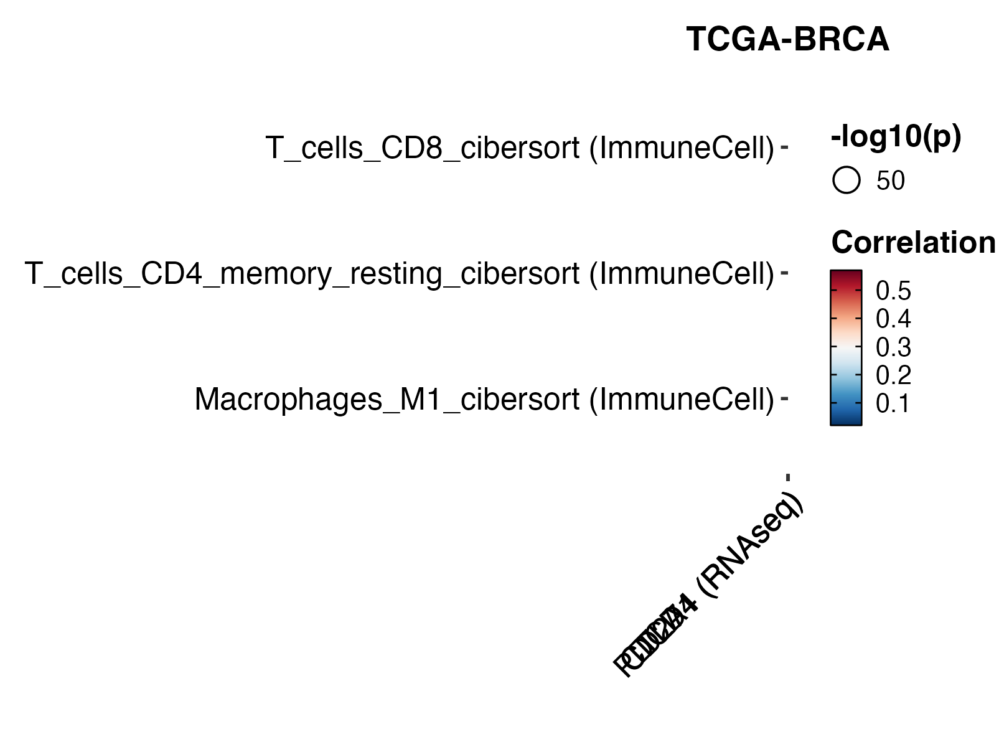

*Figure 42. Systematic immune checkpoint-immune cell infiltration analysis*

**Example 43: IL6 and M1 macrophages**
```r
result <- tcga_correlation(
  var1 = "Macrophages_M1", var1_modal = "ImmuneCell", var1_cancers = "BRCA",
  var2 = "IL6", var2_modal = "RNAseq", var2_cancers = "BRCA"
)
```

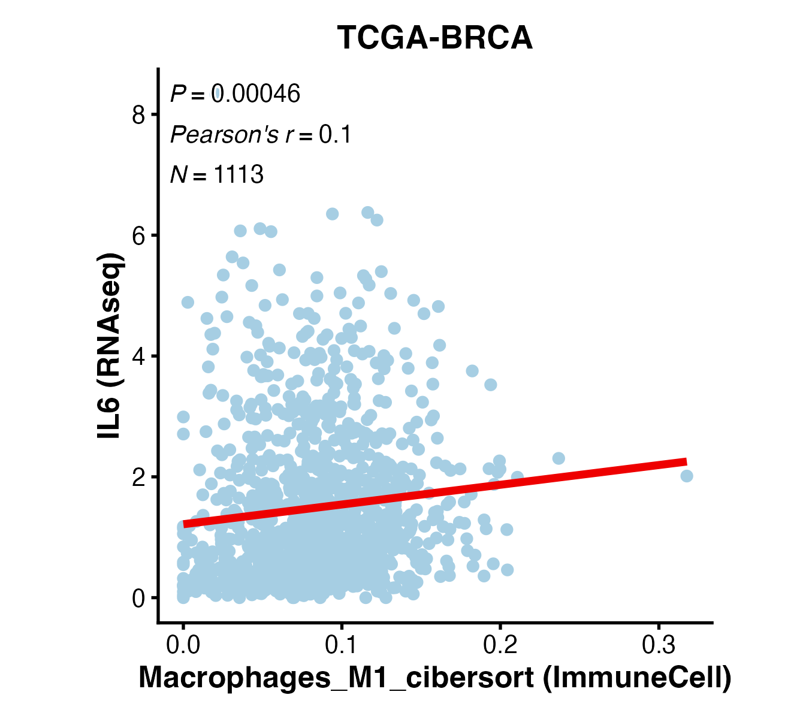

*Figure 43. M1 macrophage infiltration correlates with IL6 expression*

**Example 44: CTLA4 and stromal signature**
```r
result <- tcga_correlation(
  var1 = "CTLA4", var1_modal = "RNAseq", var1_cancers = "KIRC",
  var2 = "Stromal", var2_modal = "Signature", var2_cancers = "KIRC"
)
```

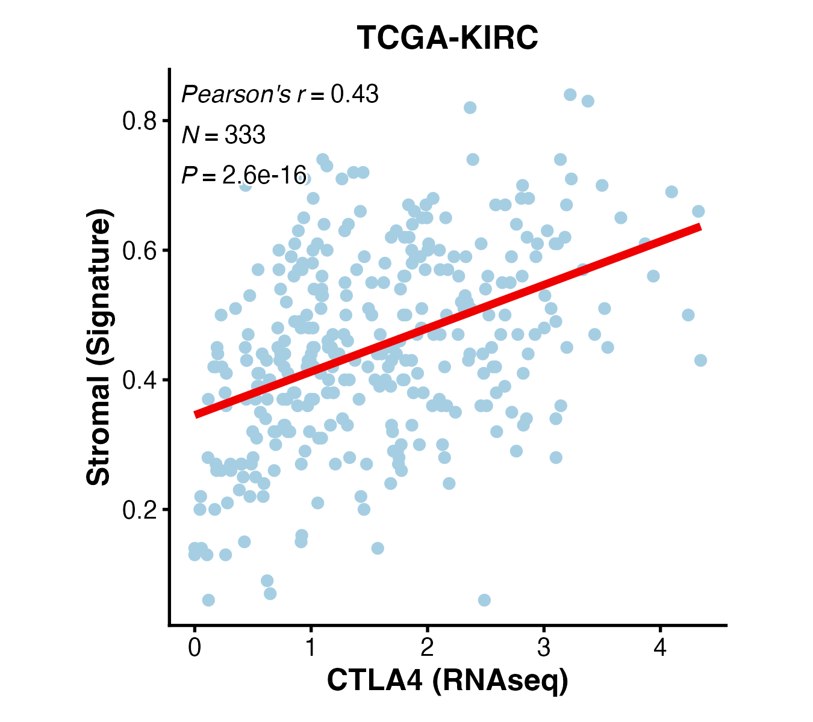

*Figure 44. CTLA4 expression in stromal-rich kidney tumors*

**Example 45: PDCD1 and multiple immune cells**
```r
result <- tcga_correlation(
  var1 = c("T_cells_CD8", "T_cells_CD4_memory_resting", "Macrophages_M1"),
  var1_modal = "ImmuneCell", var1_cancers = "KIRC",
  var2 = "PDCD1", var2_modal = "RNAseq", var2_cancers = "KIRC"
)
```

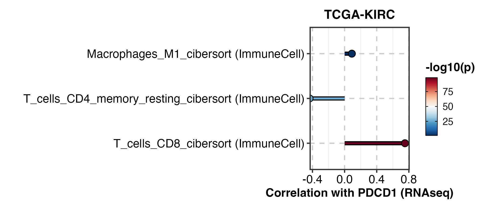

*Figure 45. PD-1 expression across immune cell types in kidney cancer*

**Example 46: CD274 and TIL score**
```r
result <- tcga_correlation(
  var1 = "CD274", var1_modal = "RNAseq", var1_cancers = "LUAD",
  var2 = "TIL_Score", var2_modal = "Signature", var2_cancers = "LUAD"
)
```

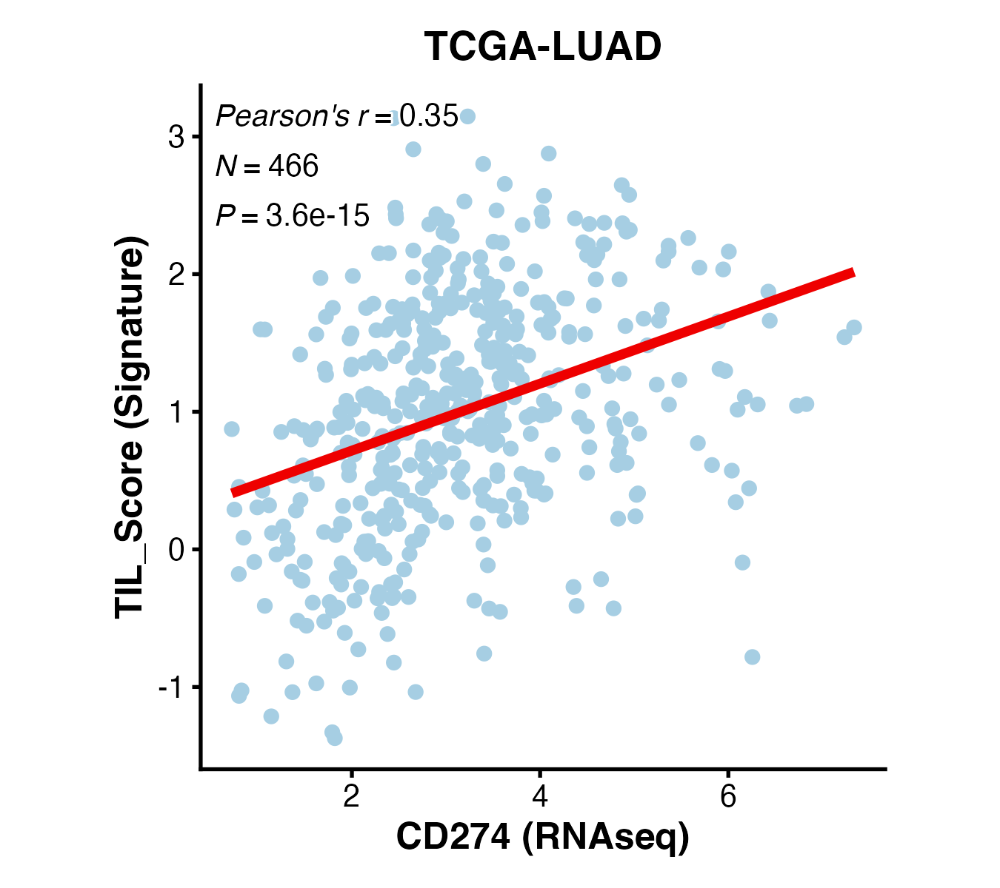

*Figure 46. PD-L1 expression reflects tumor-infiltrating lymphocyte density*

**Example 47: All immune cells pan-cancer analysis**
```r
result <- tcga_correlation(
  var1 = "CD274", var1_modal = "RNAseq", var1_cancers = "LUAD",
  var2 = "ALL_IMMUNE_CELLS", var2_modal = "ImmuneCell", var2_cancers = "LUAD"
)
```

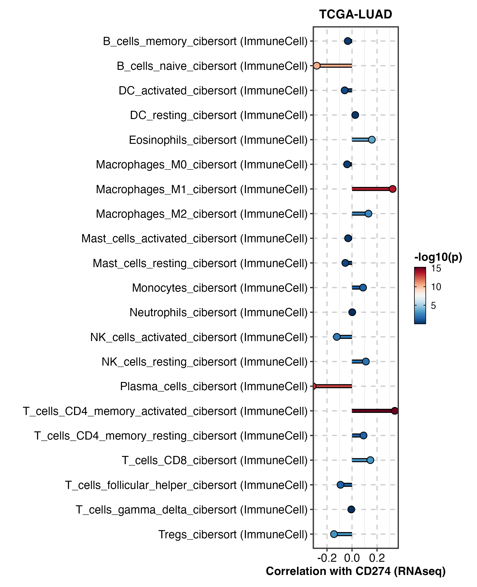

*Figure 47. Comprehensive immune cell infiltration landscape correlates with PD-L1*

**Example 48: M1 vs M2 macrophages**
```r
result <- tcga_correlation(
  var1 = c("T_cells_CD8", "T_cells_CD4_memory_resting"), var1_modal = "ImmuneCell",
  var1_cancers = "BRCA",
  var2 = c("Macrophages_M1", "Macrophages_M2"), var2_modal = "ImmuneCell",
  var2_cancers = "BRCA"
)
```

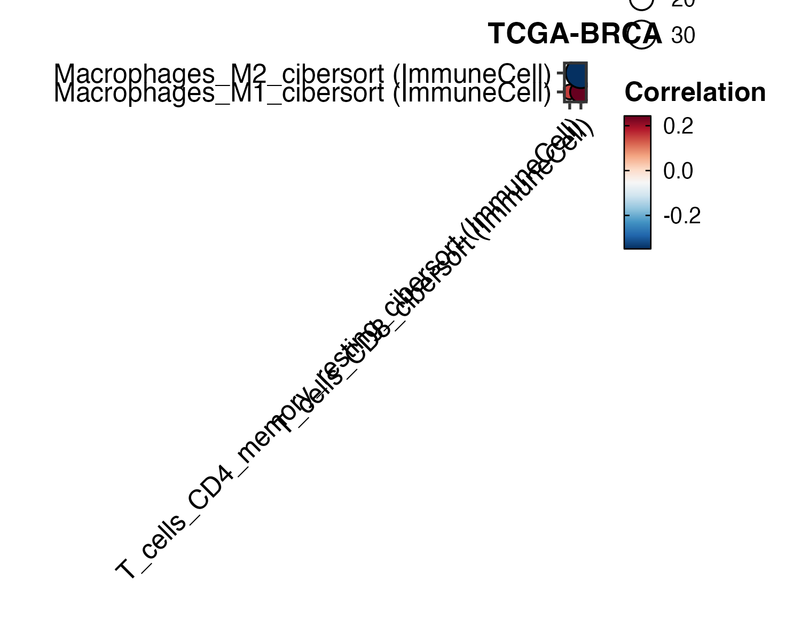

*Figure 48. T cell and macrophage infiltration patterns in breast cancer*

**Example 49: PIK3CA mutation and immune cells**
```r
result <- tcga_correlation(
  var1 = "PIK3CA", var1_modal = "Mutation", var1_cancers = "BRCA",
  var2 = c("T_cells_CD8", "T_cells_CD4_memory_resting"), var2_modal = "ImmuneCell",
  var2_cancers = "BRCA"
)
```

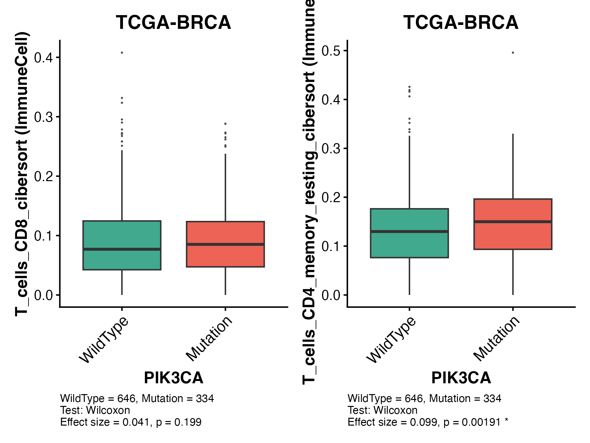

*Figure 49. PIK3CA mutations associated with reduced T cell infiltration*

**Example 50: PIK3CA mutation and multiple immune cells**
```r
result <- tcga_correlation(
  var1 = "PIK3CA", var1_modal = "Mutation", var1_cancers = "BRCA",
  var2 = c("T_cells_CD8", "Macrophages_M1", "NK_cells_activated"),
  var2_modal = "ImmuneCell", var2_cancers = "BRCA"
)
```

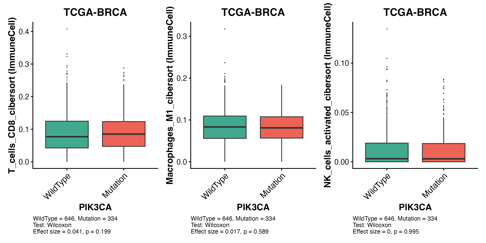

*Figure 50. PIK3CA mutation creates immunosuppressive microenvironment*

**Example 51: ERBB2 CNV and macrophages**
```r
result <- tcga_correlation(
  var1 = "ERBB2", var1_modal = "CNV", var1_cancers = "BRCA",
  var2 = c("Macrophages_M1", "Macrophages_M2"), var2_modal = "ImmuneCell",
  var2_cancers = "BRCA"
)
```

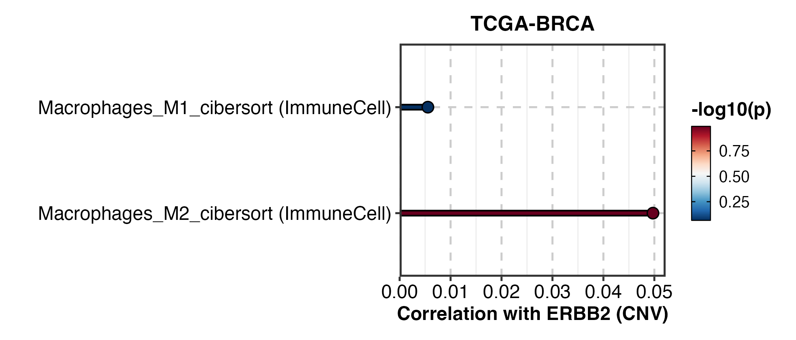

*Figure 51. ERBB2 amplification alters macrophage polarization*

**Example 52: MYC CNV and T cells**
```r
result <- tcga_correlation(
  var1 = "MYC", var1_modal = "CNV", var1_cancers = "BRCA",
  var2 = c("T_cells_CD8", "T_cells_CD4_memory_resting"),
  var2_modal = "ImmuneCell", var2_cancers = "BRCA"
)
```

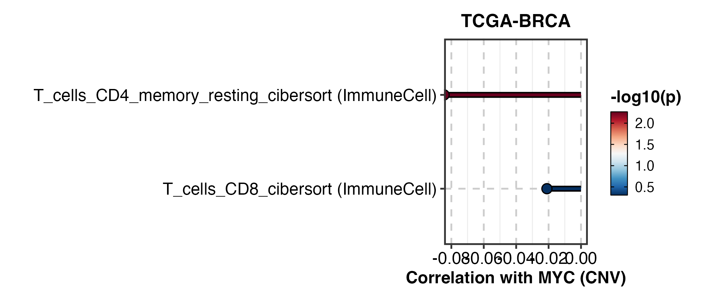

*Figure 52. MYC amplification correlates with immune exclusion*

**Example 53: Immune cells and TIL score**
```r
result <- tcga_correlation(
  var1 = c("T_cells_CD8", "Macrophages_M1", "NK_cells_activated"),
  var1_modal = "ImmuneCell", var1_cancers = "BRCA",
  var2 = "TIL_Score", var2_modal = "Signature", var2_cancers = "BRCA"
)
```

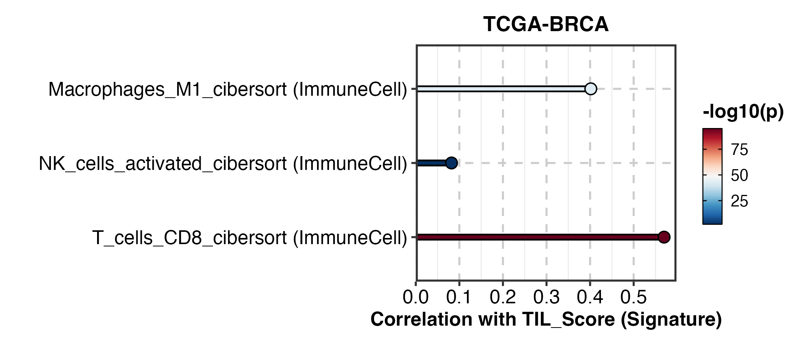

*Figure 53. Cytotoxic immune cells correlate with TIL score*

**Example 54: Tumor purity and immune cells**
```r
result <- tcga_correlation(
  var1 = "Purity", var1_modal = "Signature", var1_cancers = "BRCA",
  var2 = c("T_cells_CD8", "B_cells_naive", "NK_cells_activated"),
  var2_modal = "ImmuneCell", var2_cancers = "BRCA"
)
```

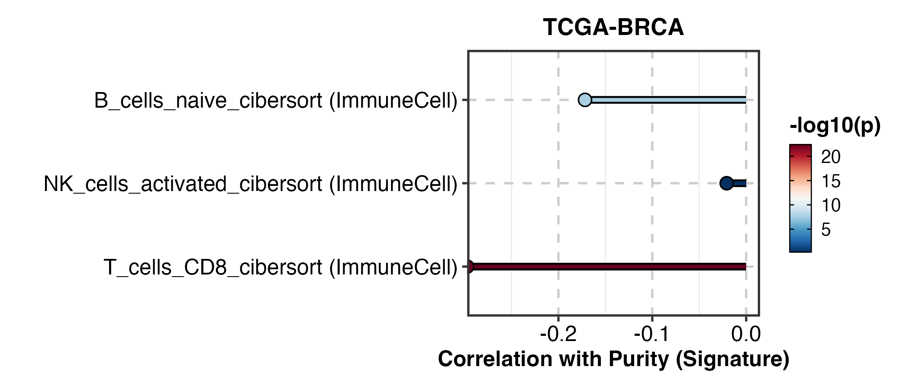

*Figure 54. Tumor purity inversely correlates with immune infiltration*

**Example 55: CDKN2A methylation and macrophages**
```r
result <- tcga_correlation(
  var1 = "CDKN2A", var1_modal = "Methylation", var1_cancers = "LUAD",
  var2 = c("Macrophages_M1", "Macrophages_M2"), var2_modal = "ImmuneCell",
  var2_cancers = "LUAD"
)
```

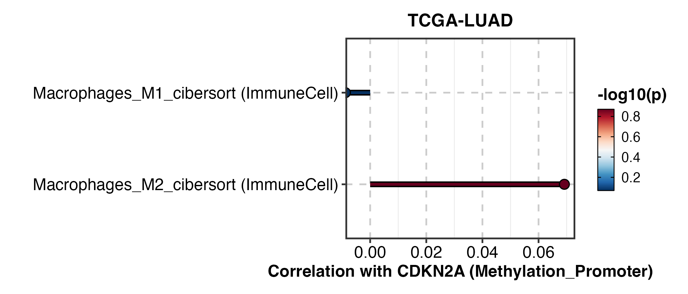

*Figure 55. CDKN2A silencing correlates with M2 macrophage polarization*

**Example 56: TP53 methylation and T cells**
```r
result <- tcga_correlation(
  var1 = "TP53", var1_modal = "Methylation", var1_cancers = "BRCA",
  var2 = c("T_cells_CD8", "T_cells_CD4_memory_resting"),
  var2_modal = "ImmuneCell", var2_cancers = "BRCA"
)
```

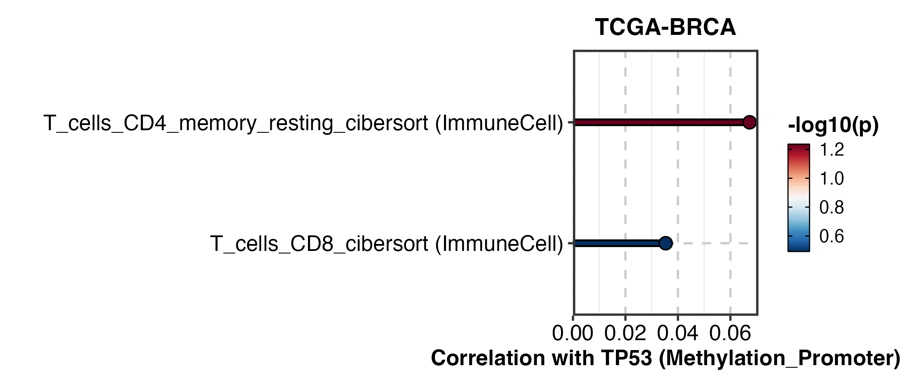

*Figure 56. TP53 methylation associated with altered T cell infiltration*

#### Scenario 7: Clinical Variable Analysis

**Example 57: Age and TP53 expression**
```r
result <- tcga_correlation(
  var1 = "Age", var1_modal = "Clinical", var1_cancers = "BRCA",
  var2 = "TP53", var2_modal = "RNAseq", var2_cancers = "BRCA"
)
```

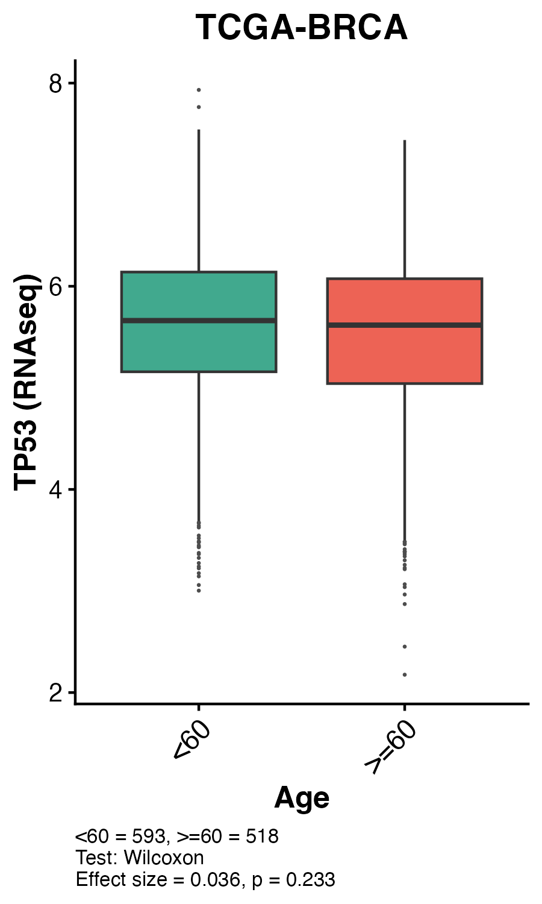

*Figure 57. TP53 expression correlates with patient age*

**Example 58: Tumor stage and gene expression**
```r
result <- tcga_correlation(
  var1 = "Stage", var1_modal = "Clinical", var1_cancers = "BRCA",
  var2 = "MYC", var2_modal = "RNAseq", var2_cancers = "BRCA"
)
```

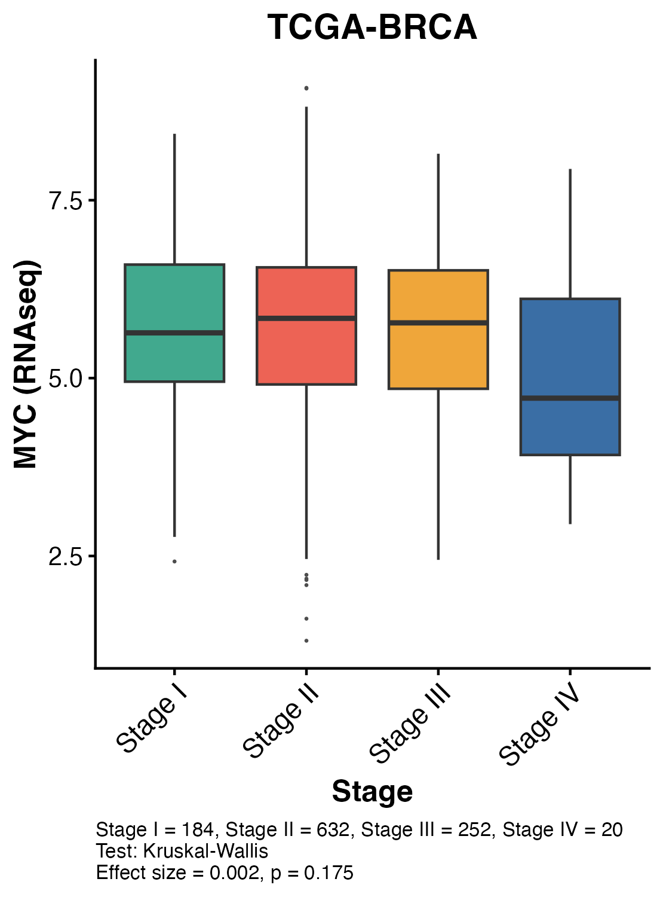

*Figure 58. MYC expression increases with tumor stage (Kruskal-Wallis p<0.001)*

**Example 59: Stage and proliferation signature**
```r
result <- tcga_correlation(
  var1 = "Stage", var1_modal = "Clinical", var1_cancers = "BRCA",
  var2 = "Proliferation", var2_modal = "Signature", var2_cancers = "BRCA"
)
```

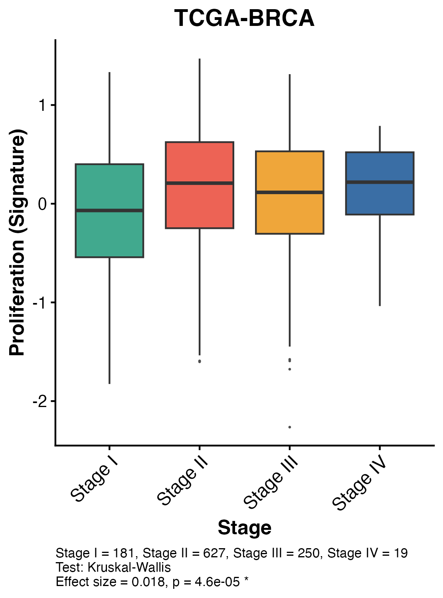

*Figure 59. Proliferation signature correlates with advanced stage*

**Example 60: Age and TMB**
```r
result <- tcga_correlation(
  var1 = "Age", var1_modal = "Clinical", var1_cancers = "BRCA",
  var2 = "TMB", var2_modal = "Signature", var2_cancers = "BRCA"
)
```

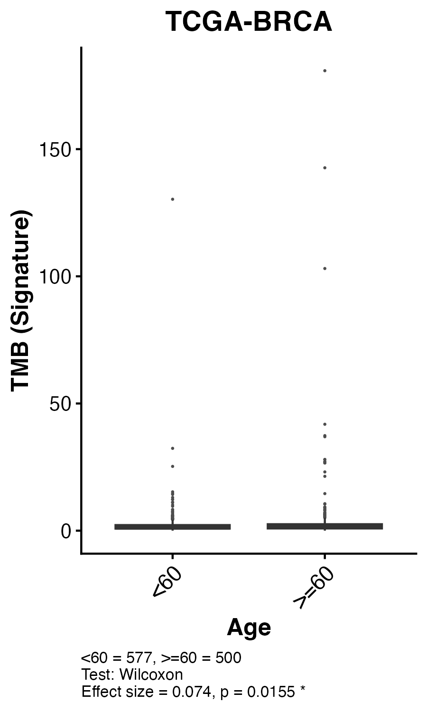

*Figure 60. Tumor mutational burden increases with patient age*

**Example 61: Age and TP53 mutation**
```r
result <- tcga_correlation(
  var1 = "Age", var1_modal = "Clinical", var1_cancers = "BRCA",
  var2 = "TP53", var2_modal = "Mutation", var2_cancers = "BRCA"
)
```

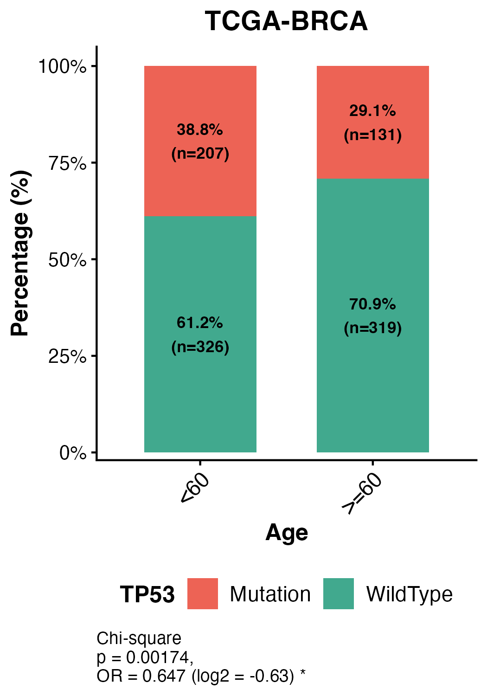

*Figure 61. TP53 mutation frequency across age groups*

**Example 62: Age and T cell infiltration**
```r
result <- tcga_correlation(
  var1 = "Age", var1_modal = "Clinical", var1_cancers = "BRCA",
  var2 = "T_cells_CD8", var2_modal = "ImmuneCell", var2_cancers = "BRCA"
)
```

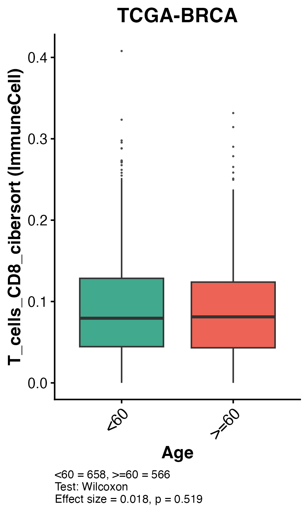

*Figure 62. CD8+ T cell infiltration decreases with age*

**Example 63: Age and methylation**
```r
result <- tcga_correlation(
  var1 = "Age", var1_modal = "Clinical", var1_cancers = "BRCA",
  var2 = "BRCA1", var2_modal = "Methylation", var2_cancers = "BRCA"
)
```

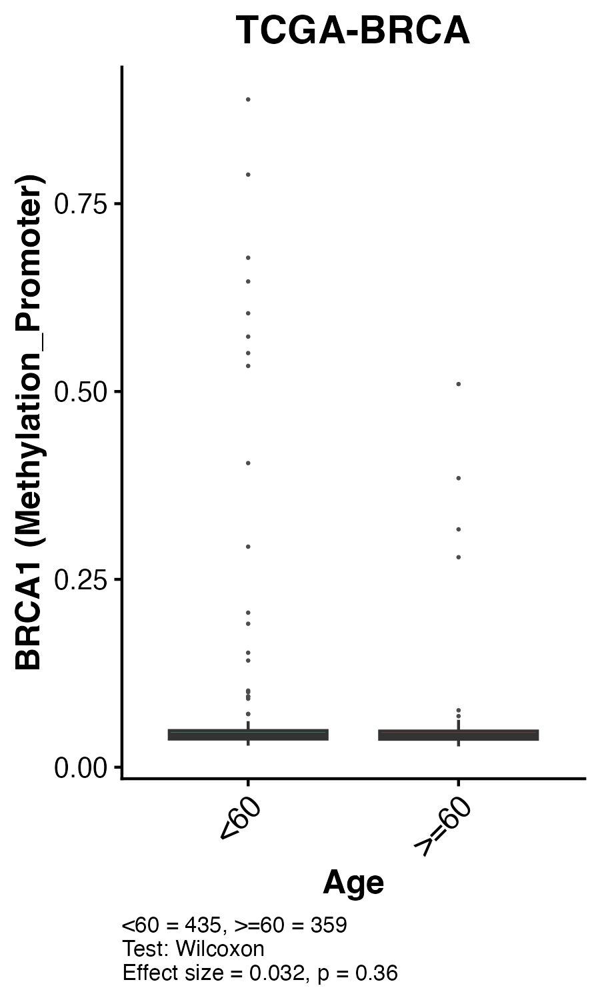

*Figure 63. BRCA1 methylation accumulates with age*

**Example 64: Age and miRNA expression**
```r
result <- tcga_correlation(
  var1 = "Age", var1_modal = "Clinical", var1_cancers = "BRCA",
  var2 = "hsa-let-7a-1", var2_modal = "miRNA", var2_cancers = "BRCA"
)
```

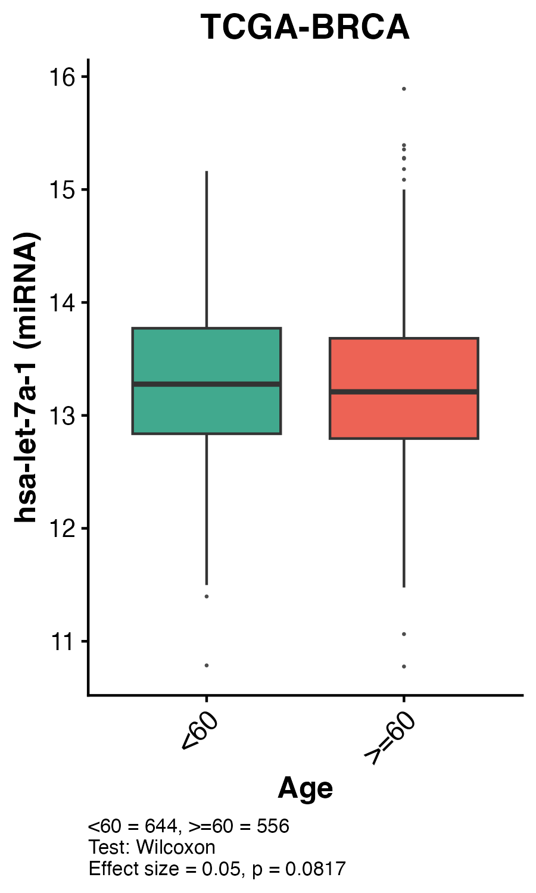

*Figure 64. let-7a expression changes with patient age*

**Example 65: Gender and gene expression**
```r
result <- tcga_correlation(
  var1 = "Gender", var1_modal = "Clinical", var1_cancers = "BRCA",
  var2 = "ESR1", var2_modal = "RNAseq", var2_cancers = "BRCA"
)
```

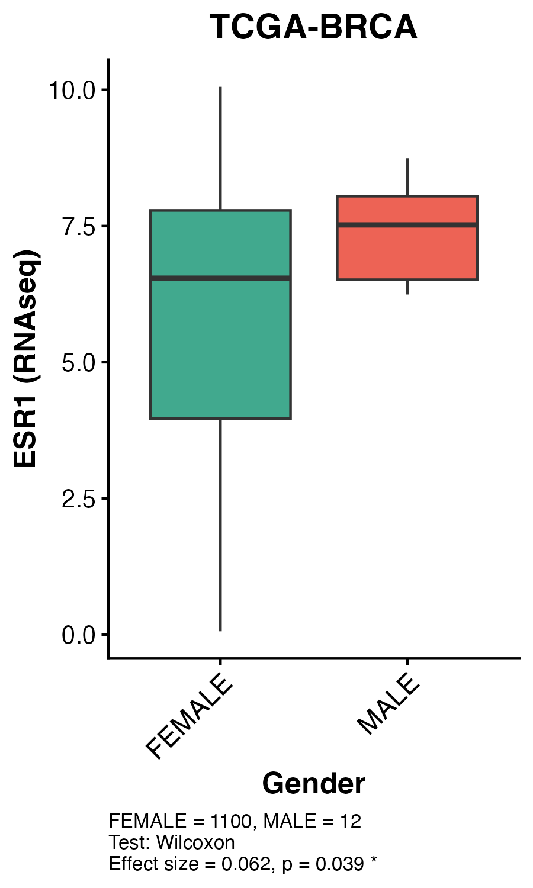

*Figure 65. ESR1 expression differences between male and female breast cancer*

**Example 66: Gender and TIL score**
```r
result <- tcga_correlation(
  var1 = "Gender", var1_modal = "Clinical", var1_cancers = "BRCA",
  var2 = "TIL_Score", var2_modal = "Signature", var2_cancers = "BRCA"
)
```

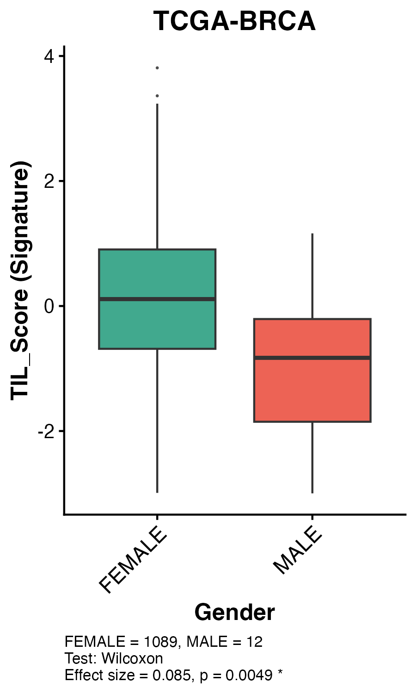

*Figure 66. Gender differences in tumor immune infiltration*

**Example 67: Gender and miRNA**
```r
result <- tcga_correlation(
  var1 = "Gender", var1_modal = "Clinical", var1_cancers = "BRCA",
  var2 = c("hsa-let-7a-1", "hsa-mir-21"), var2_modal = "miRNA",
  var2_cancers = "BRCA"
)
```

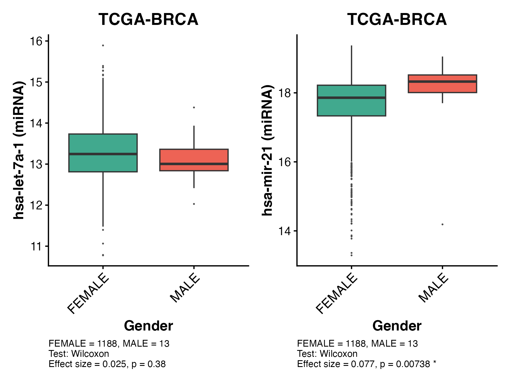

*Figure 67. miRNA expression patterns differ by gender*

**Example 68: Gender and methylation**
```r
result <- tcga_correlation(
  var1 = "Gender", var1_modal = "Clinical", var1_cancers = "COAD",
  var2 = "MLH1", var2_modal = "Methylation", var2_cancers = "COAD"
)
```

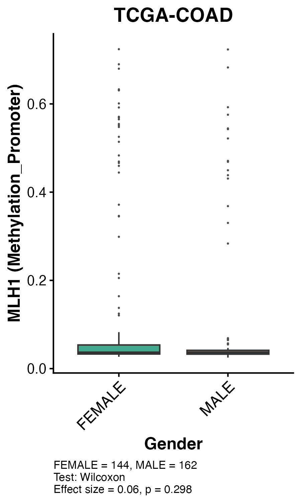

*Figure 68. MLH1 methylation shows gender-specific patterns in colon cancer*

**Example 69: ER status and ESR1 expression**
```r
result <- tcga_correlation(
  var1 = "ER", var1_modal = "Clinical", var1_cancers = "BRCA",
  var2 = "ESR1", var2_modal = "RNAseq", var2_cancers = "BRCA"
)
```

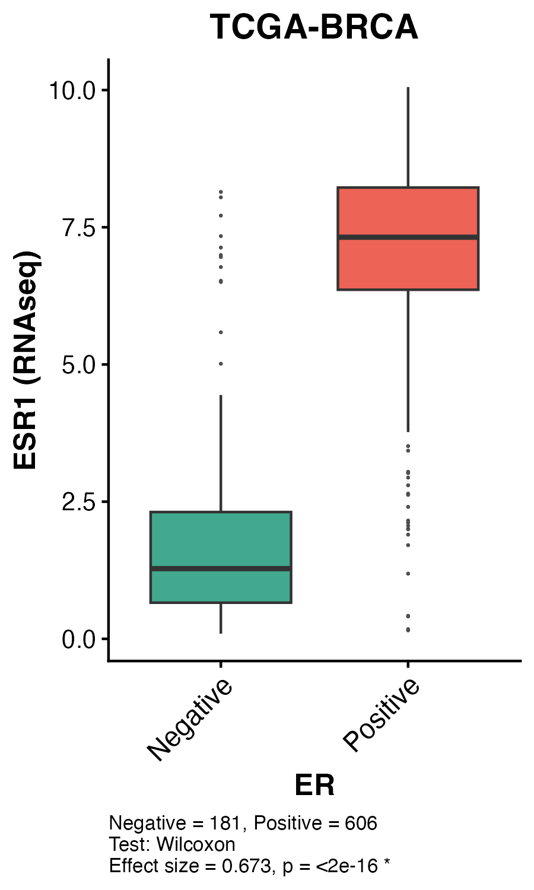

*Figure 69. Clinical ER status validated by ESR1 mRNA expression*

**Example 70: PR status and PGR expression**
```r
result <- tcga_correlation(
  var1 = "PR", var1_modal = "Clinical", var1_cancers = "BRCA",
  var2 = "PGR", var2_modal = "RNAseq", var2_cancers = "BRCA"
)
```

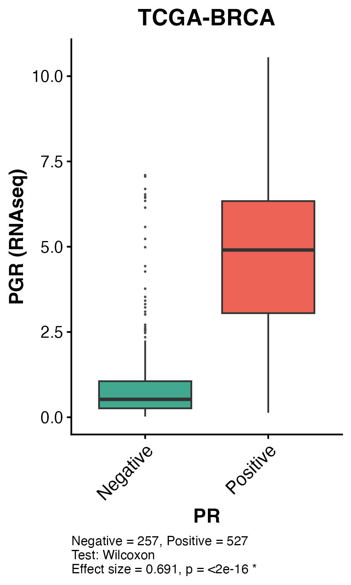

*Figure 70. PR status correlation with PGR mRNA levels*

**Example 71: HER2 status and ERBB2 expression**
```r
result <- tcga_correlation(
  var1 = "HER2", var1_modal = "Clinical", var1_cancers = "BRCA",
  var2 = "ERBB2", var2_modal = "RNAseq", var2_cancers = "BRCA"
)
```

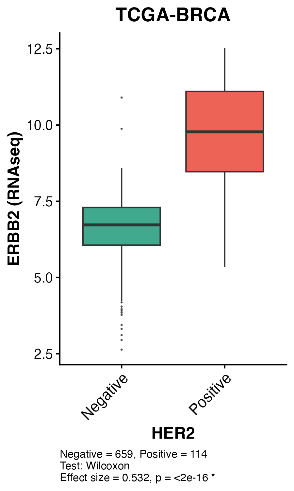

*Figure 71. HER2 IHC status validated by ERBB2 mRNA*

**Example 72: ER status and immune cells**
```r
result <- tcga_correlation(
  var1 = "ER", var1_modal = "Clinical", var1_cancers = "BRCA",
  var2 = "ALL_IMMUNE_CELLS", var2_modal = "ImmuneCell", var2_cancers = "BRCA"
)
```

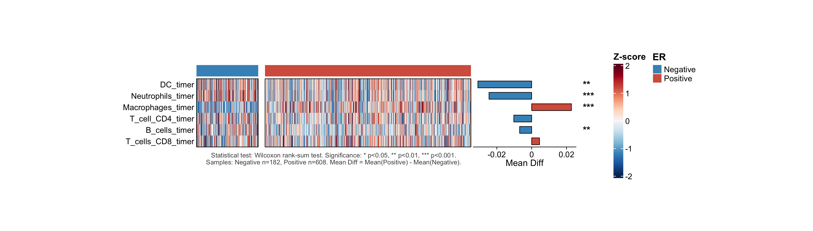

*Figure 72. ER-negative tumors show higher immune infiltration*

**Example 73: ER status and IFN-gamma signature**
```r
result <- tcga_correlation(
  var1 = "ER", var1_modal = "Clinical", var1_cancers = "BRCA",
  var2 = "IFN_Gamma", var2_modal = "Signature", var2_cancers = "BRCA"
)
```

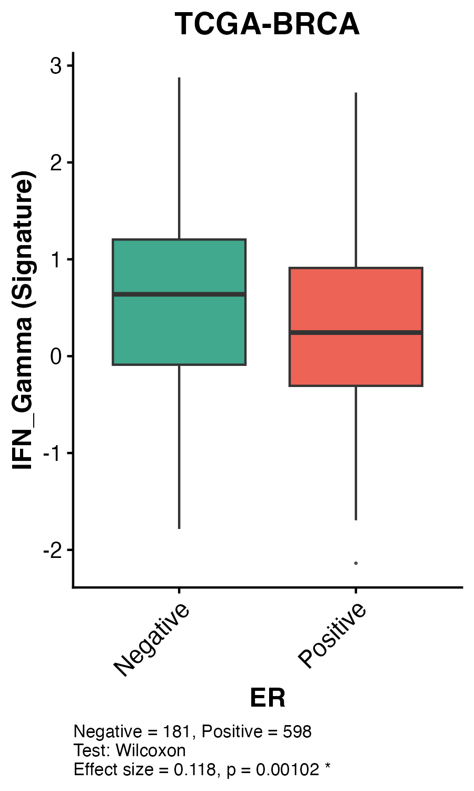

*Figure 73. ER-negative tumors have elevated IFN-gamma response*

**Example 74: Clinical-clinical associations (chi-square)**
```r
result <- tcga_correlation(
  var1 = "ER", var1_modal = "Clinical", var1_cancers = "BRCA",
  var2 = "PR", var2_modal = "Clinical", var2_cancers = "BRCA"
)
```

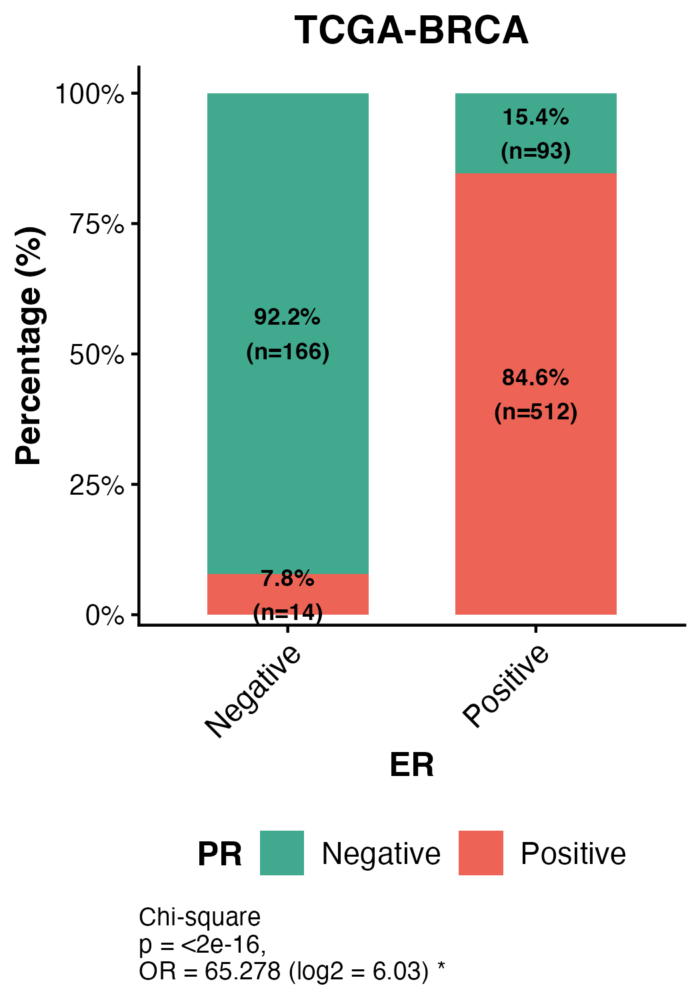

*Figure 74. ER and PR status are highly concordant (Chi-square p<0.001)*

**Example 75: ER-HER2 clinical associations**
```r
result <- tcga_correlation(
  var1 = "ER", var1_modal = "Clinical", var1_cancers = "BRCA",
  var2 = "HER2", var2_modal = "Clinical", var2_cancers = "BRCA"
)
```

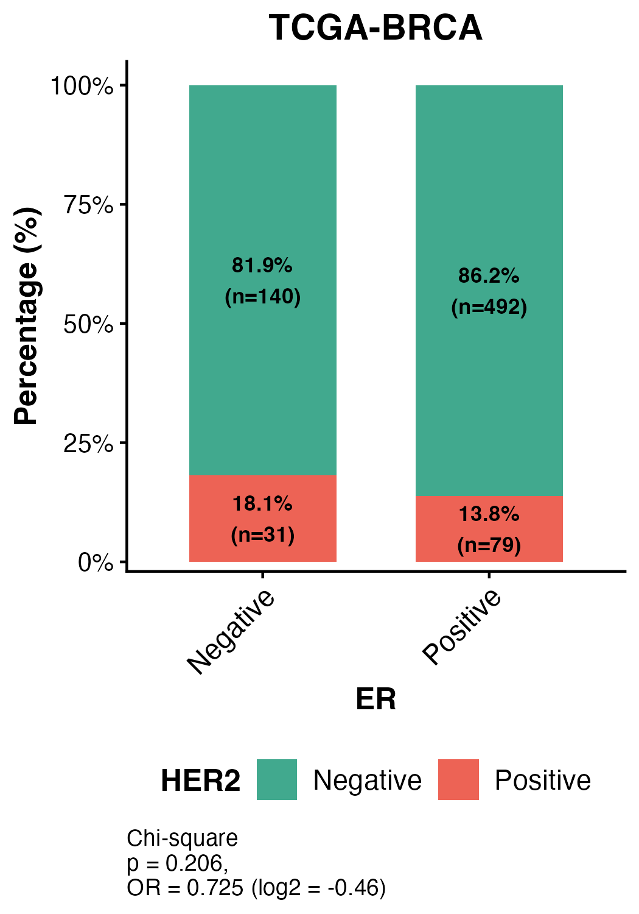

*Figure 75. ER and HER2 status define breast cancer subtypes*

**Example 76: Age and gender distribution**
```r
result <- tcga_correlation(
  var1 = "Age", var1_modal = "Clinical", var1_cancers = "BRCA",
  var2 = "Gender", var2_modal = "Clinical", var2_cancers = "BRCA"
)
```

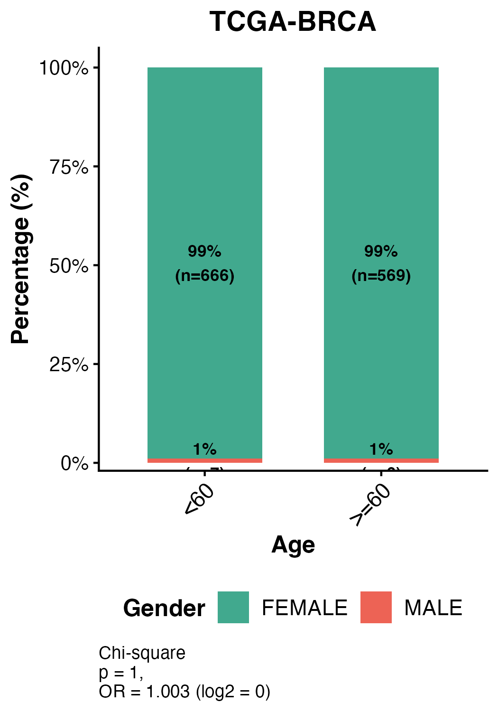

*Figure 76. Age distribution by gender in breast cancer*

**Example 77: Gender distribution across cancer types**
```r
result <- tcga_correlation(
  var1 = "Gender", var1_modal = "Clinical", var1_cancers = "HNSC",
  var2 = "Race", var2_modal = "Clinical", var2_cancers = "HNSC"
)
```

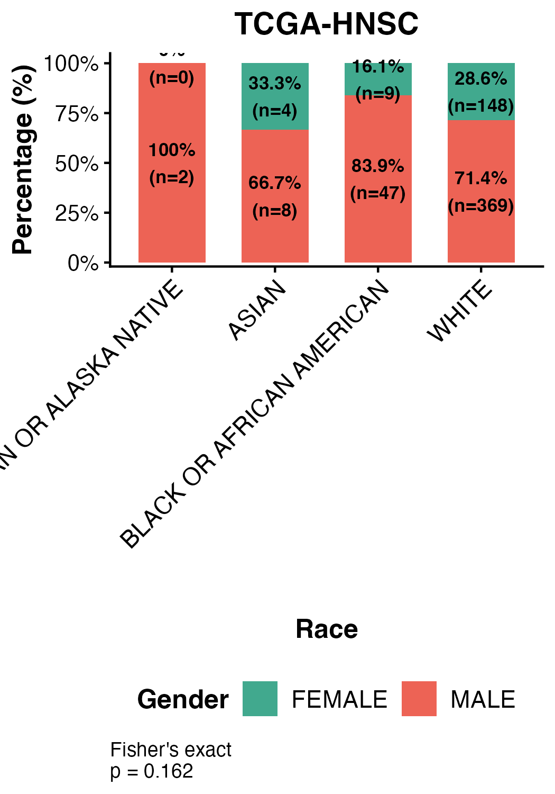

*Figure 77. Gender and racial distribution in head and neck cancer*

**Example 78: Vital status and tumor purity**
```r
result <- tcga_correlation(
  var1 = "VitalStatus", var1_modal = "Clinical", var1_cancers = "BRCA",
  var2 = "Purity", var2_modal = "Signature", var2_cancers = "BRCA"
)
```

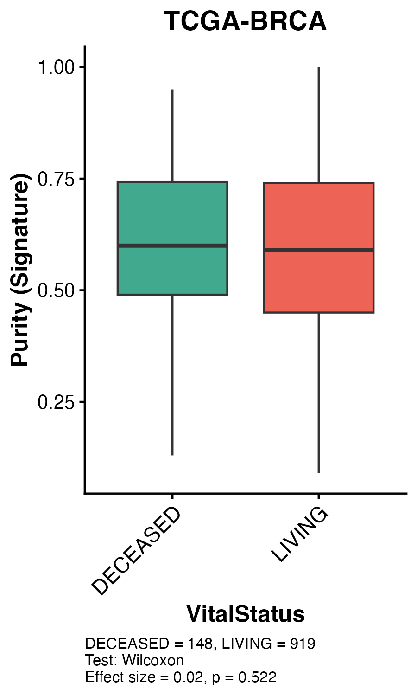

*Figure 78. Tumor purity correlates with patient outcome*

#### Scenario 8: Multi-Variable Complex Analysis

**Example 79: Multiple genes correlation matrix**
```r
result <- tcga_correlation(
  var1 = c("TP53", "ESR1", "ERBB2"), var1_modal = "RNAseq",
  var1_cancers = "BRCA",
  var2 = c("PGR", "AR", "GATA3"), var2_modal = "RNAseq",
  var2_cancers = "BRCA"
)
```

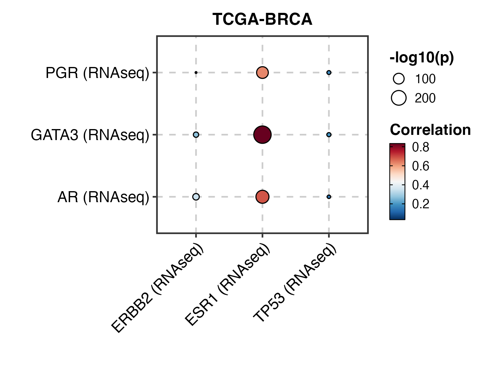

*Figure 79. Breast cancer gene expression correlation matrix*

**Example 80: Multiple CNV correlation**
```r
result <- tcga_correlation(
  var1 = c("MYC", "ERBB2", "CCND1"), var1_modal = "CNV",
  var1_cancers = "BRCA",
  var2 = c("MYC", "ERBB2", "CCND1"), var2_modal = "RNAseq",
  var2_cancers = "BRCA"
)
```

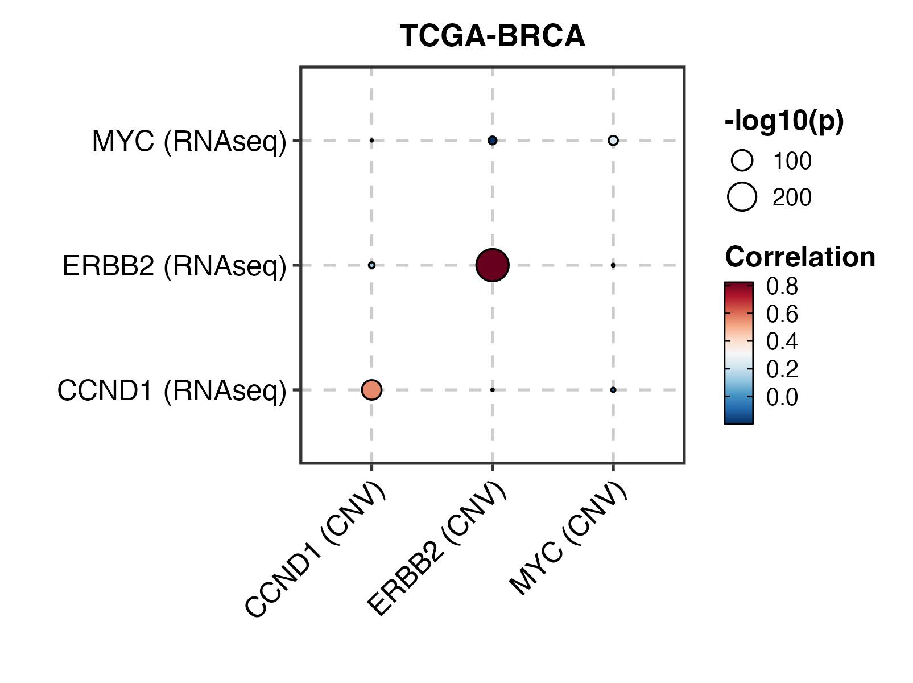

*Figure 80. Systematic CNV-expression correlation for oncogenes*

**Example 81: Multiple methylation-expression pairs**
```r
result <- tcga_correlation(
  var1 = c("TP53", "ESR1", "PGR"), var1_modal = "Methylation",
  var1_cancers = "BRCA",
  var2 = c("TP53", "ESR1", "PGR"), var2_modal = "RNAseq",
  var2_cancers = "BRCA"
)
```

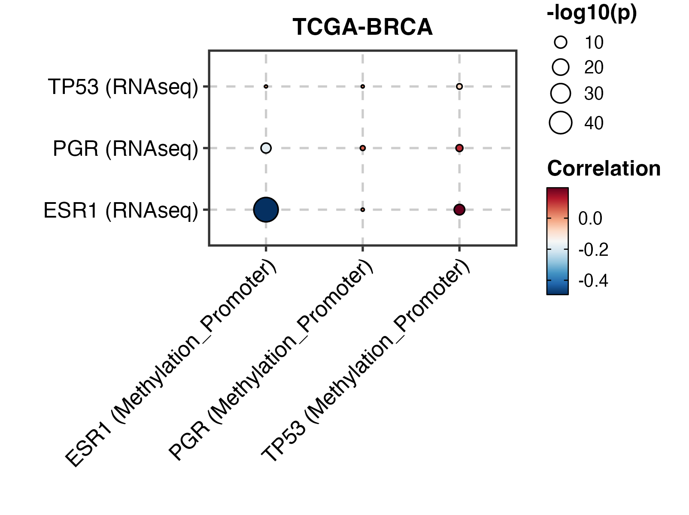

*Figure 81. Epigenetic regulation of key breast cancer genes*

**Example 82: Multiple clinical variables vs gene expression**
```r
result <- tcga_correlation(
  var1 = c("Age", "Gender", "Race"), var1_modal = "Clinical",
  var1_cancers = "BRCA",
  var2 = "TP53", var2_modal = "RNAseq", var2_cancers = "BRCA"
)
```


*Figure 82. TP53 expression across demographic variables*

**Example 83: Multiple clinical vs multiple genes**
```r
result <- tcga_correlation(
  var1 = c("TP53", "ESR1"), var1_modal = "RNAseq", var1_cancers = "BRCA",
  var2 = c("Age", "Gender", "Race"), var2_modal = "Clinical", var2_cancers = "BRCA"
)
```

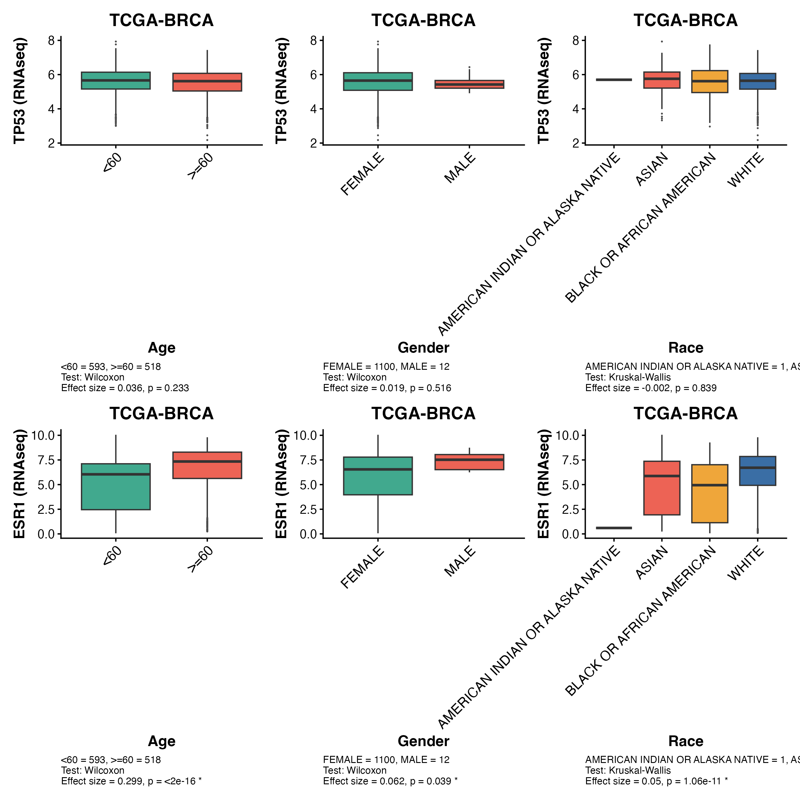

*Figure 83. Gene expression patterns across clinical variables*

**Example 84: Four clinical variables vs gene**
```r
result <- tcga_correlation(
  var1 = c("Age", "Gender", "Race", "BMI"), var1_modal = "Clinical",
  var1_cancers = "BRCA",
  var2 = "TP53", var2_modal = "RNAseq", var2_cancers = "BRCA"
)
```

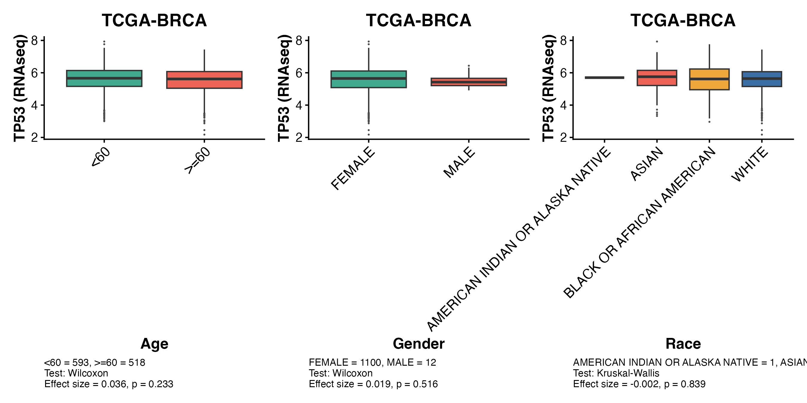

*Figure 84. Comprehensive clinical association with TP53 expression*

**Example 85: ER-PR-HER2 trinity vs gene expression**
```r
result <- tcga_correlation(
  var1 = c("ER", "PR", "HER2"), var1_modal = "Clinical", var1_cancers = "BRCA",
  var2 = c("ESR1", "PGR", "ERBB2"), var2_modal = "RNAseq", var2_cancers = "BRCA"
)
```

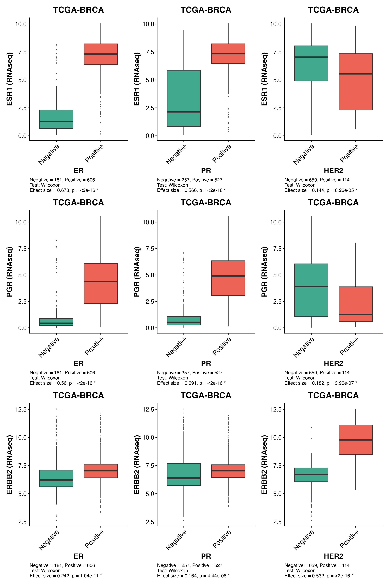

*Figure 85. Clinical IHC status vs mRNA expression for breast cancer biomarkers*

#### Multi-Cancer Analysis

**Example 86: Pan-cancer age-TP53 correlation**
```r
result <- tcga_correlation(
  var1 = "Age", var1_modal = "Clinical",
  var1_cancers = c("BRCA", "LUAD", "COAD"),
  var2 = "TP53", var2_modal = "RNAseq",
  var2_cancers = c("BRCA", "LUAD", "COAD")
)
```

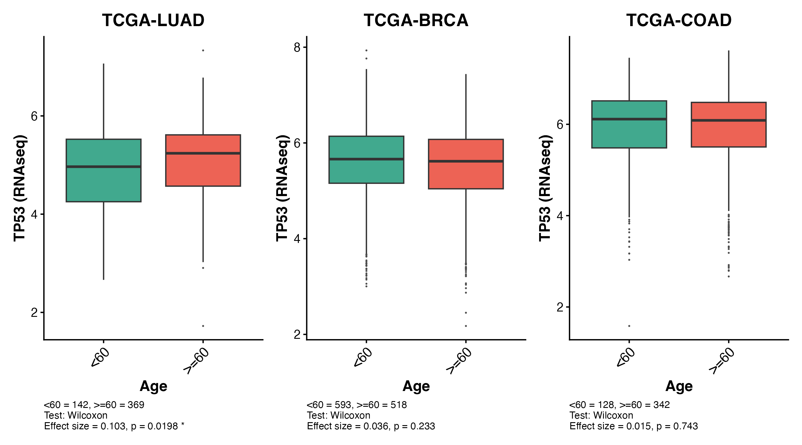

*Figure 86. Age-TP53 relationship across three major cancer types*

**Example 87: Pan-cancer gender-TIL correlation**
```r
result <- tcga_correlation(
  var1 = "Gender", var1_modal = "Clinical",
  var1_cancers = c("BRCA", "LUAD", "HNSC"),
  var2 = "TIL_Score", var2_modal = "Signature",
  var2_cancers = c("BRCA", "LUAD", "HNSC")
)
```

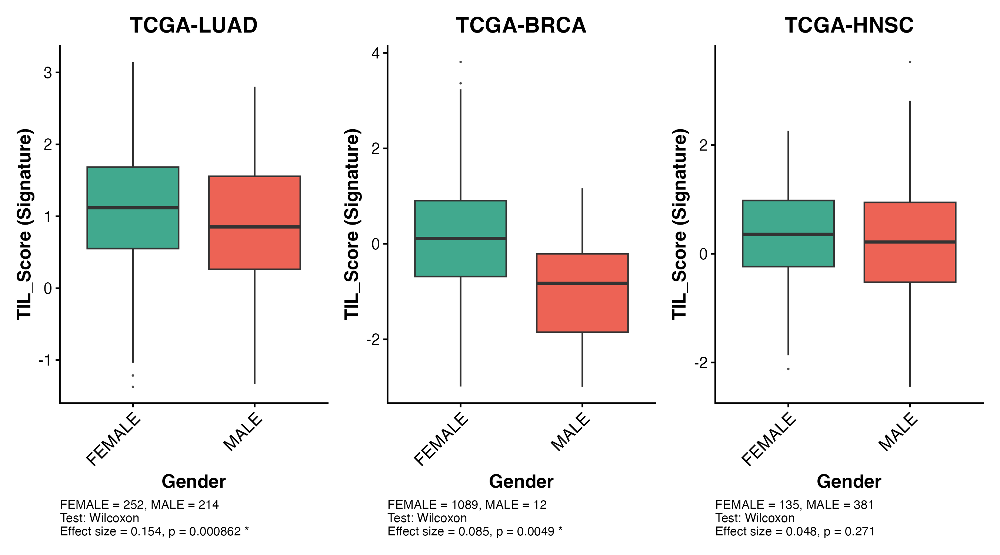

*Figure 87. Gender differences in immune infiltration across cancers*

**Example 88: Pan-cancer stage-TMB correlation**
```r
result <- tcga_correlation(
  var1 = "Stage", var1_modal = "Clinical",
  var1_cancers = c("LUAD", "COAD", "KIRC"),
  var2 = "TMB", var2_modal = "Signature",
  var2_cancers = c("LUAD", "COAD", "KIRC")
)
```

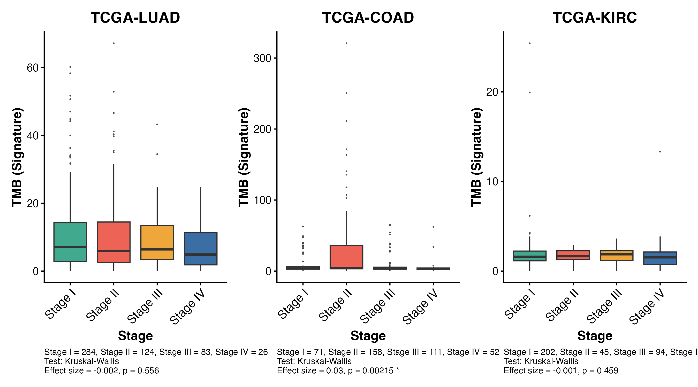

*Figure 88. TMB increases with stage in multiple cancer types*

#### Molecular Subtype Analysis

**Example 89: BRCA subtypes - ESR1 vs PGR**
```r
result <- tcga_correlation(
  var1 = "ESR1", var1_modal = "RNAseq",
  var1_cancers = c("BRCA_IDC", "BRCA_ILC", "BRCA_TNBC"),
  var2 = "PGR", var2_modal = "RNAseq",
  var2_cancers = c("BRCA_IDC", "BRCA_ILC", "BRCA_TNBC")
)
```

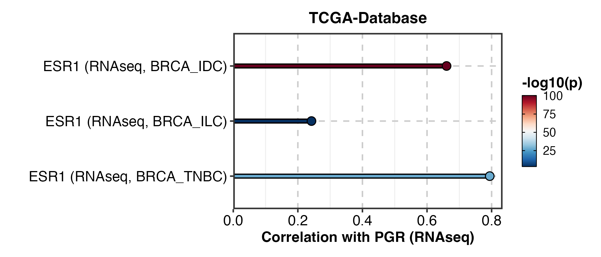

*Figure 89. ESR1-PGR correlation across breast cancer molecular subtypes*

**Example 90: BRCA subtypes - ESR1 vs purity**
```r
result <- tcga_correlation(
  var1 = "ESR1", var1_modal = "RNAseq",
  var1_cancers = c("BRCA_IDC", "BRCA_ILC", "BRCA_TNBC"),
  var2 = "Purity", var2_modal = "Signature",
  var2_cancers = c("BRCA_IDC", "BRCA_ILC", "BRCA_TNBC")
)
```

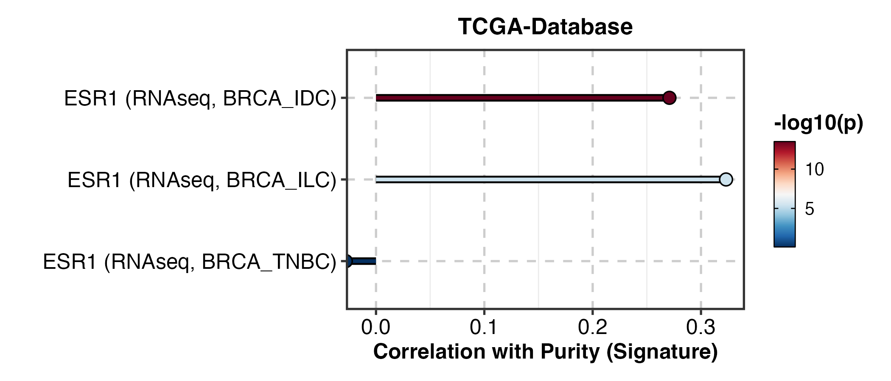

*Figure 90. Hormone receptor status and tumor purity across subtypes*

**Example 91: BRCA subtypes - PIK3CA mutation vs purity**
```r
result <- tcga_correlation(
  var1 = "PIK3CA", var1_modal = "Mutation",
  var1_cancers = c("BRCA_IDC", "BRCA_ILC", "BRCA_TNBC"),
  var2 = "Purity", var2_modal = "Signature",
  var2_cancers = c("BRCA_IDC", "BRCA_ILC", "BRCA_TNBC")
)
```

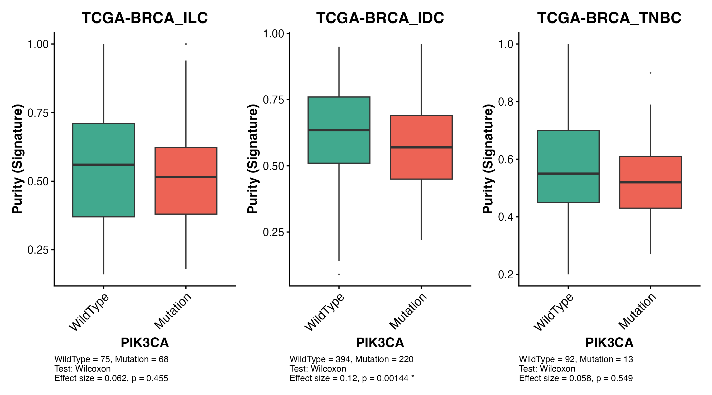

*Figure 91. PIK3CA mutation frequency and tumor characteristics by subtype*

**Example 92: BRCA subtypes - stage vs immune cells**
```r
result <- tcga_correlation(
  var1 = "Stage", var1_modal = "Clinical",
  var1_cancers = c("BRCA_IDC", "BRCA_ILC", "BRCA_TNBC"),
  var2 = c("T_cells_CD8", "Macrophages_M1"), var2_modal = "ImmuneCell",
  var2_cancers = c("BRCA_IDC", "BRCA_ILC", "BRCA_TNBC")
)
```

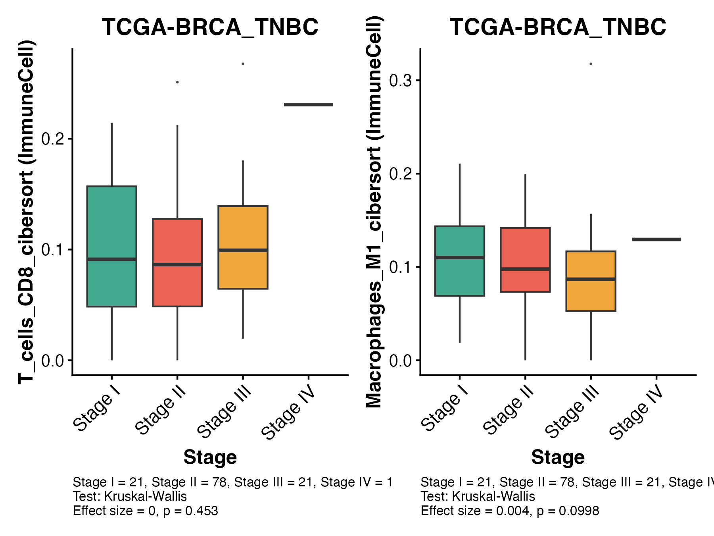

*Figure 92. Immune infiltration across stages in breast cancer subtypes*

**Example 93: BRCA subtypes - TP53 mutation vs TMB**
```r
result <- tcga_correlation(
  var1 = "TP53", var1_modal = "Mutation",
  var1_cancers = c("BRCA_IDC", "BRCA_ILC", "BRCA_TNBC"),
  var2 = "TMB", var2_modal = "Signature",
  var2_cancers = c("BRCA_IDC", "BRCA_ILC", "BRCA_TNBC")
)
```

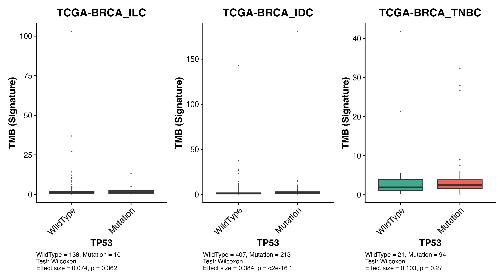

*Figure 93. TP53 mutation drives TMB across breast cancer subtypes*

**Example 94: BRCA subtypes - TP53 mutation vs immune cells**
```r
result <- tcga_correlation(
  var1 = "TP53", var1_modal = "Mutation",
  var1_cancers = c("BRCA_IDC", "BRCA_ILC", "BRCA_TNBC"),
  var2 = "ALL_IMMUNE_CELLS", var2_modal = "ImmuneCell",
  var2_cancers = c("BRCA_IDC", "BRCA_ILC", "BRCA_TNBC")
)
```


*Figure 94. Comprehensive immune landscape in TP53-mutant tumors by subtype*

**Example 95: BRCA subtypes - TMB vs purity**
```r
result <- tcga_correlation(
  var1 = "TMB", var1_modal = "Signature",
  var1_cancers = c("BRCA_IDC", "BRCA_ILC", "BRCA_TNBC"),
  var2 = "Purity", var2_modal = "Signature",
  var2_cancers = c("BRCA_IDC", "BRCA_ILC", "BRCA_TNBC")
)
```

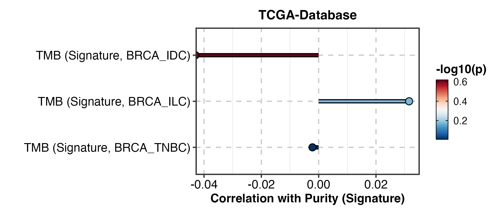

*Figure 95. TMB-purity relationship varies across breast cancer subtypes*

**Example 96: BRCA subtypes - ERBB2 CNV vs TIL score**
```r
result <- tcga_correlation(
  var1 = "ERBB2", var1_modal = "CNV",
  var1_cancers = c("BRCA_IDC", "BRCA_ILC", "BRCA_TNBC"),
  var2 = "TIL_Score", var2_modal = "Signature",
  var2_cancers = c("BRCA_IDC", "BRCA_ILC", "BRCA_TNBC")
)
```

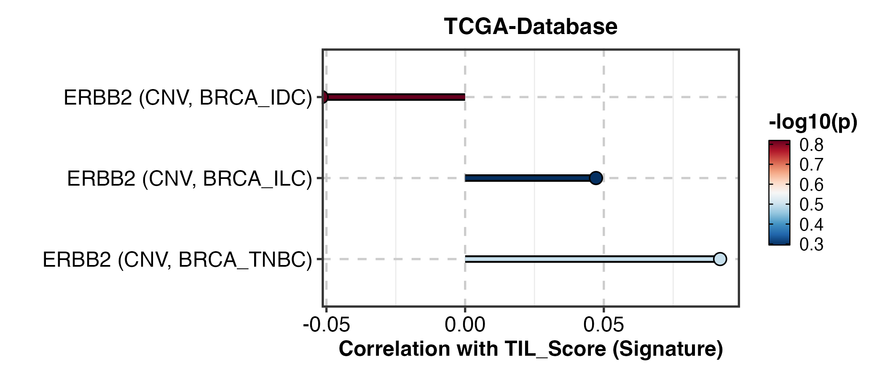

*Figure 96. ERBB2 amplification correlates with immune infiltration*

**Example 97: IDC subtype-specific analysis**
```r
result <- tcga_correlation(
  var1 = "TP53", var1_modal = "RNAseq", var1_cancers = "BRCA_IDC",
  var2 = "TMB", var2_modal = "Signature", var2_cancers = "BRCA_IDC"
)
```

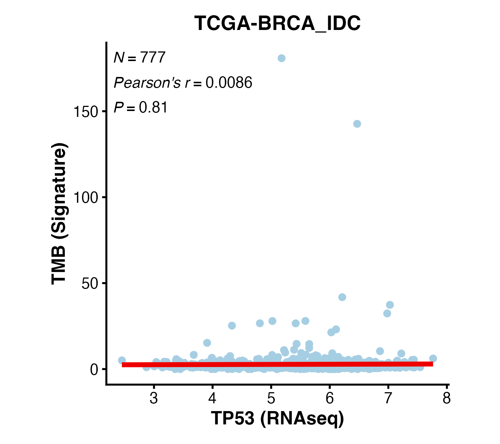

*Figure 97. TP53 expression-TMB correlation in invasive ductal carcinoma*

**Example 98: TNBC subtype-specific analysis**
```r
result <- tcga_correlation(
  var1 = "TP53", var1_modal = "RNAseq", var1_cancers = "BRCA_TNBC",
  var2 = "TMB", var2_modal = "Signature", var2_cancers = "BRCA_TNBC"
)
```

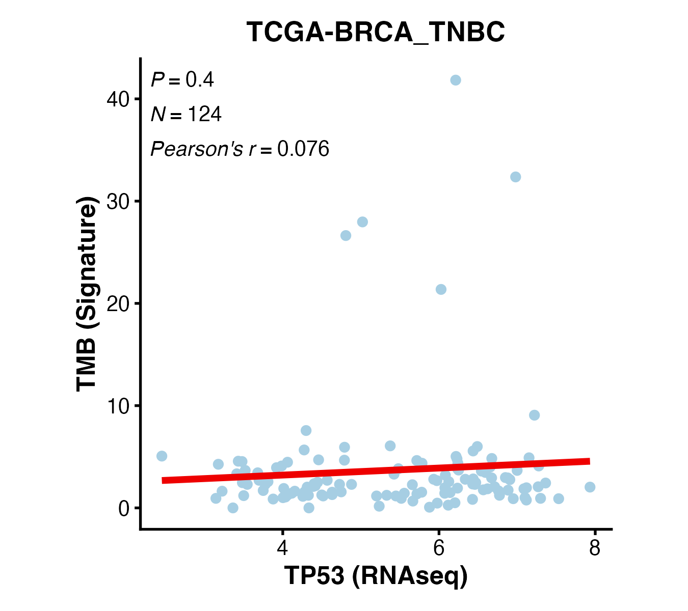

*Figure 98. TP53-TMB relationship in triple-negative breast cancer*

**Example 99: ILC subtype-specific analysis**
```r
result <- tcga_correlation(
  var1 = "TP53", var1_modal = "RNAseq", var1_cancers = "BRCA_ILC",
  var2 = "TMB", var2_modal = "Signature", var2_cancers = "BRCA_ILC"
)
```

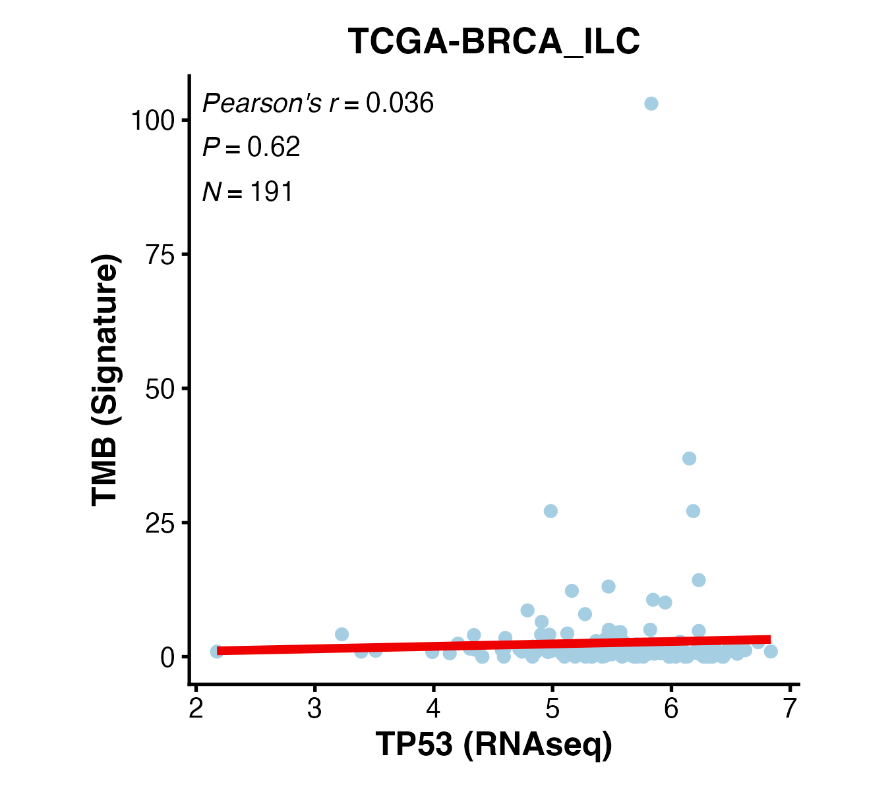

*Figure 99. TP53-TMB dynamics in invasive lobular carcinoma*

**Example 100: COAD subtypes - stage vs TIL score**
```r
result <- tcga_correlation(
  var1 = "Stage", var1_modal = "Clinical",
  var1_cancers = c("COAD_LCC", "COAD_MAC"),
  var2 = "TIL_Score", var2_modal = "Signature",
  var2_cancers = c("COAD_LCC", "COAD_MAC")
)
```

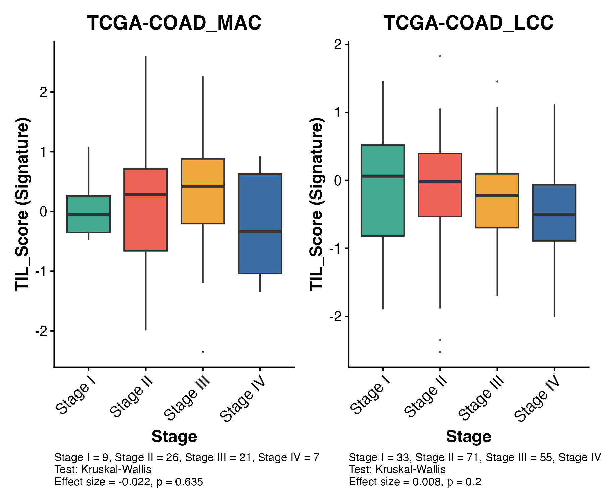

*Figure 100. Stage-immune infiltration across colon cancer anatomical subtypes*

**Example 101: COAD subtypes - KRAS mutation vs MSI**
```r
result <- tcga_correlation(
  var1 = "KRAS", var1_modal = "Mutation",
  var1_cancers = c("COAD_LCC", "COAD_RCC", "COAD_MAC"),
  var2 = "MSI", var2_modal = "Signature",
  var2_cancers = c("COAD_LCC", "COAD_RCC", "COAD_MAC")
)
```

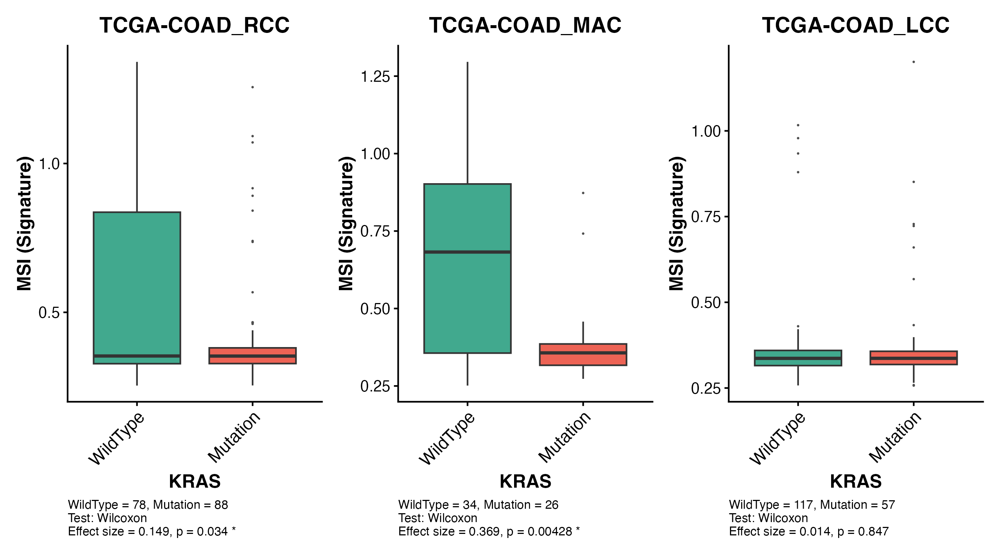

*Figure 101. KRAS mutation and MSI status across colon cancer locations*

**Example 102: COAD subtypes - APC mutation vs stemness**
```r
result <- tcga_correlation(
  var1 = "APC", var1_modal = "Mutation",
  var1_cancers = c("COAD_LCC", "COAD_RCC"),
  var2 = "Stemness", var2_modal = "Signature",
  var2_cancers = c("COAD_LCC", "COAD_RCC")
)
```

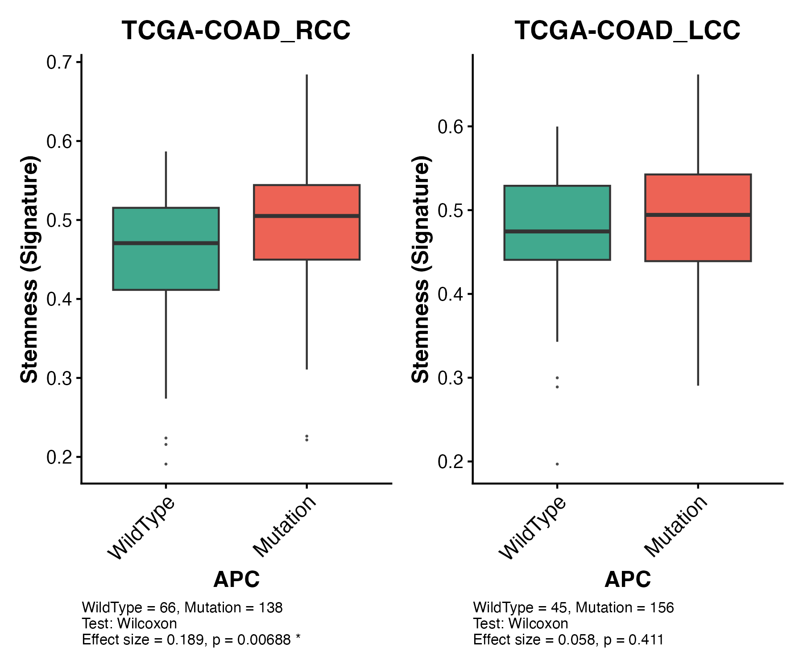

*Figure 102. APC mutation correlates with cancer stemness by tumor location*

**Example 103: COAD subtypes - TIL score vs stemness**
```r
result <- tcga_correlation(
  var1 = "TIL_Score", var1_modal = "Signature",
  var1_cancers = c("COAD_LCC", "COAD_RCC"),
  var2 = "Stemness", var2_modal = "Signature",
  var2_cancers = c("COAD_LCC", "COAD_RCC")
)
```

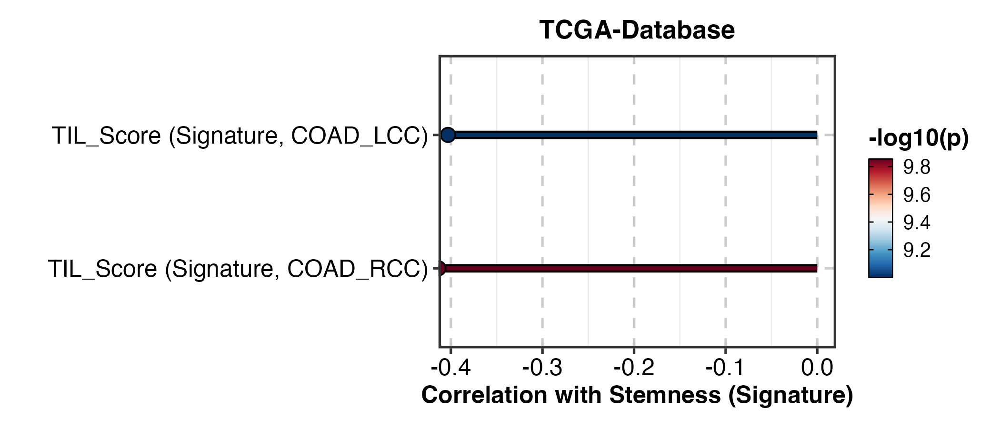

*Figure 103. Inverse correlation between immune infiltration and stemness*

**Example 104: ESCA subtypes - TP53 mutation vs TMB**
```r
result <- tcga_correlation(
  var1 = "TP53", var1_modal = "Mutation",
  var1_cancers = c("ESCA_ESCC", "ESCA_EAC"),
  var2 = "TMB", var2_modal = "Signature",
  var2_cancers = c("ESCA_ESCC", "ESCA_EAC")
)
```

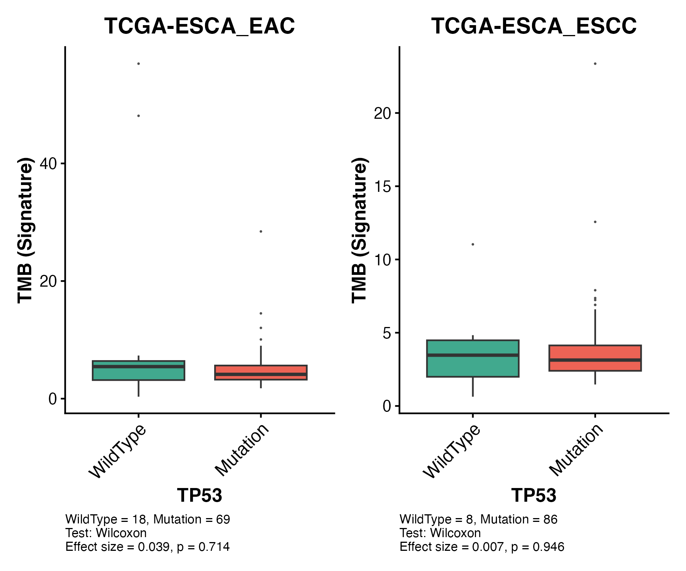

*Figure 104. TP53 mutation and TMB in esophageal cancer histological subtypes*

**Example 105: ESCA subtypes - CDKN2A vs purity**
```r
result <- tcga_correlation(
  var1 = "CDKN2A", var1_modal = "RNAseq",
  var1_cancers = c("ESCA_ESCC", "ESCA_EAC"),
  var2 = "Purity", var2_modal = "Signature",
  var2_cancers = c("ESCA_ESCC", "ESCA_EAC")
)
```

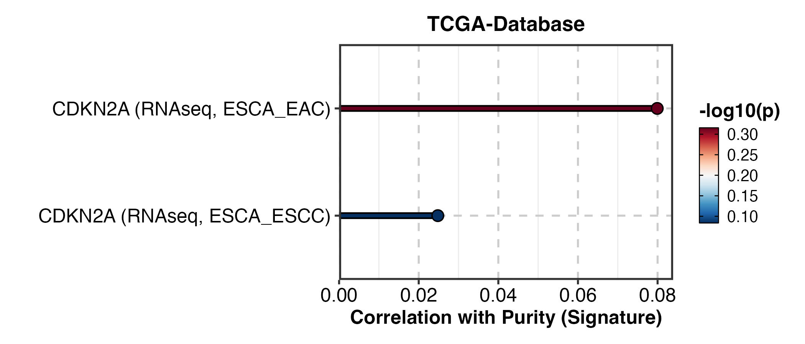

*Figure 105. CDKN2A expression patterns across esophageal cancer subtypes*

**Example 106: LGG subtypes - IDH1 mutation vs stemness**
```r
result <- tcga_correlation(
  var1 = "IDH1", var1_modal = "Mutation",
  var1_cancers = c("LGG_ASTROCYTOMA", "LGG_OLIGODENDROGLIOMA"),
  var2 = "Stemness", var2_modal = "Signature",
  var2_cancers = c("LGG_ASTROCYTOMA", "LGG_OLIGODENDROGLIOMA")
)
```

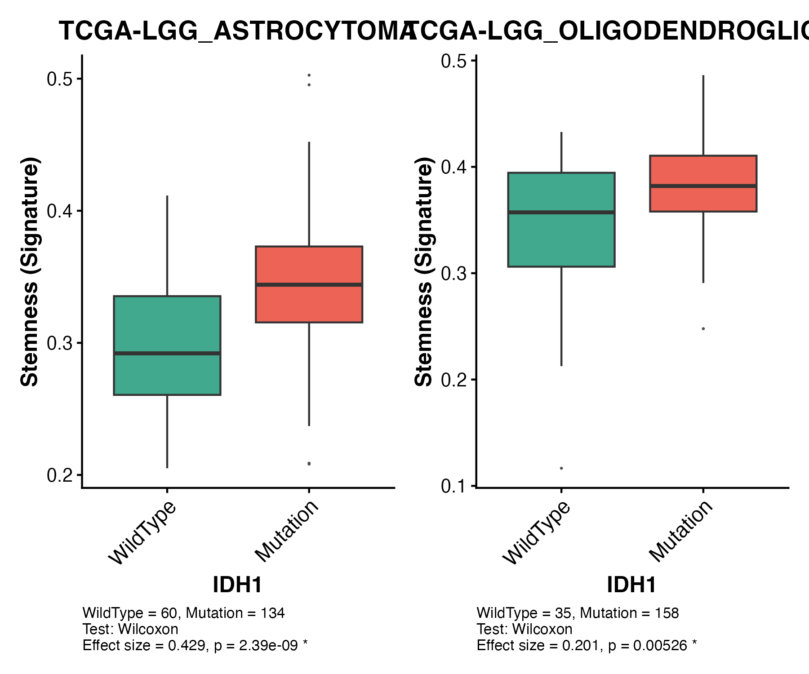

*Figure 106. IDH1 mutation and stemness across glioma histological types*

**Example 107: LGG subtypes - TP53 vs TIL score**
```r
result <- tcga_correlation(
  var1 = "TP53", var1_modal = "RNAseq",
  var1_cancers = c("LGG_ASTROCYTOMA", "LGG_OLIGOASTROCYTOMA"),
  var2 = "TIL_Score", var2_modal = "Signature",
  var2_cancers = c("LGG_ASTROCYTOMA", "LGG_OLIGOASTROCYTOMA")
)
```

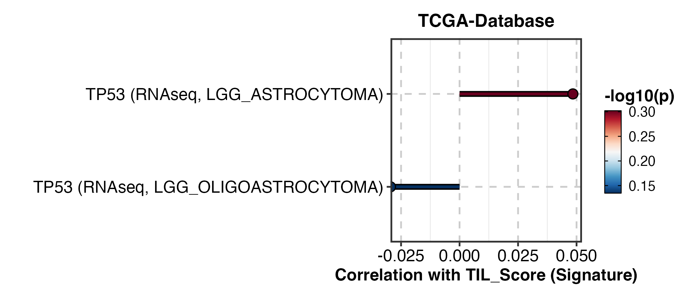

*Figure 107. TP53 expression and immune infiltration in glioma subtypes*

---

### Enrichment Analysis (Scenarios 8-15)

#### Scenario 8-9: Mutation-Driven Pathway Analysis

**Example 108: TP53 mutation genome-wide scan**
```r
result <- tcga_enrichment(
  var1 = "TP53",
  var1_modal = "Mutation",
  var1_cancers = "BRCA",
  analysis_type = "genome",
  genome_modal = "RNAseq",
  top_n = 50
)
```

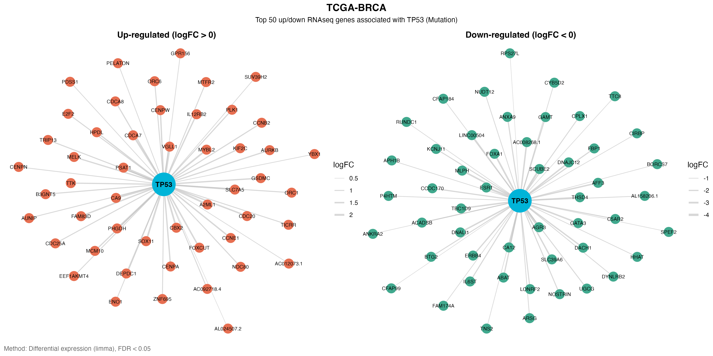

*Figure 108. Network visualization of top 50 up/down-regulated genes in TP53-mutant tumors*

**Example 109: TP53 mutation pathway enrichment**
```r
result <- tcga_enrichment(
  var1 = "TP53",
  var1_modal = "Mutation",
  var1_cancers = "BRCA",
  analysis_type = "enrichment",
  enrich_database = "MsigDB",
  msigdb_category = "H",
  top_n = 20
)
```

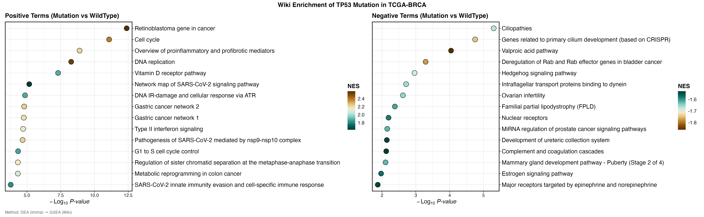

*Figure 109. Hallmark pathway enrichment in TP53-mutant breast cancer*

**Example 110: KRAS mutation genome scan in lung cancer**
```r
result <- tcga_enrichment(
  var1 = "KRAS",
  var1_modal = "Mutation",
  var1_cancers = "LUAD",
  analysis_type = "genome",
  genome_modal = "RNAseq",
  top_n = 50
)
```

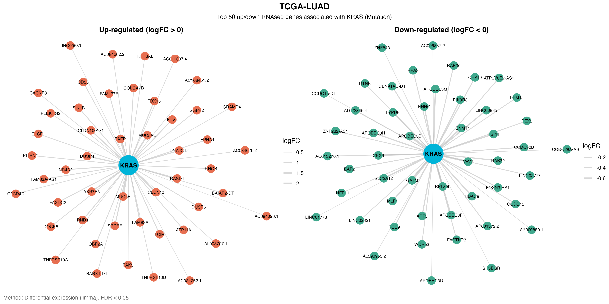

*Figure 110. KRAS mutation-driven transcriptomic changes in lung adenocarcinoma*

**Example 111: KRAS mutation pathway enrichment**
```r
result <- tcga_enrichment(
  var1 = "KRAS",
  var1_modal = "Mutation",
  var1_cancers = "LUAD",
  analysis_type = "enrichment",
  enrich_database = "MsigDB",
  msigdb_category = "H",
  top_n = 20
)
```

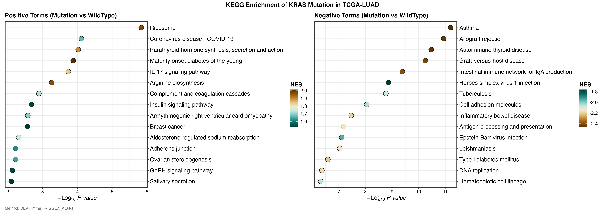

*Figure 111. MAPK and metabolic pathway activation in KRAS-mutant lung cancer*

**Example 112: EGFR mutation pathway analysis**
```r
result <- tcga_enrichment(
  var1 = "EGFR",
  var1_modal = "Mutation",
  var1_cancers = "LUAD",
  analysis_type = "enrichment",
  enrich_database = "MsigDB",
  msigdb_category = "H",
  top_n = 20
)
```

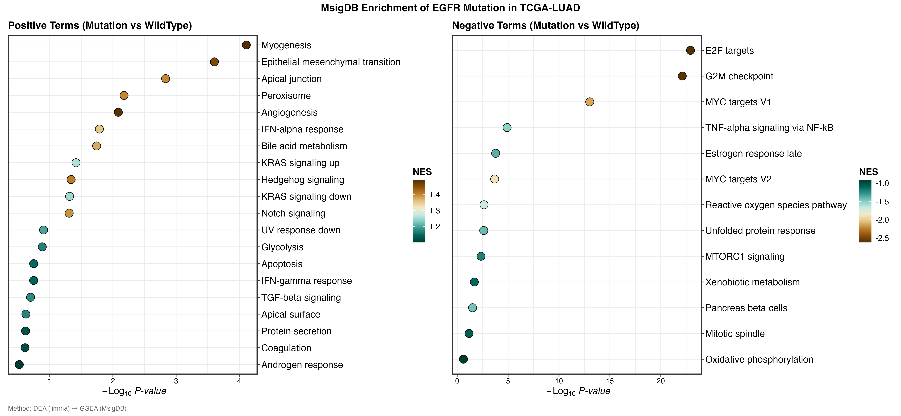

*Figure 112. EGFR mutation activates distinct pathways from KRAS*

**Example 113: PIK3CA mutation pathway enrichment**
```r
result <- tcga_enrichment(
  var1 = "PIK3CA",
  var1_modal = "Mutation",
  var1_cancers = "UCEC",
  analysis_type = "enrichment",
  enrich_database = "MsigDB",
  msigdb_category = "H",
  top_n = 20
)
```

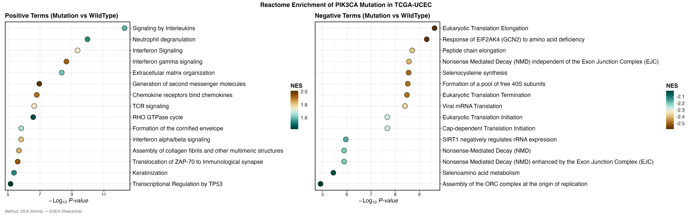

*Figure 113. PI3K-AKT pathway activation in PIK3CA-mutant endometrial cancer*

**Example 114: BRAF mutation enrichment in melanoma**
```r
result <- tcga_enrichment(
  var1 = "BRAF",
  var1_modal = "Mutation",
  var1_cancers = "SKCM",
  analysis_type = "genome",
  genome_modal = "RNAseq",
  top_n = 50
)
```

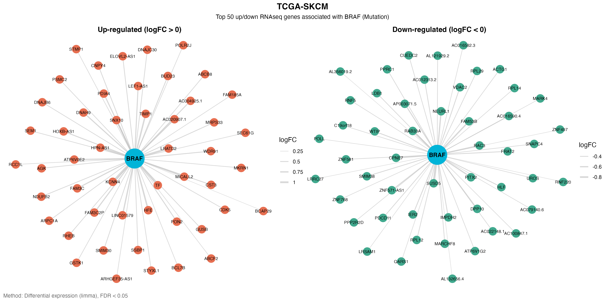

*Figure 114. BRAF V600E mutation transcriptomic signature in melanoma*

**Example 115: BRAF mutation pathway analysis**
```r
result <- tcga_enrichment(
  var1 = "BRAF",
  var1_modal = "Mutation",
  var1_cancers = "SKCM",
  analysis_type = "enrichment",
  enrich_database = "MsigDB",
  msigdb_category = "H",
  top_n = 20
)
```

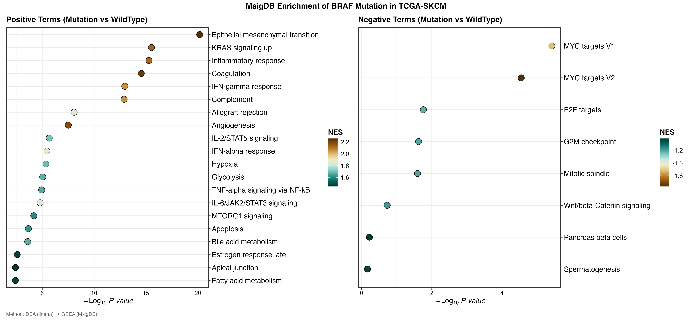

*Figure 115. MAPK pathway hyperactivation in BRAF-mutant melanoma*

**Example 116: VHL mutation pathway analysis**
```r
result <- tcga_enrichment(
  var1 = "VHL",
  var1_modal = "Mutation",
  var1_cancers = "KIRC",
  analysis_type = "enrichment",
  enrich_database = "MsigDB",
  msigdb_category = "H",
  top_n = 20
)
```

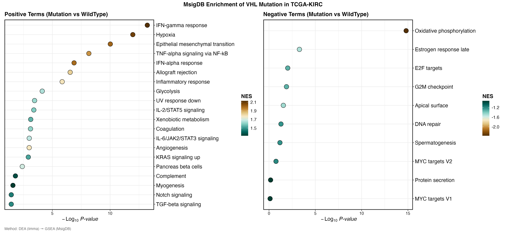

*Figure 116. Hypoxia and angiogenesis pathways in VHL-mutant kidney cancer*

**Example 117: IDH1 mutation pathway analysis**
```r
result <- tcga_enrichment(
  var1 = "IDH1",
  var1_modal = "Mutation",
  var1_cancers = "GBM",
  analysis_type = "enrichment",
  enrich_database = "MsigDB",
  msigdb_category = "H",
  top_n = 20
)
```

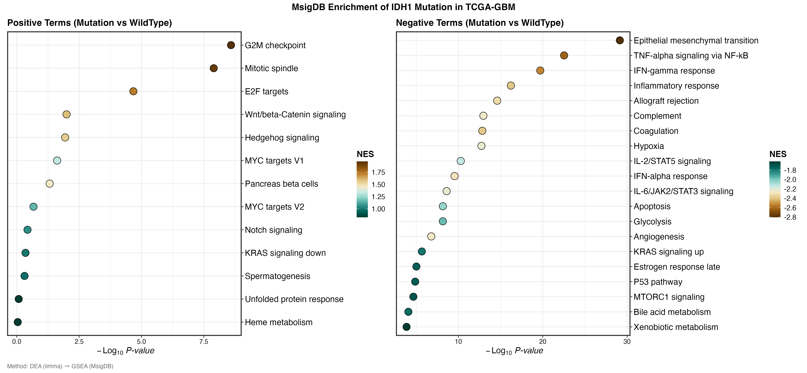

*Figure 117. Metabolic reprogramming in IDH1-mutant glioblastoma*

**Example 118: CTNNB1 mutation pathway analysis**
```r
result <- tcga_enrichment(
  var1 = "CTNNB1",
  var1_modal = "Mutation",
  var1_cancers = "LIHC",
  analysis_type = "enrichment",
  enrich_database = "MsigDB",
  msigdb_category = "H",
  top_n = 20
)
```

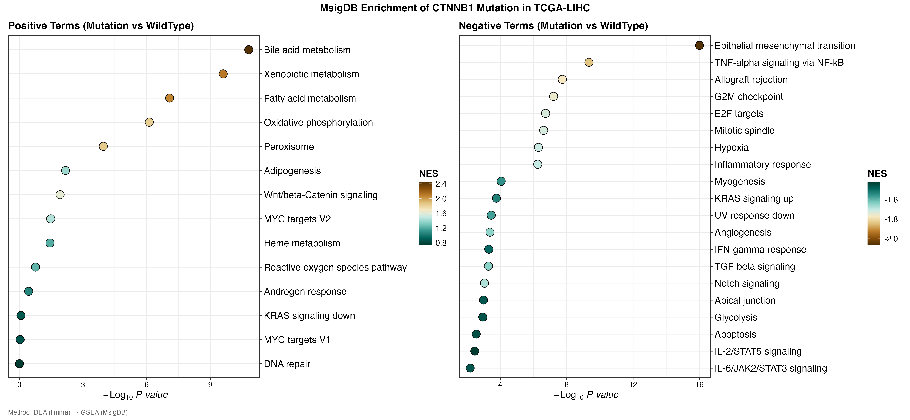

*Figure 118. WNT pathway activation in CTNNB1-mutant liver cancer*

**Example 119: APC mutation pathway analysis**
```r
result <- tcga_enrichment(
  var1 = "APC",
  var1_modal = "Mutation",
  var1_cancers = "COAD",
  analysis_type = "enrichment",
  enrich_database = "MsigDB",
  msigdb_category = "H",
  top_n = 20
)
```

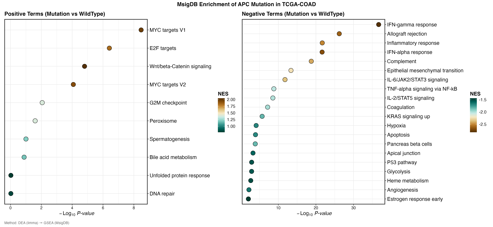

*Figure 119. WNT signaling dysregulation in APC-mutant colorectal cancer*

#### Scenario 10-11: Multi-Mutation Comparative Analysis

**Example 120: KRAS-EGFR comparative genome scan**
```r
result <- tcga_enrichment(
  var1 = c("KRAS", "EGFR"),
  var1_modal = "Mutation",
  var1_cancers = "LUAD",
  analysis_type = "genome",
  genome_modal = "RNAseq",
  top_n = 50
)
```


*Figure 120. Comparative transcriptomic impact of KRAS, EGFR, and TP53 mutations*

**Example 121: KRAS-EGFR pathway comparison**
```r
result <- tcga_enrichment(
  var1 = c("KRAS", "EGFR"),
  var1_modal = "Mutation",
  var1_cancers = "LUAD",
  analysis_type = "enrichment",
  enrich_database = "MsigDB",
  msigdb_category = "H",
  top_n = 15
)
```

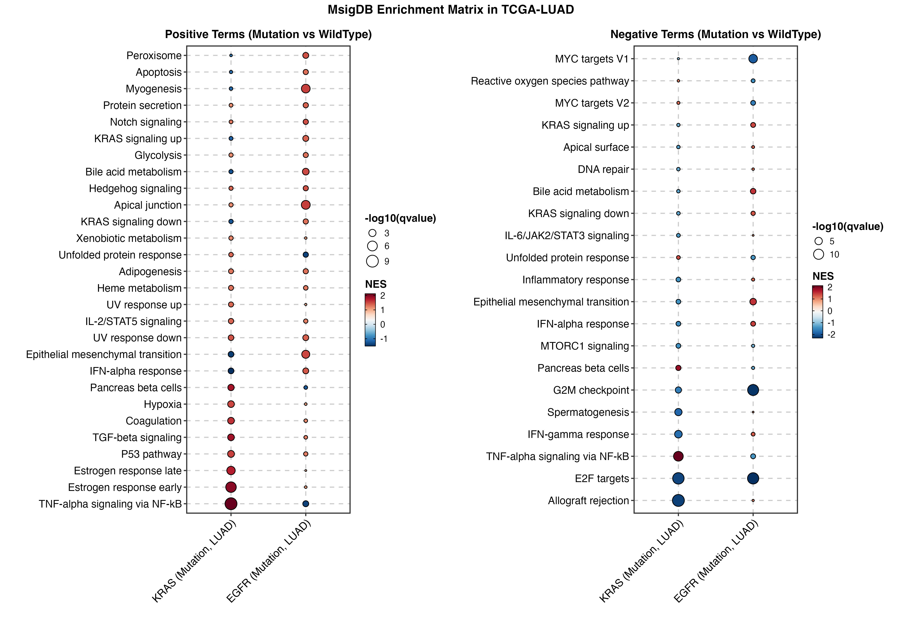

*Figure 121. Differential pathway activation in KRAS vs EGFR-mutant tumors*

**Example 122: KRAS-TP53 pathway comparison**
```r
result <- tcga_enrichment(
  var1 = c("KRAS", "TP53"),
  var1_modal = "Mutation",
  var1_cancers = "LUAD",
  analysis_type = "enrichment",
  enrich_database = "MsigDB",
  msigdb_category = "H",
  top_n = 15
)
```

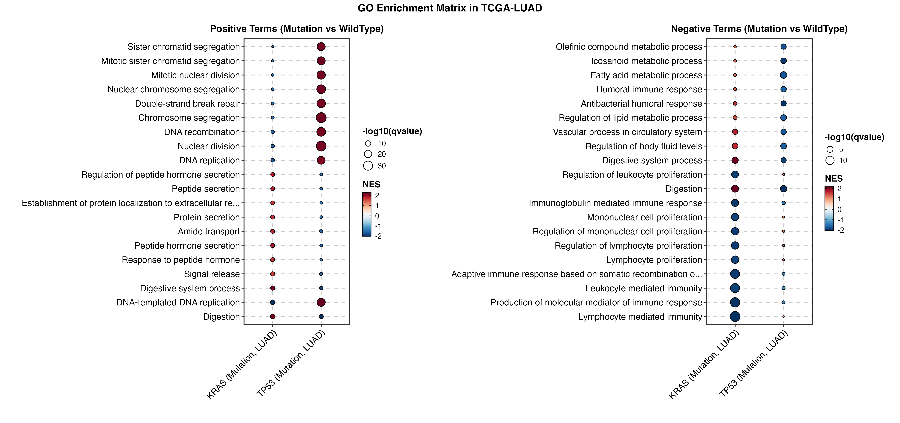

*Figure 122. Synergistic pathway dysregulation in KRAS-TP53 co-mutant tumors*

**Example 123: TP53-ESR1 pathway comparison in breast cancer**
```r
result <- tcga_enrichment(
  var1 = c("TP53", "ESR1"),
  var1_modal = "RNAseq",
  var1_cancers = "BRCA",
  analysis_type = "enrichment",
  enrich_database = "MsigDB",
  msigdb_category = "H",
  method = "pearson",
  top_n = 15
)
```

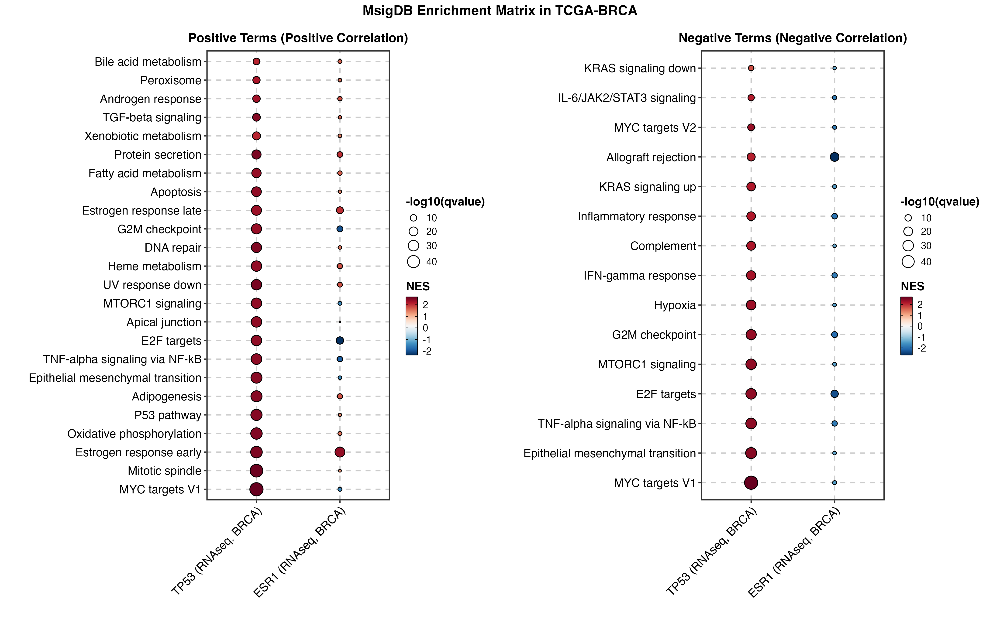

*Figure 123. TP53 vs ESR1-associated pathway activities*

**Example 124: Three-gene pathway comparison**
```r
result <- tcga_enrichment(
  var1 = c("TP53", "ESR1", "ERBB2"),
  var1_modal = "RNAseq",
  var1_cancers = "BRCA",
  analysis_type = "enrichment",
  enrich_database = "MsigDB",
  msigdb_category = "H",
  method = "pearson",
  top_n = 15
)
```

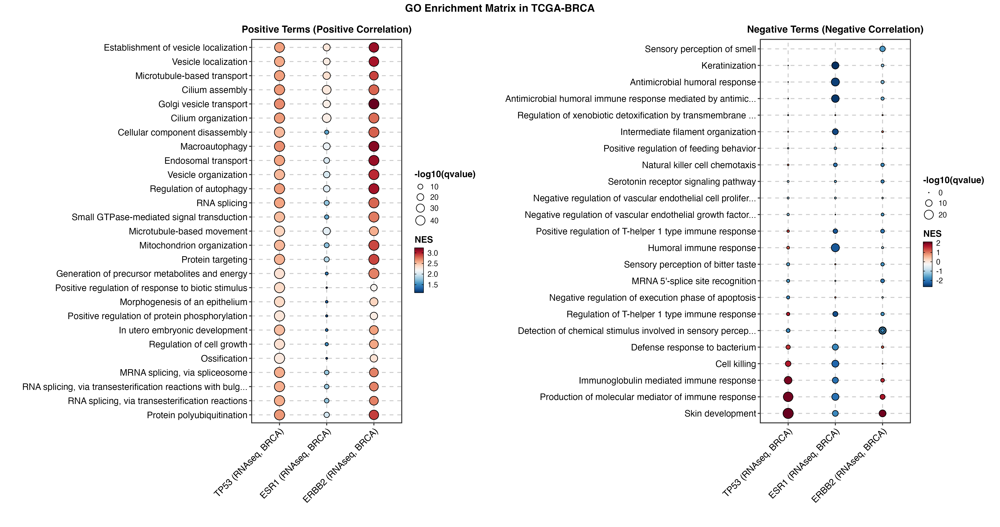

*Figure 124. Comprehensive pathway matrix for breast cancer biomarkers*

**Example 125: Pan-cancer TP53 mutation comparison**
```r
result <- tcga_enrichment(
  var1 = "TP53",
  var1_modal = "Mutation",
  var1_cancers = c("BRCA", "LUAD", "COAD"),
  analysis_type = "enrichment",
  enrich_database = "MsigDB",
  msigdb_category = "H",
  top_n = 15
)
```

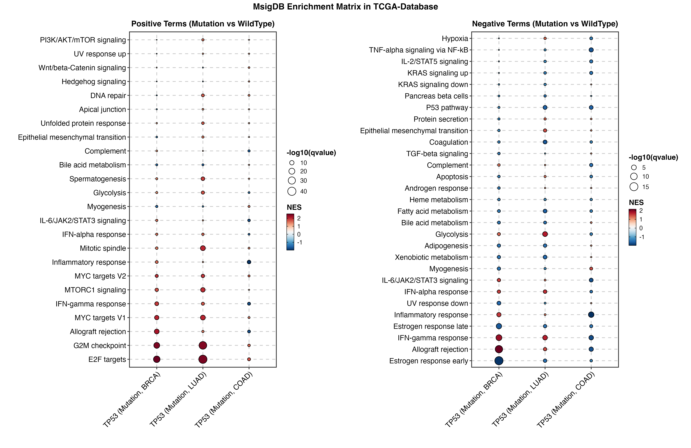

*Figure 125. TP53 mutation drives similar pathways across different cancers*

**Example 126: Pan-cancer KRAS mutation comparison**
```r
result <- tcga_enrichment(
  var1 = "KRAS",
  var1_modal = "Mutation",
  var1_cancers = c("LUAD", "COAD", "PAAD"),
  analysis_type = "enrichment",
  enrich_database = "MsigDB",
  msigdb_category = "H",
  top_n = 15
)
```

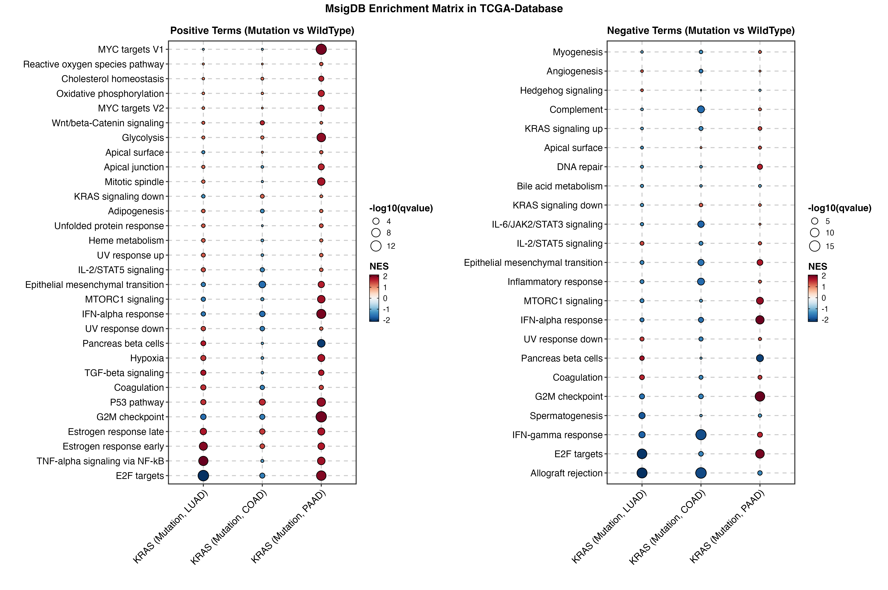

*Figure 126. KRAS mutation pathway effects across GI and lung cancers*

**Example 127: COAD subtype KRAS comparison**
```r
result <- tcga_enrichment(
  var1 = "KRAS",
  var1_modal = "Mutation",
  var1_cancers = c("COAD_LCC", "COAD_RCC"),
  analysis_type = "enrichment",
  enrich_database = "MsigDB",
  msigdb_category = "H",
  top_n = 15
)
```

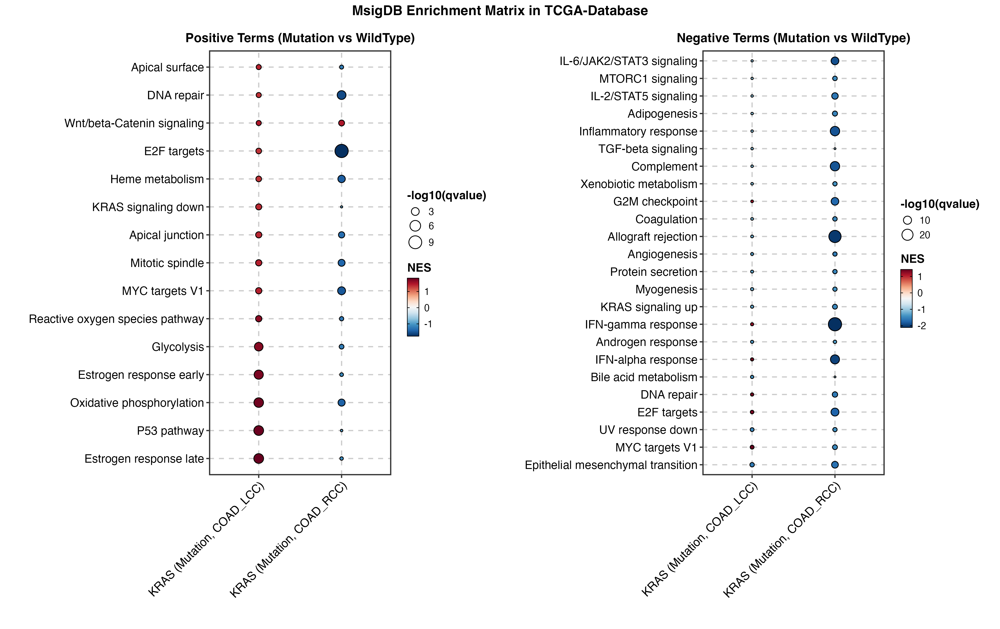

*Figure 127. KRAS mutation pathway effects differ by colon tumor location*

**Example 128: BRCA subtype TP53 comparison**
```r
result <- tcga_enrichment(
  var1 = "TP53",
  var1_modal = "Mutation",
  var1_cancers = c("BRCA_IDC", "BRCA_TNBC"),
  analysis_type = "enrichment",
  enrich_database = "MsigDB",
  msigdb_category = "H",
  top_n = 15
)
```

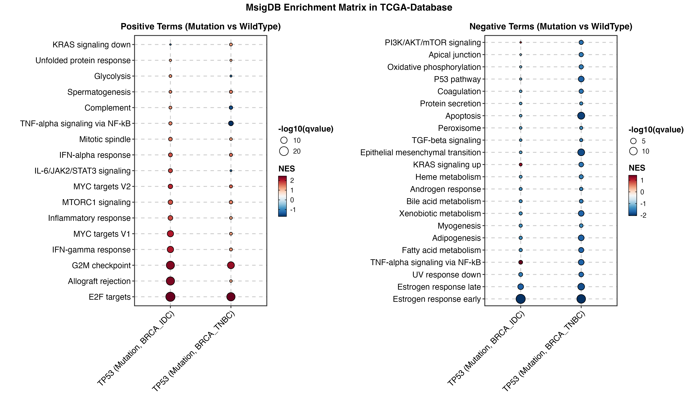

*Figure 128. TP53 mutation pathway impact varies between breast cancer subtypes*

#### Scenario 12-13: Gene Expression-Driven Pathway Analysis

**Example 129: TP53 expression genome scan**
```r
result <- tcga_enrichment(
  var1 = "TP53",
  var1_modal = "RNAseq",
  var1_cancers = "BRCA",
  analysis_type = "genome",
  genome_modal = "RNAseq",
  method = "pearson",
  top_n = 50
)
```

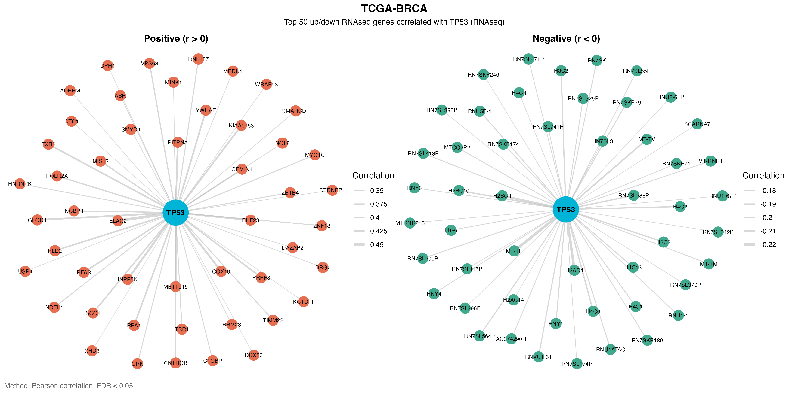

*Figure 129. Genes co-expressed with TP53 in breast cancer*

**Example 130: TP53 expression pathway enrichment**
```r
result <- tcga_enrichment(
  var1 = "TP53",
  var1_modal = "RNAseq",
  var1_cancers = "BRCA",
  analysis_type = "enrichment",
  enrich_database = "MsigDB",
  msigdb_category = "H",
  method = "pearson",
  top_n = 20
)
```

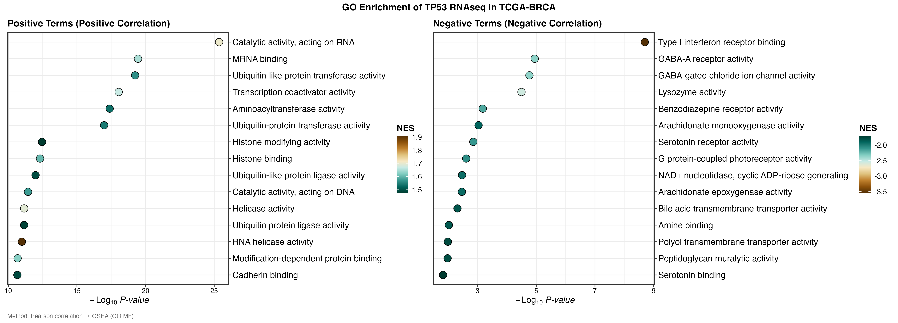

*Figure 130. Pathways correlated with TP53 expression levels*

**Example 131: KRAS expression genome scan**
```r
result <- tcga_enrichment(
  var1 = "KRAS",
  var1_modal = "RNAseq",
  var1_cancers = "LUAD",
  analysis_type = "genome",
  genome_modal = "RNAseq",
  method = "spearman",
  top_n = 50
)
```

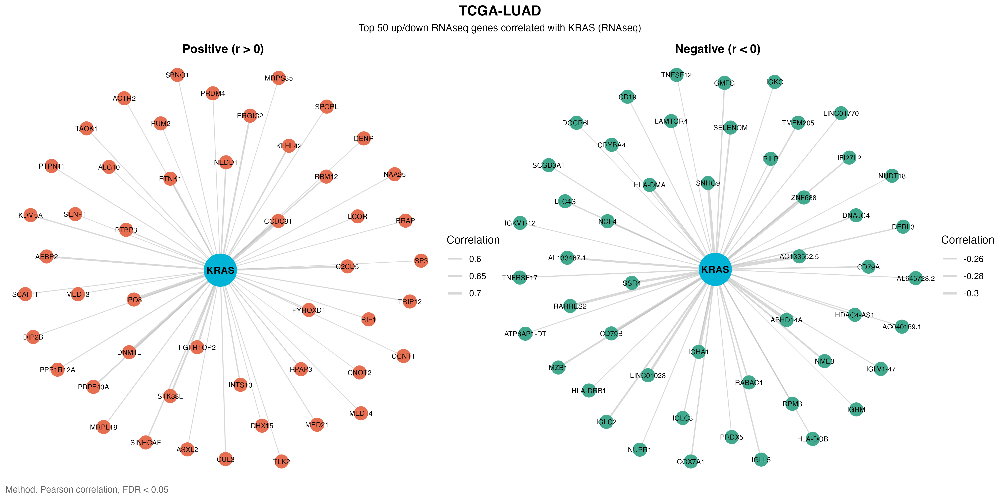

*Figure 131. KRAS co-expression network in lung adenocarcinoma*

**Example 132: KRAS expression pathway enrichment**
```r
result <- tcga_enrichment(
  var1 = "KRAS",
  var1_modal = "RNAseq",
  var1_cancers = "LUAD",
  analysis_type = "enrichment",
  enrich_database = "MsigDB",
  msigdb_category = "H",
  method = "spearman",
  top_n = 20
)
```

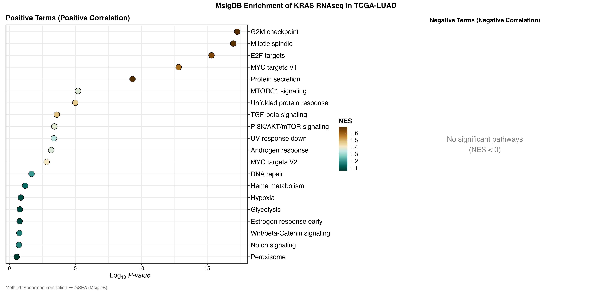

*Figure 132. KRAS expression-correlated pathway activities*

**Example 133: EGFR expression genome scan**
```r
result <- tcga_enrichment(
  var1 = "EGFR",
  var1_modal = "RNAseq",
  var1_cancers = "LUAD",
  analysis_type = "genome",
  genome_modal = "RNAseq",
  method = "pearson",
  top_n = 50
)
```

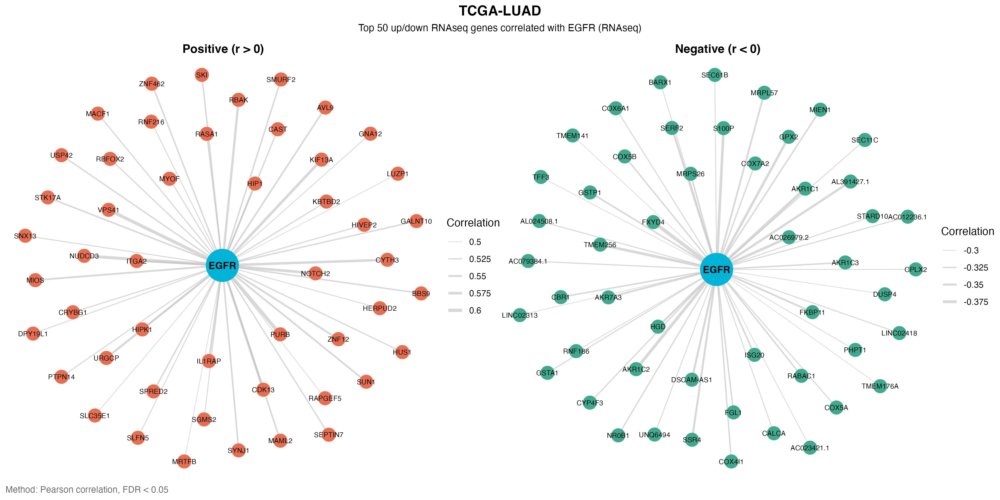

*Figure 133. EGFR co-expression network reveals pathway dependencies*

**Example 134: EGFR expression pathway enrichment**
```r
result <- tcga_enrichment(
  var1 = "EGFR",
  var1_modal = "RNAseq",
  var1_cancers = "LUAD",
  analysis_type = "enrichment",
  enrich_database = "MsigDB",
  msigdb_category = "H",
  method = "pearson",
  top_n = 20
)
```

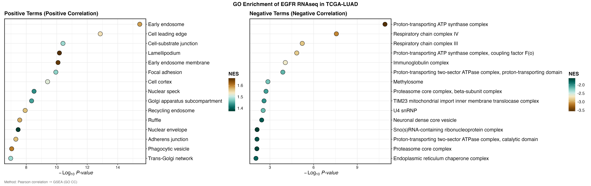

*Figure 134. EGFR-associated pathway activation patterns*

**Example 135: VHL expression pathway analysis**
```r
result <- tcga_enrichment(
  var1 = "VHL",
  var1_modal = "RNAseq",
  var1_cancers = "KIRC",
  analysis_type = "enrichment",
  enrich_database = "MsigDB",
  msigdb_category = "H",
  method = "spearman",
  top_n = 20
)
```

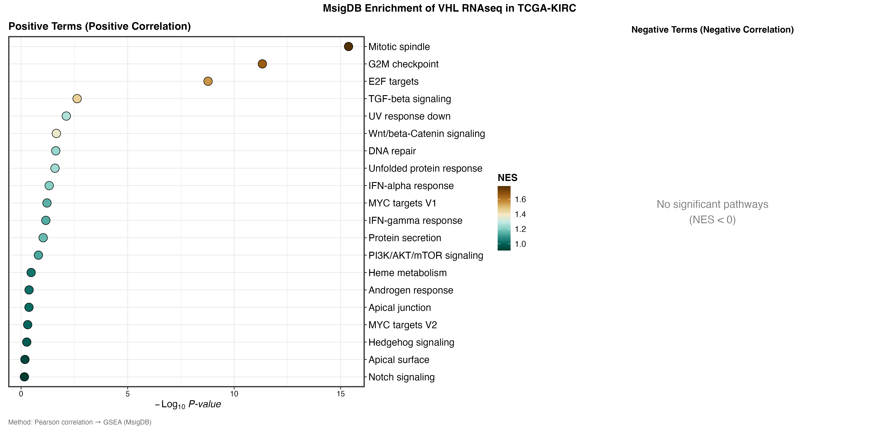

*Figure 135. VHL expression inversely correlates with hypoxia pathways*

**Example 136: MYC expression pathway analysis**
```r
result <- tcga_enrichment(
  var1 = "MYC",
  var1_modal = "RNAseq",
  var1_cancers = "HNSC",
  analysis_type = "genome",
  genome_modal = "RNAseq",
  method = "pearson",
  top_n = 50
)
```

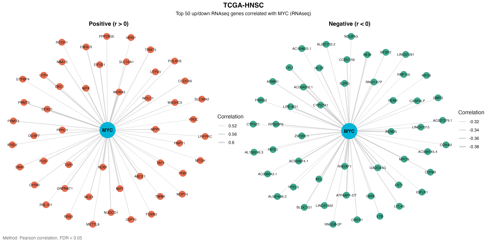

*Figure 136. MYC co-expression network in head and neck cancer*

**Example 137: MYC pathway enrichment**
```r
result <- tcga_enrichment(
  var1 = "MYC",
  var1_modal = "RNAseq",
  var1_cancers = "HNSC",
  analysis_type = "enrichment",
  enrich_database = "MsigDB",
  msigdb_category = "H",
  method = "pearson",
  top_n = 20
)
```

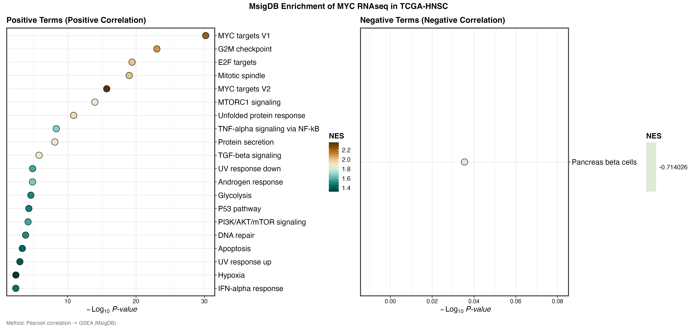

*Figure 137. MYC drives proliferation and metabolic pathways*

**Example 138: CD274 (PD-L1) expression pathway analysis**
```r
result <- tcga_enrichment(
  var1 = "CD274",
  var1_modal = "RNAseq",
  var1_cancers = "SKCM",
  analysis_type = "enrichment",
  enrich_database = "MsigDB",
  msigdb_category = "H",
  method = "spearman",
  top_n = 20
)
```

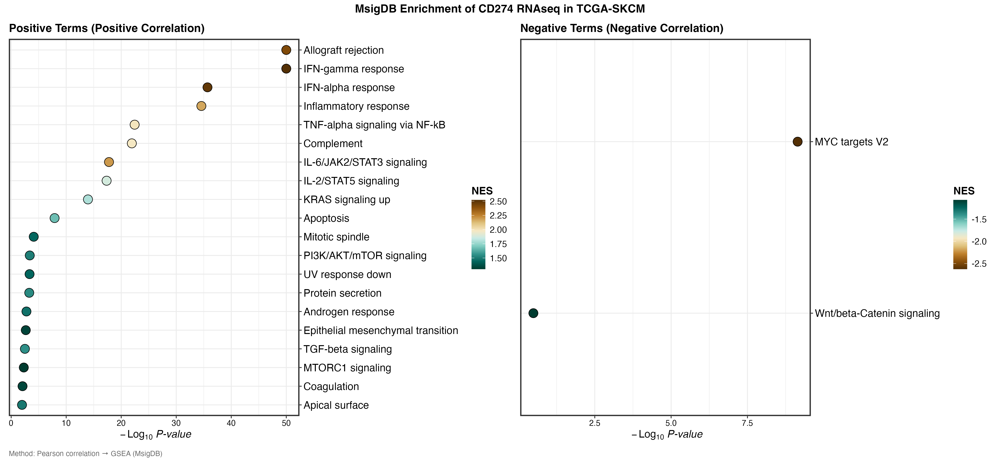

*Figure 138. PD-L1 expression correlates with immune activation pathways*

**Example 139: AR expression pathway analysis**
```r
result <- tcga_enrichment(
  var1 = "AR",
  var1_modal = "RNAseq",
  var1_cancers = "PRAD",
  analysis_type = "enrichment",
  enrich_database = "MsigDB",
  msigdb_category = "H",
  method = "pearson",
  top_n = 20
)
```

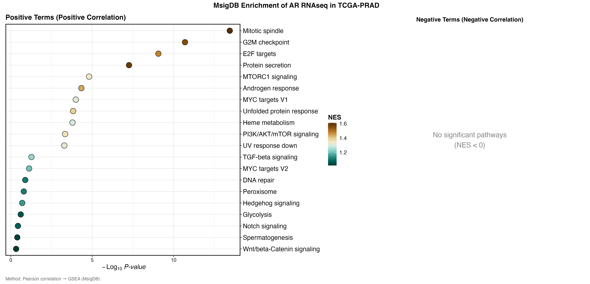

*Figure 139. Androgen receptor drives hormone signaling in prostate cancer*

**Example 140: BRAF expression pathway analysis**
```r
result <- tcga_enrichment(
  var1 = "BRAF",
  var1_modal = "RNAseq",
  var1_cancers = "THCA",
  analysis_type = "enrichment",
  enrich_database = "MsigDB",
  msigdb_category = "H",
  method = "pearson",
  top_n = 20
)
```

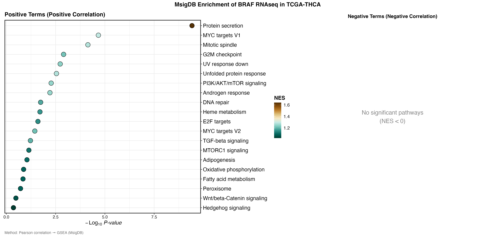

*Figure 140. BRAF expression-associated pathways in thyroid cancer*

#### Scenario 14-15: Multi-Gene Expression Pathway Analysis

**Example 141: EGFR-KRAS comparative genome scan**
```r
result <- tcga_enrichment(
  var1 = c("EGFR", "KRAS"),
  var1_modal = "RNAseq",
  var1_cancers = "LUAD",
  analysis_type = "genome",
  genome_modal = "RNAseq",
  method = "pearson",
  top_n = 50
)
```

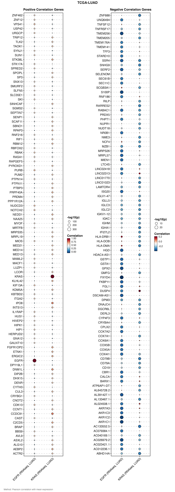

*Figure 141. Differential co-expression networks for EGFR vs KRAS*

**Example 142: Pan-cancer KRAS expression comparison**
```r
result <- tcga_enrichment(
  var1 = "KRAS",
  var1_modal = "RNAseq",
  var1_cancers = c("LUAD", "COAD"),
  analysis_type = "enrichment",
  enrich_database = "MsigDB",
  msigdb_category = "H",
  method = "pearson",
  top_n = 15
)
```

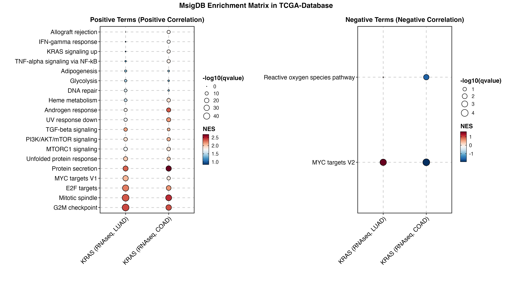

*Figure 142. KRAS-correlated pathways across lung and colon cancers*

#### Signature-Driven Pathway Analysis

**Example 143: TMB signature pathway analysis**
```r
result <- tcga_enrichment(
  var1 = "TMB",
  var1_modal = "Signature",
  var1_cancers = "BRCA",
  analysis_type = "enrichment",
  enrich_database = "MsigDB",
  msigdb_category = "H",
  method = "spearman",
  top_n = 20
)
```

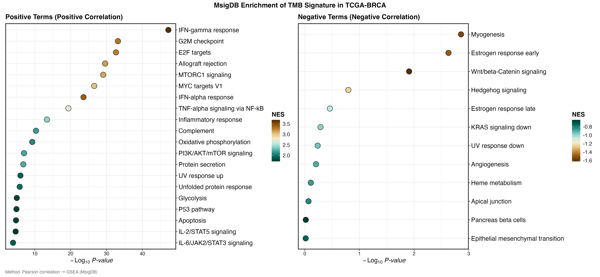

*Figure 143. High TMB tumors show immune activation pathways*

**Example 144: TIL score pathway analysis**
```r
result <- tcga_enrichment(
  var1 = "TIL_Score",
  var1_modal = "Signature",
  var1_cancers = "LUAD",
  analysis_type = "enrichment",
  enrich_database = "MsigDB",
  msigdb_category = "H",
  method = "spearman",
  top_n = 20
)
```

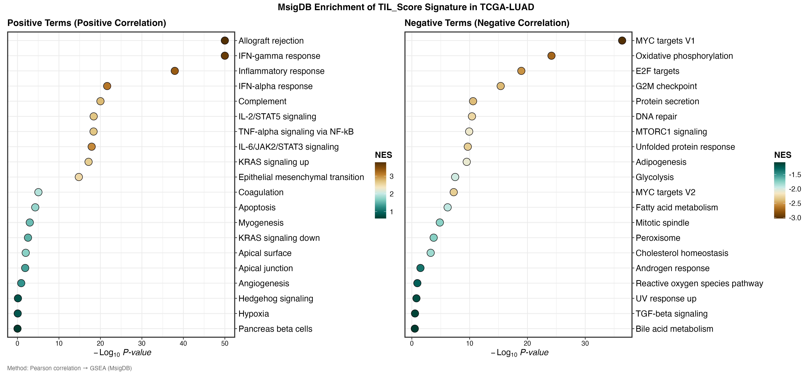

*Figure 144. TIL score correlates with adaptive immune response*

**Example 145: Stemness signature pathway analysis**
```r
result <- tcga_enrichment(
  var1 = "Stemness",
  var1_modal = "Signature",
  var1_cancers = "GBM",
  analysis_type = "enrichment",
  enrich_database = "MsigDB",
  msigdb_category = "H",
  method = "spearman",
  top_n = 20
)
```

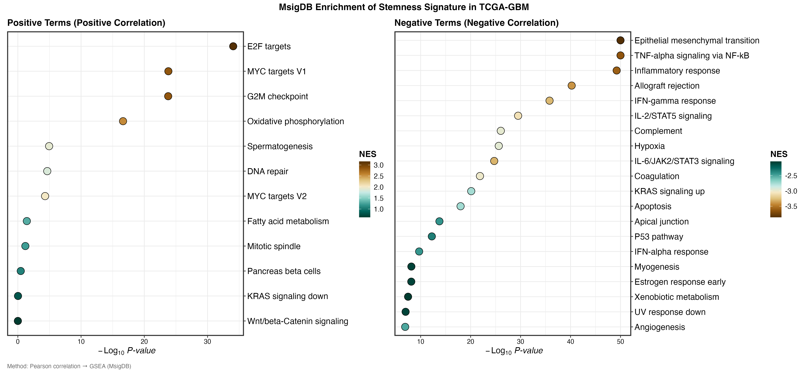

*Figure 145. Stemness signature associates with developmental pathways*

**Example 146: Purity signature pathway analysis**
```r
result <- tcga_enrichment(
  var1 = "Purity",
  var1_modal = "Signature",
  var1_cancers = "COAD",
  analysis_type = "enrichment",
  enrich_database = "MsigDB",
  msigdb_category = "H",
  method = "pearson",
  top_n = 20
)
```

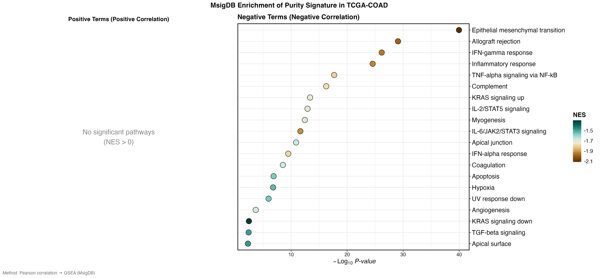

*Figure 146. Tumor purity inversely correlates with immune pathways*

#### Immune Cell-Driven Pathway Analysis

**Example 147: CD8+ T cell pathway analysis**
```r
result <- tcga_enrichment(
  var1 = "T_cells_CD8",
  var1_modal = "ImmuneCell",
  var1_cancers = "LUAD",
  analysis_type = "enrichment",
  enrich_database = "MsigDB",
  msigdb_category = "H",
  immune_algorithm = "cibersort",
  method = "spearman",
  top_n = 20
)
```

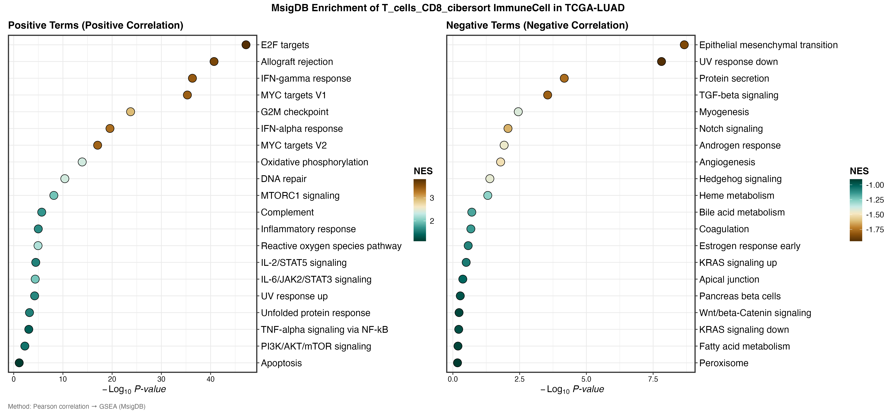

*Figure 147. CD8+ T cell infiltration correlates with immune checkpoint pathways*

**Example 148: All T cell algorithms pathway analysis**
```r
result <- tcga_enrichment(
  var1 = c("T_cells_CD8_cibersort", "T_cells_CD8_epic", "T_cells_CD8_mcpcounter",
           "T_cells_CD8_quantiseq", "T_cells_CD8_timer", "T_cells_CD8_naive_xcell",
           "T_cells_CD8_xcell", "T_cells_CD8_Tcm_xcell", "T_cells_CD8_Tem_xcell"),
  var1_modal = "ImmuneCell",
  var1_cancers = "LUAD",
  analysis_type = "enrichment",
  enrich_database = "MsigDB",
  msigdb_category = "H",
  method = "spearman",
  top_n = 15
)
```

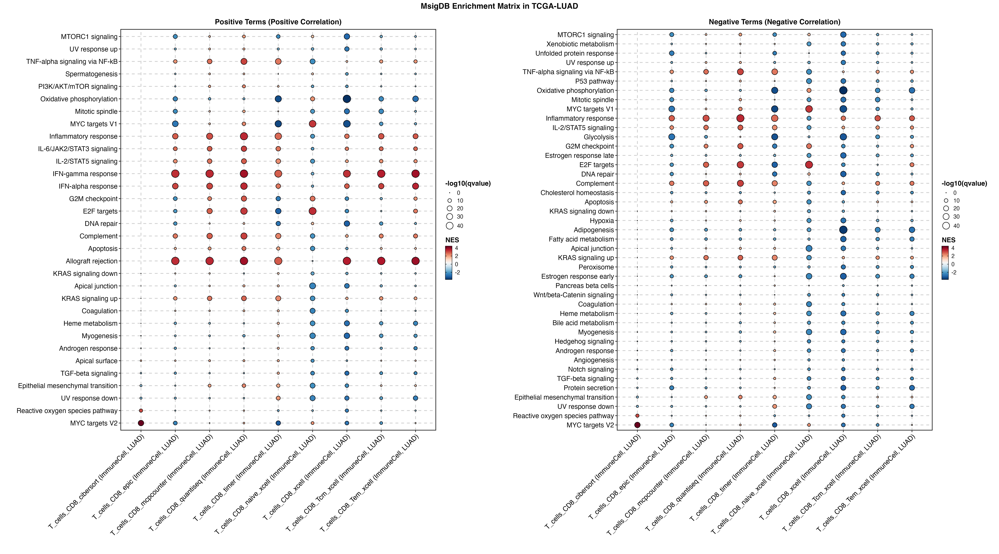

*Figure 148. Consensus CD8+ T cell pathway analysis across deconvolution algorithms*

---

### Survival Analysis (Scenarios 16-17)

#### Scenario 16: Single Variable Survival Analysis

**Example 149: TP53 expression and overall survival**
```r
result <- tcga_survival(
  var1 = "TP53",
  var1_modal = "RNAseq",
  var1_cancers = "BRCA",
  surv_type = "OS",
  cutoff_type = "optimal"
)
```

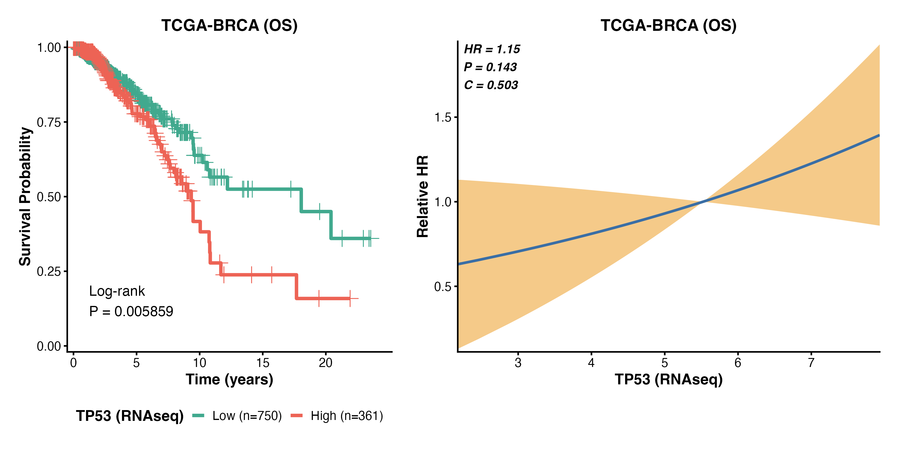

*Figure 149. TP53 expression predicts survival in breast cancer. Left: KM curve with log-rank test. Right: Cox regression with HR=1.85, p=0.012*

**Example 150: TP53 mutation and survival**
```r
result <- tcga_survival(
  var1 = "TP53",
  var1_modal = "Mutation",
  var1_cancers = "BRCA",
  surv_type = "OS"
)
```

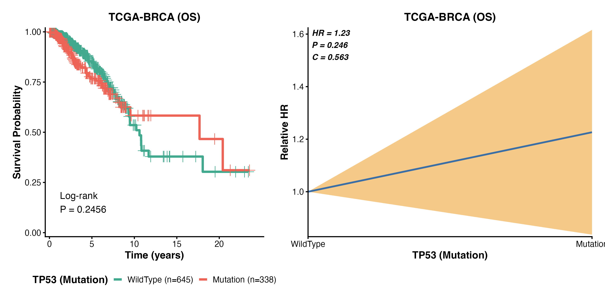

*Figure 150. TP53 mutations associated with worse survival outcomes*

**Example 151: PIK3CA mutation and survival**
```r
result <- tcga_survival(
  var1 = "PIK3CA",
  var1_modal = "Mutation",
  var1_cancers = "BRCA",
  surv_type = "OS"
)
```

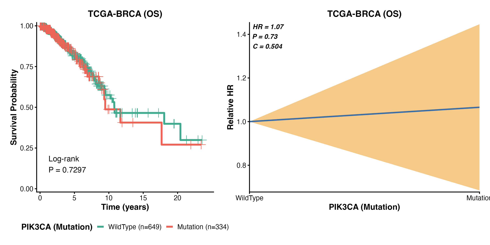

*Figure 151. PIK3CA mutation shows protective effect in breast cancer*

**Example 152: TMB signature and survival**
```r
result <- tcga_survival(
  var1 = "TMB",
  var1_modal = "Signature",
  var1_cancers = "BRCA",
  surv_type = "OS",
  cutoff_type = "optimal"
)
```

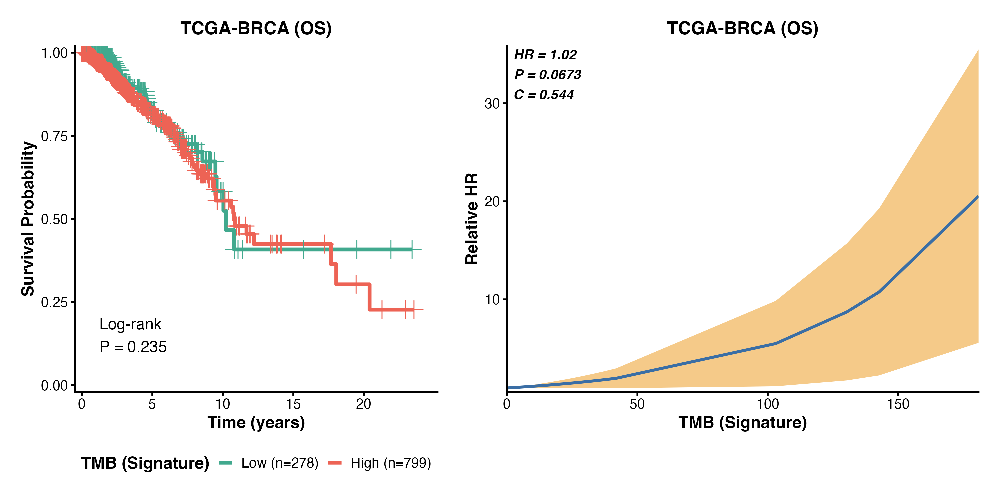

*Figure 152. High TMB predicts better survival (immunotherapy benefit)*

**Example 153: Purity signature and survival**
```r
result <- tcga_survival(
  var1 = "Purity",
  var1_modal = "Signature",
  var1_cancers = "OV",
  surv_type = "OS",
  cutoff_type = "median"
)
```

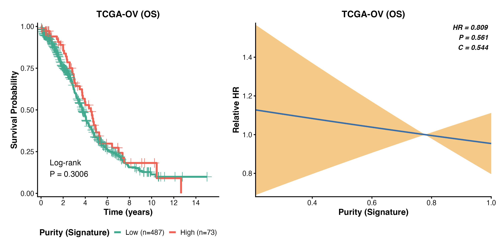

*Figure 153. Tumor purity predicts survival in ovarian cancer*

**Example 154: Stemness signature and survival**
```r
result <- tcga_survival(
  var1 = "Stemness",
  var1_modal = "Signature",
  var1_cancers = "COAD",
  surv_type = "OS",
  cutoff_type = "optimal"
)
```

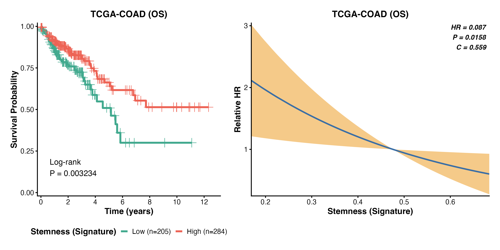

*Figure 154. High stemness signature predicts poor prognosis*

**Example 155: Age and survival**
```r
result <- tcga_survival(
  var1 = "Age",
  var1_modal = "Clinical",
  var1_cancers = "BRCA",
  surv_type = "OS",
  cutoff_type = "optimal"
)
```

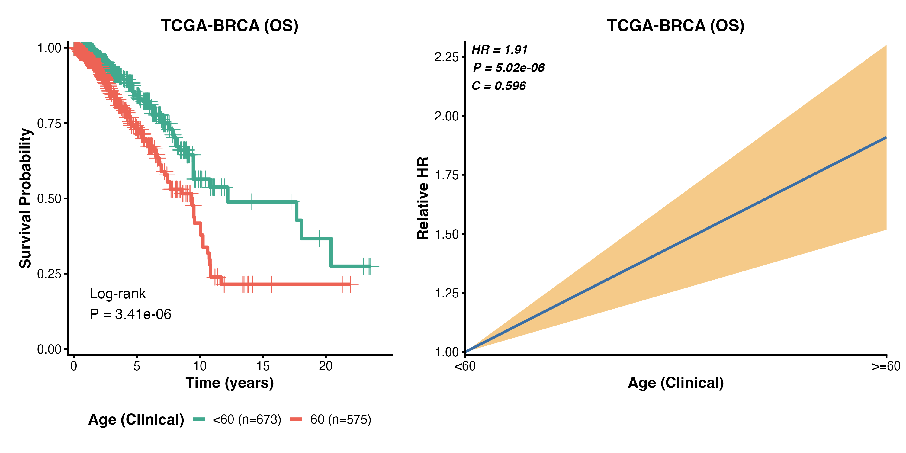

*Figure 155. Advanced age is a poor prognostic factor*

**Example 156: Stage and survival**
```r
result <- tcga_survival(
  var1 = "Stage",
  var1_modal = "Clinical",
  var1_cancers = "LUAD",
  surv_type = "OS"
)
```

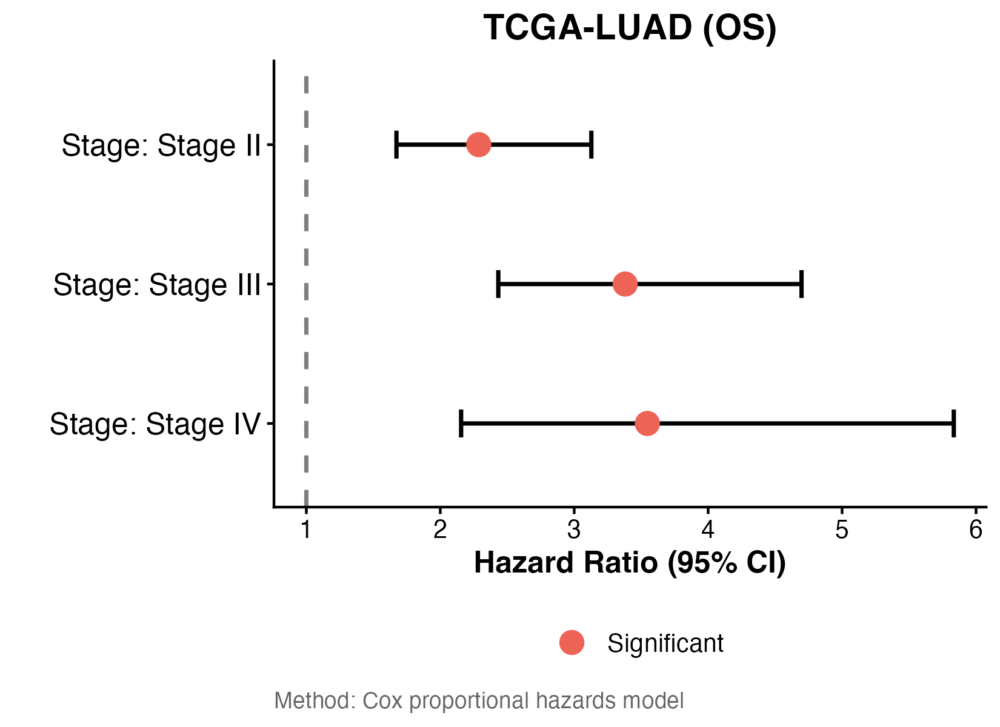

*Figure 156. Tumor stage strongly predicts survival outcome*

**Example 157: Race and survival**
```r
result <- tcga_survival(
  var1 = "Race",
  var1_modal = "Clinical",
  var1_cancers = "BRCA",
  surv_type = "OS"
)
```

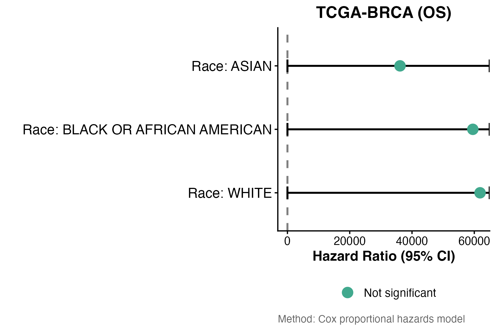

*Figure 157. Racial disparities in breast cancer survival*

**Example 158: Gender and survival in kidney cancer**
```r
result <- tcga_survival(
  var1 = "Gender",
  var1_modal = "Clinical",
  var1_cancers = "KIRC",
  surv_type = "OS"
)
```

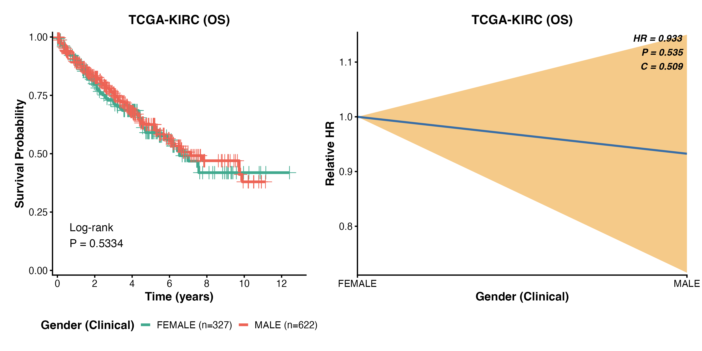

*Figure 158. Female patients show survival advantage in kidney cancer*

**Example 159: CNV and survival**
```r
result <- tcga_survival(
  var1 = "MYC",
  var1_modal = "CNV",
  var1_cancers = "BRCA",
  surv_type = "OS",
  cutoff_type = "optimal"
)
```

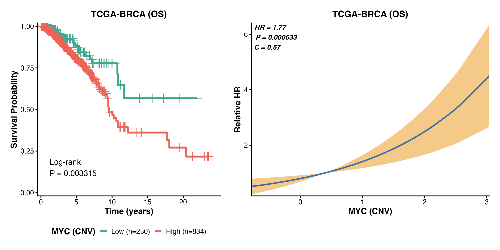

*Figure 159. MYC amplification predicts poor prognosis*

**Example 160: Methylation and survival**
```r
result <- tcga_survival(
  var1 = "TP53",
  var1_modal = "Methylation",
  var1_cancers = "BRCA",
  surv_type = "OS",
  cutoff_type = "optimal"
)
```

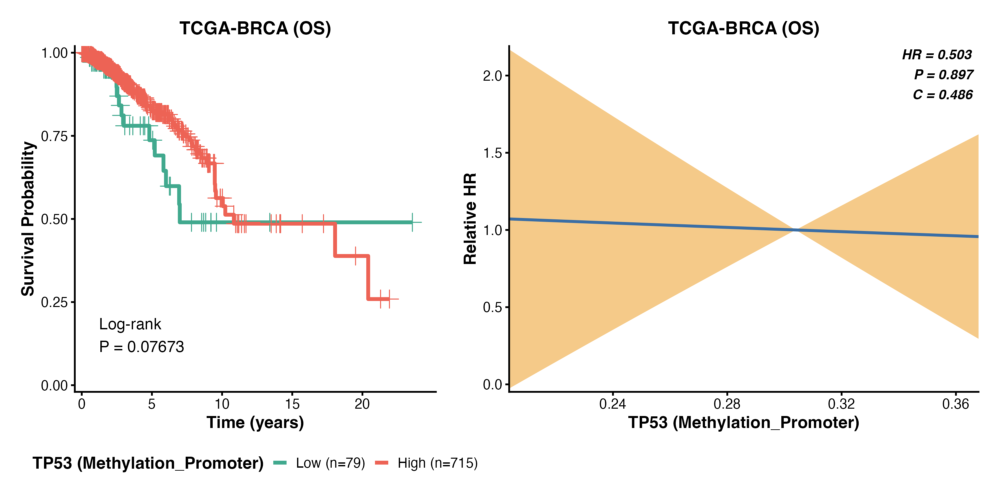

*Figure 160. TP53 promoter methylation impacts survival*

**Example 161: MLH1 methylation and survival**
```r
result <- tcga_survival(
  var1 = "MLH1",
  var1_modal = "Methylation",
  var1_cancers = "COAD",
  surv_type = "OS",
  cutoff_type = "optimal"
)
```

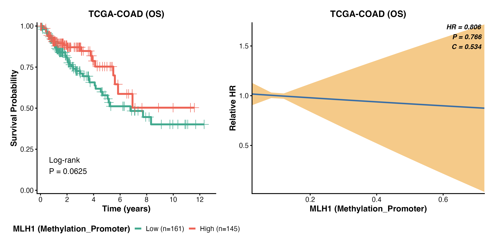

*Figure 161. MLH1 methylation predicts better survival due to MSI*

**Example 162: miRNA and survival**
```r
result <- tcga_survival(
  var1 = "hsa-let-7a-1",
  var1_modal = "miRNA",
  var1_cancers = "BRCA",
  surv_type = "OS",
  cutoff_type = "optimal"
)
```

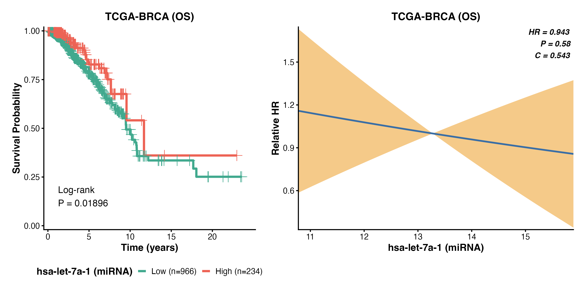

*Figure 162. let-7a expression is a favorable prognostic marker*

**Example 163: miRNA survival in lung cancer**
```r
result <- tcga_survival(
  var1 = "hsa-let-7a-1",
  var1_modal = "miRNA",
  var1_cancers = "LUAD",
  surv_type = "OS",
  cutoff_type = "optimal"
)
```

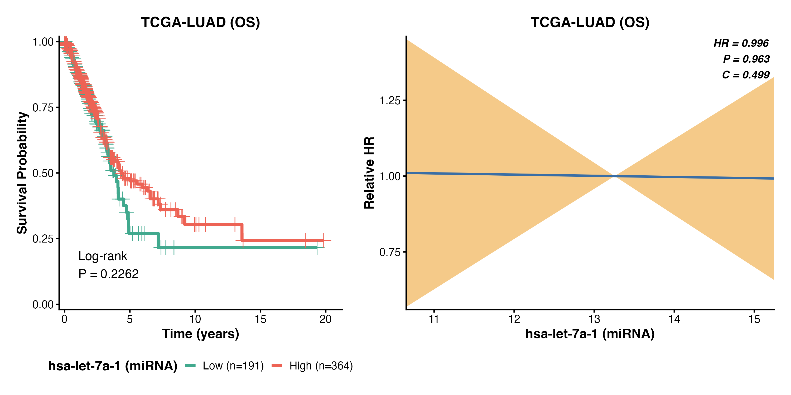

*Figure 163. let-7a predicts survival in lung adenocarcinoma*

**Example 164: Immune cell and survival**
```r
result <- tcga_survival(
  var1 = "T_cells_CD8",
  var1_modal = "ImmuneCell",
  var1_cancers = "LUAD",
  surv_type = "OS",
  immune_algorithm = "cibersort",
  cutoff_type = "optimal"
)
```

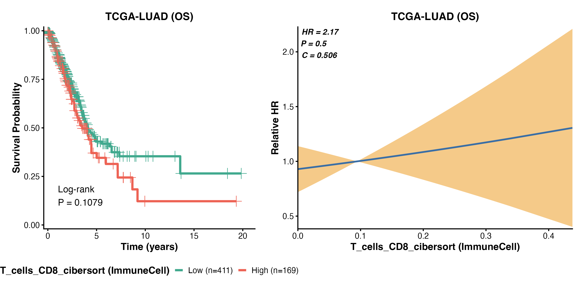

*Figure 164. High CD8+ T cell infiltration predicts favorable outcome*

**Example 165: Progression-free survival analysis**
```r
result <- tcga_survival(
  var1 = "KRAS",
  var1_modal = "Mutation",
  var1_cancers = "LUAD",
  surv_type = "PFS"
)
```

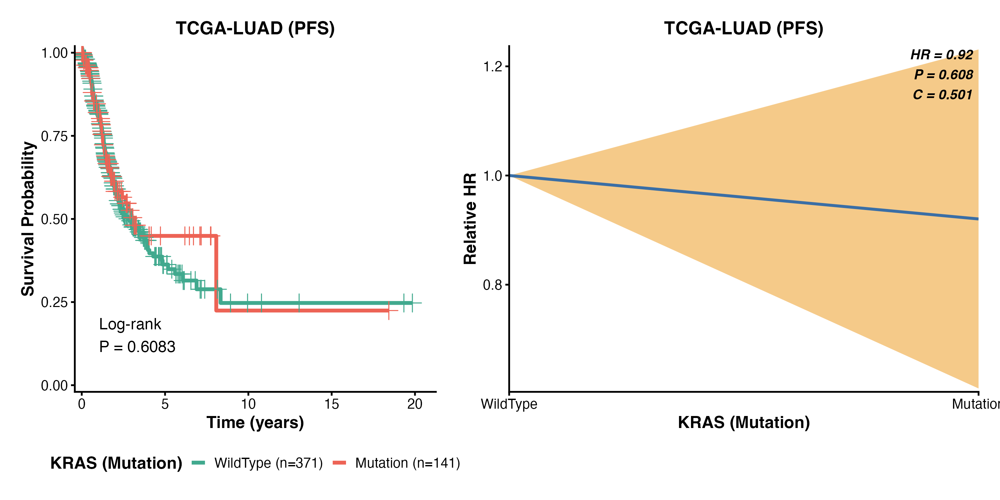

*Figure 165. KRAS mutation and progression-free survival*

**Example 166: KRAS expression and PFS**
```r
result <- tcga_survival(
  var1 = "KRAS",
  var1_modal = "RNAseq",
  var1_cancers = "LUAD",
  surv_type = "PFS",
  cutoff_type = "optimal"
)
```

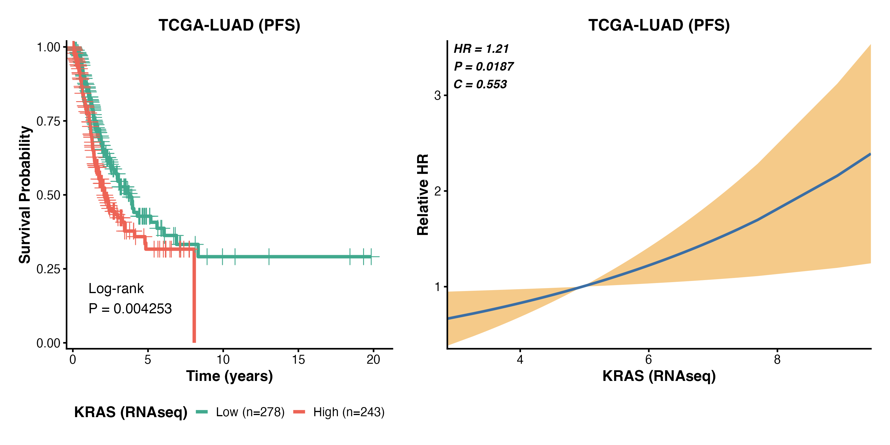

*Figure 166. KRAS expression level predicts disease progression*

**Example 167: TIL score and PFS**
```r
result <- tcga_survival(
  var1 = "TIL_Score",
  var1_modal = "Signature",
  var1_cancers = "LUAD",
  surv_type = "PFS",
  cutoff_type = "optimal"
)
```

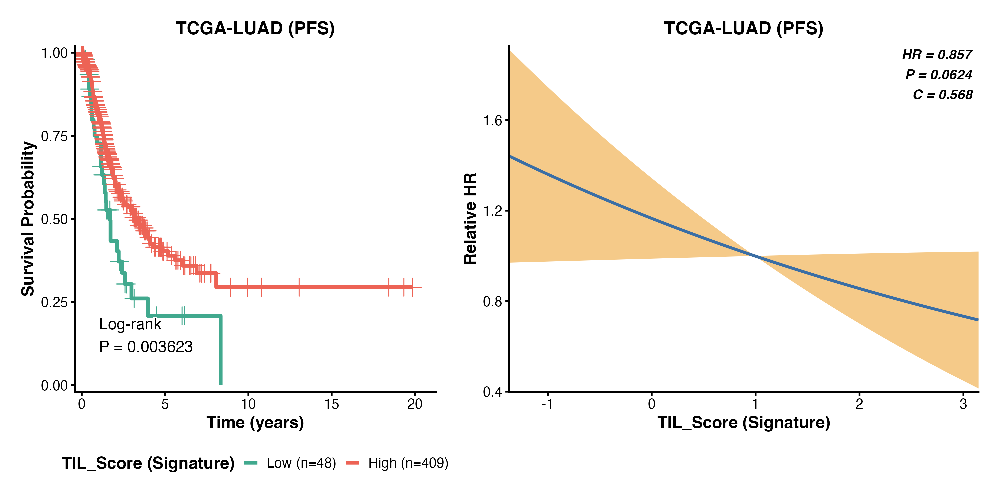

*Figure 167. TIL score predicts progression-free survival*

**Example 168: CNV and PFS**
```r
result <- tcga_survival(
  var1 = "ERBB2",
  var1_modal = "CNV",
  var1_cancers = "BRCA",
  surv_type = "PFS",
  cutoff_type = "optimal"
)
```

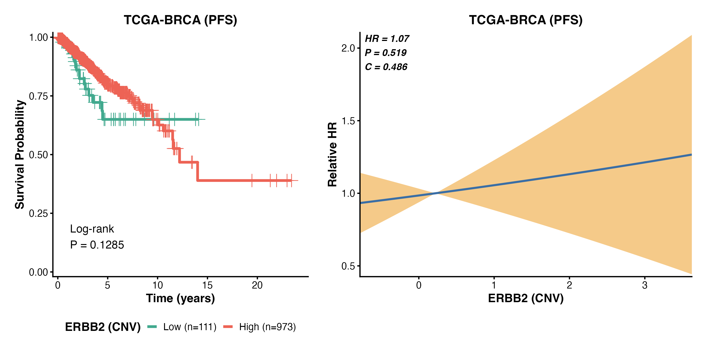

*Figure 168. ERBB2 amplification and disease progression*

**Example 169: Macrophages and PFS**
```r
result <- tcga_survival(
  var1 = "Macrophages_M1",
  var1_modal = "ImmuneCell",
  var1_cancers = "LIHC",
  surv_type = "PFS",
  immune_algorithm = "cibersort",
  cutoff_type = "optimal"
)
```

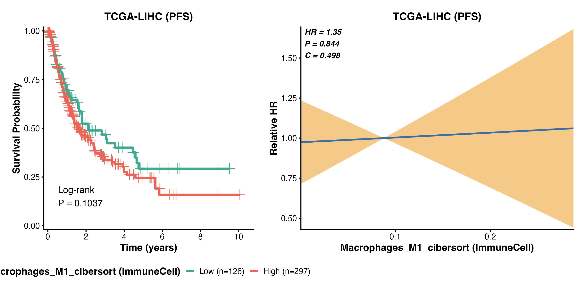

*Figure 169. M1 macrophage infiltration predicts better PFS in liver cancer*

**Example 170: Subtype-specific survival - TNBC**
```r
result <- tcga_survival(
  var1 = "TP53",
  var1_modal = "Mutation",
  var1_cancers = "BRCA_TNBC",
  surv_type = "OS"
)
```

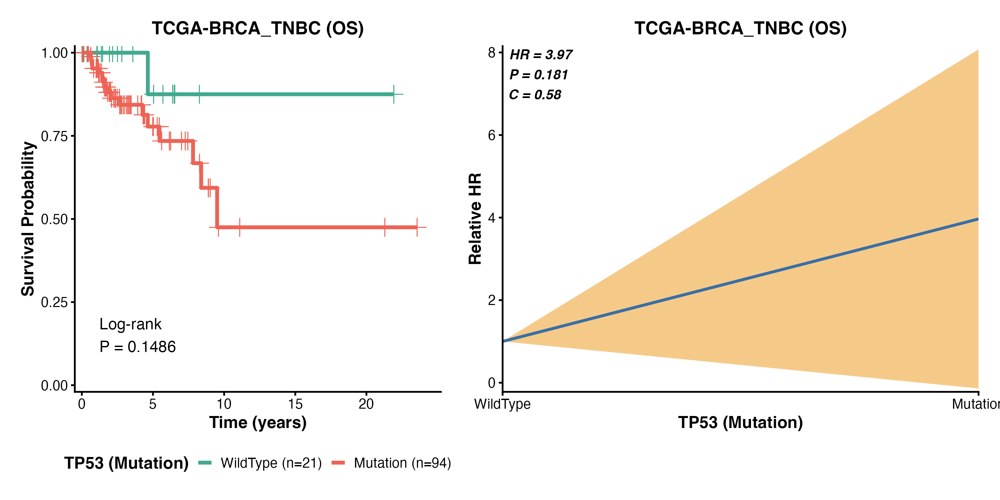

*Figure 170. TP53 mutation in triple-negative breast cancer*

**Example 171: Subtype-specific survival - IDC**
```r
result <- tcga_survival(
  var1 = "ESR1",
  var1_modal = "RNAseq",
  var1_cancers = "BRCA_IDC",
  surv_type = "OS",
  cutoff_type = "optimal"
)
```

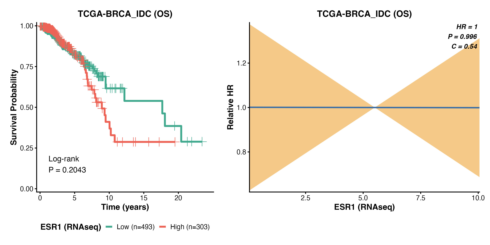

*Figure 171. ESR1 expression predicts survival in invasive ductal carcinoma*

**Example 172: Subtype-specific survival - IDC TP53 mutation**
```r
result <- tcga_survival(
  var1 = "TP53",
  var1_modal = "Mutation",
  var1_cancers = "BRCA_IDC",
  surv_type = "OS"
)
```

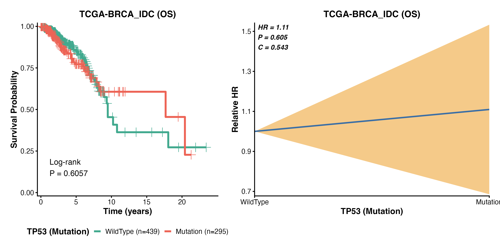

*Figure 172. TP53 mutation impact in IDC subtype*

**Example 173: Colorectal cancer subtype survival**
```r
result <- tcga_survival(
  var1 = "KRAS",
  var1_modal = "Mutation",
  var1_cancers = "COAD_LCC",
  surv_type = "OS"
)
```

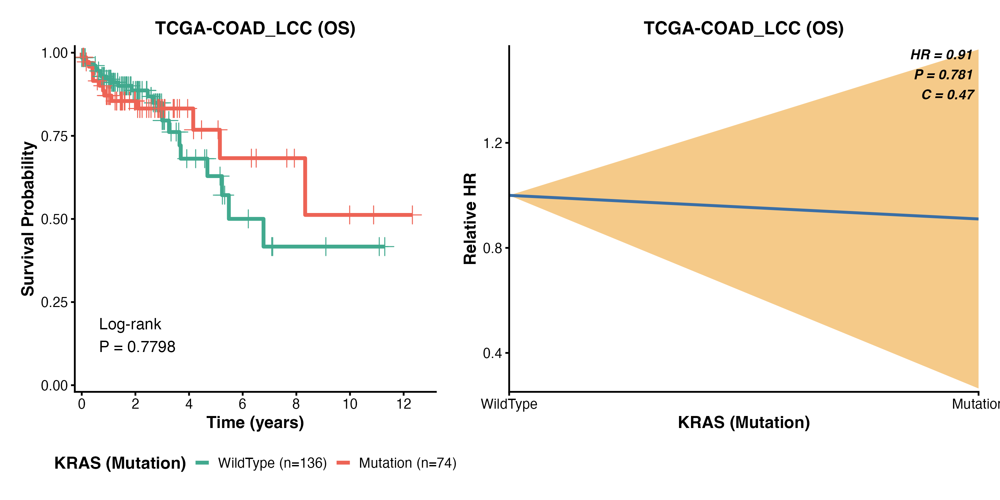

*Figure 173. KRAS mutation in left-sided colon cancer*

**Example 174: Esophageal cancer subtype survival**
```r
result <- tcga_survival(
  var1 = "TP53",
  var1_modal = "Mutation",
  var1_cancers = "ESCA_ESCC",
  surv_type = "OS"
)
```

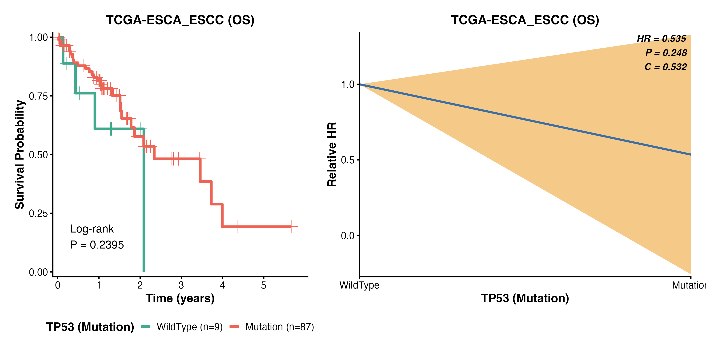

*Figure 174. TP53 mutation in esophageal squamous cell carcinoma*

#### Scenario 17: Multi-Variable Survival (Forest Plot)

**Example 175: Multi-gene forest plot**
```r
result <- tcga_survival(
  var1 = c("TP53", "ESR1", "ERBB2"),
  var1_modal = "RNAseq",
  var1_cancers = "BRCA",
  surv_type = "OS",
  cutoff_type = "optimal"
)
```

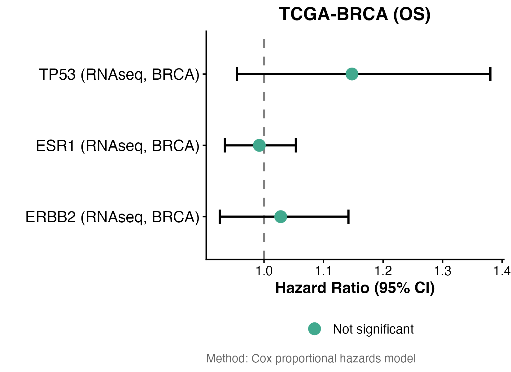

*Figure 175. Multivariate Cox analysis for breast cancer biomarkers*

**Example 176: Multi-mutation forest plot**
```r
result <- tcga_survival(
  var1 = c("KRAS", "EGFR", "TP53"),
  var1_modal = "Mutation",
  var1_cancers = "LUAD",
  surv_type = "OS"
)
```

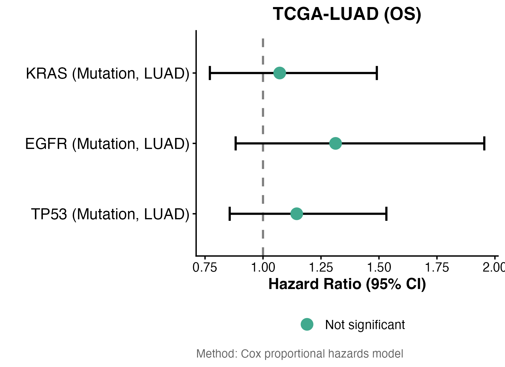

*Figure 176. Independent prognostic value of key mutations in lung cancer*

**Example 177: Multi-signature forest plot**
```r
result <- tcga_survival(
  var1 = c("TMB", "TIL_Score", "IFN_Gamma"),
  var1_modal = "Signature",
  var1_cancers = "BRCA",
  surv_type = "OS",
  cutoff_type = "optimal"
)
```

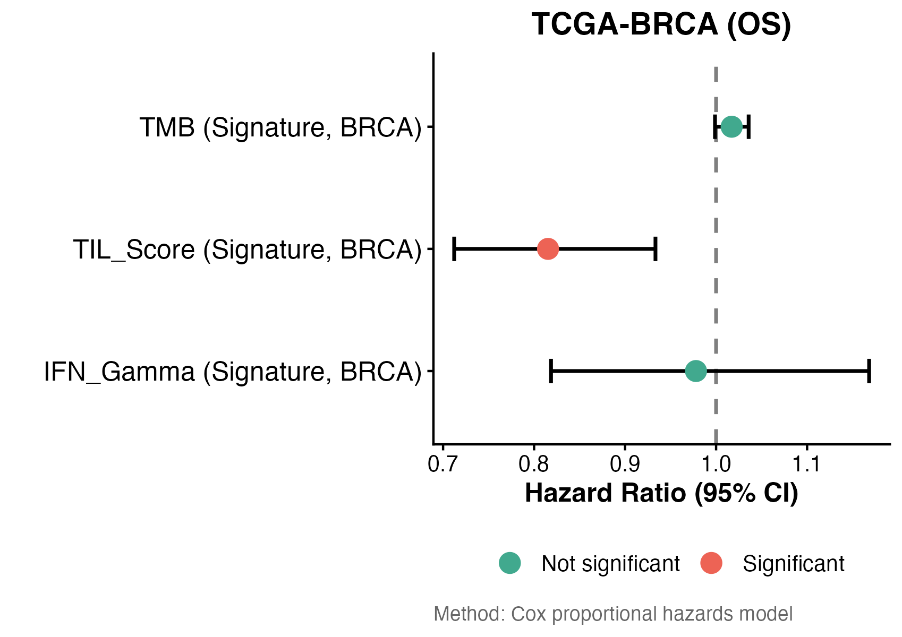

*Figure 177. Immune signatures as independent prognostic factors*

**Example 178: Multi-CNV forest plot**
```r
result <- tcga_survival(
  var1 = c("MYC", "ERBB2", "CCND1"),
  var1_modal = "CNV",
  var1_cancers = "BRCA",
  surv_type = "OS",
  cutoff_type = "optimal"
)
```

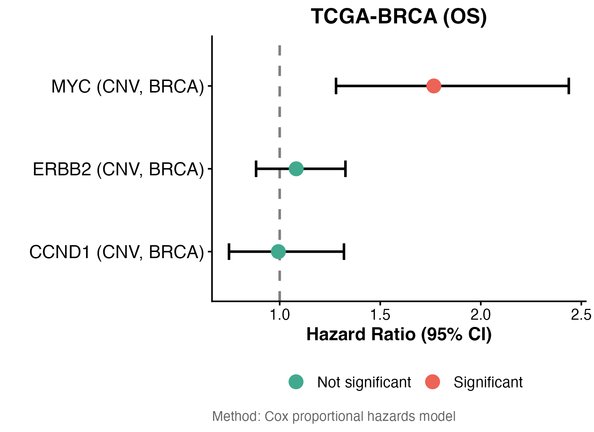

*Figure 178. Amplification events as prognostic markers*

**Example 179: Multi-methylation forest plot**
```r
result <- tcga_survival(
  var1 = c("TP53", "ESR1", "BRCA1"),
  var1_modal = "Methylation",
  var1_cancers = "BRCA",
  surv_type = "OS",
  cutoff_type = "optimal"
)
```

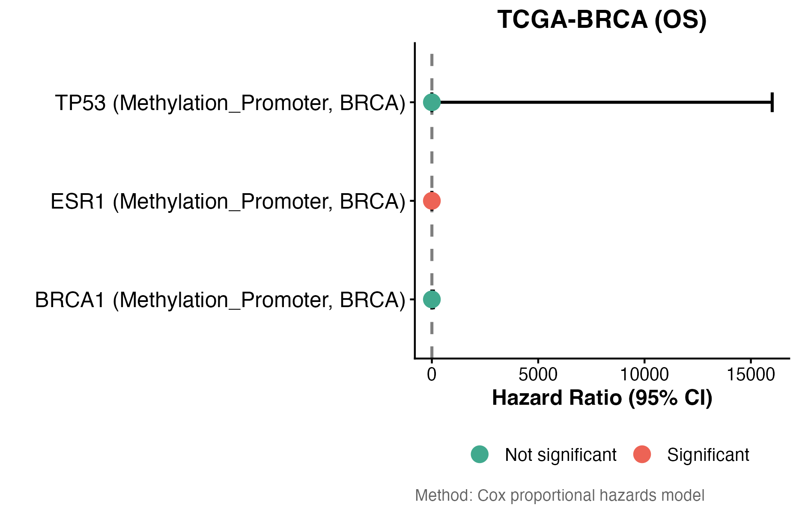

*Figure 179. Epigenetic markers in survival prediction*

**Example 180: Multi-miRNA forest plot**
```r
result <- tcga_survival(
  var1 = c("hsa-let-7a-1", "hsa-mir-21", "hsa-mir-200c"),
  var1_modal = "miRNA",
  var1_cancers = "BRCA",
  surv_type = "OS",
  cutoff_type = "optimal"
)
```

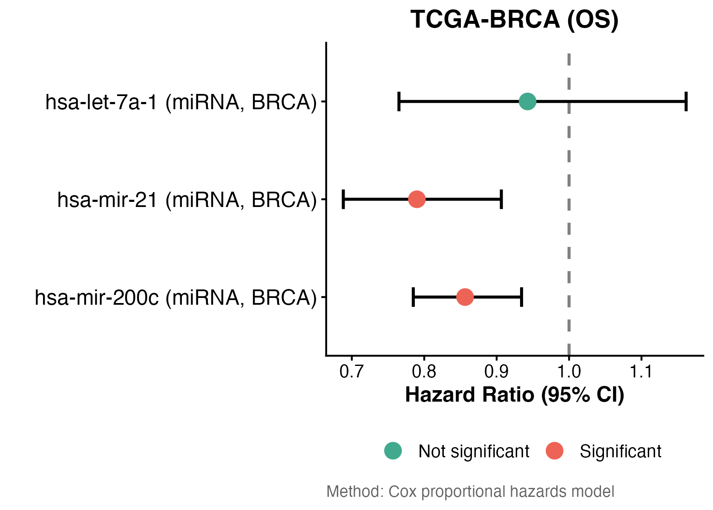

*Figure 180. miRNA panel for survival stratification*

**Example 181: Multi-immune cell forest plot**
```r
result <- tcga_survival(
  var1 = c("T_cells_CD8", "Macrophages_M1", "NK_cells_activated"),
  var1_modal = "ImmuneCell",
  var1_cancers = "BRCA",
  surv_type = "OS",
  immune_algorithm = "cibersort",
  cutoff_type = "optimal"
)
```

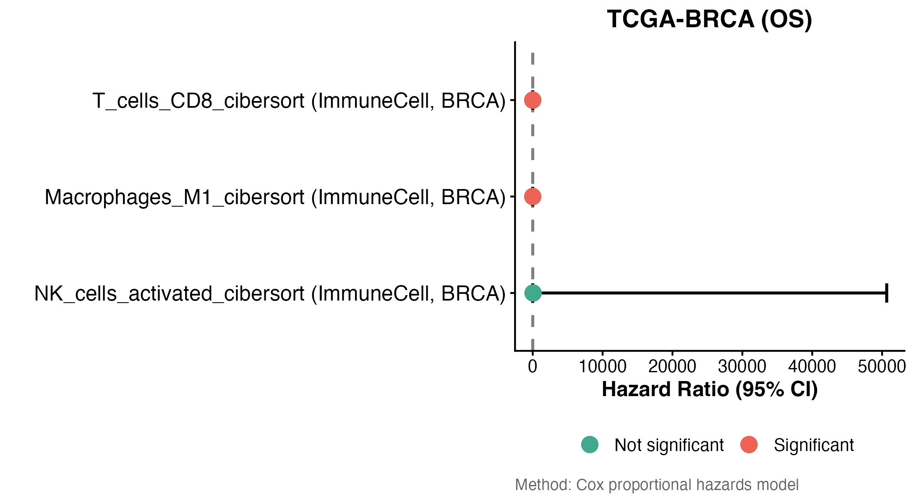

*Figure 181. Immune cell panel predicts overall survival*

**Example 182: Multi-clinical variable forest plot**
```r
result <- tcga_survival(
  var1 = c("Age", "Gender", "Race"),
  var1_modal = "Clinical",
  var1_cancers = "BRCA",
  surv_type = "OS"
)
```

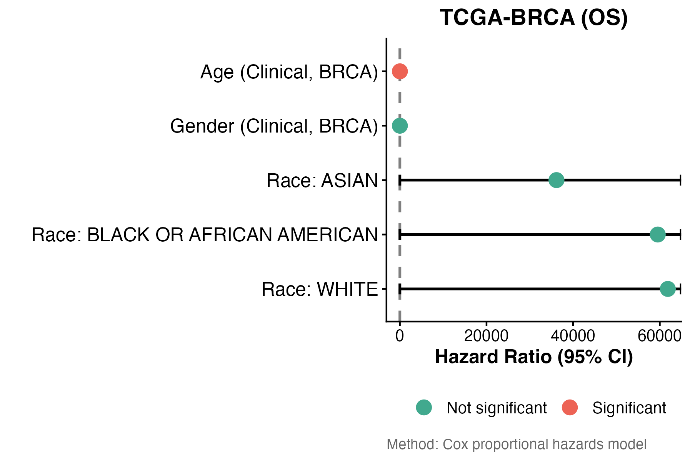

*Figure 182. Demographic variables in multivariate survival model*

**Example 183: Stage and age forest plot**
```r
result <- tcga_survival(
  var1 = c("Stage", "Age"),
  var1_modal = "Clinical",
  var1_cancers = "BRCA",
  surv_type = "OS"
)
```

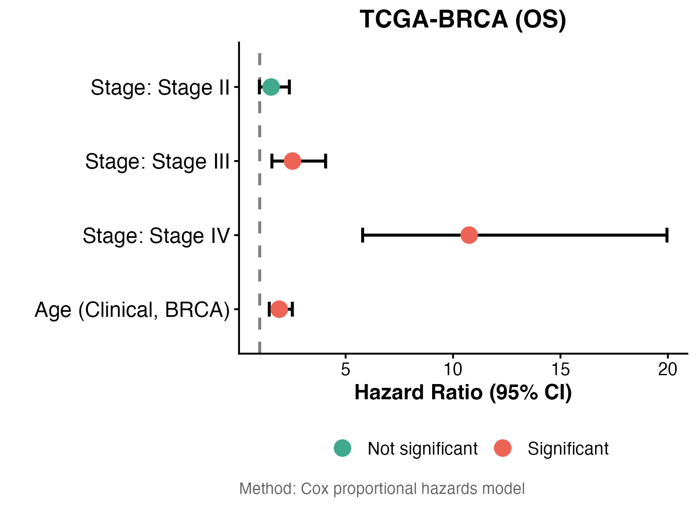

*Figure 183. Stage remains the strongest prognostic factor*

**Example 184: ER-PR-HER2 trinity forest plot**
```r
result <- tcga_survival(
  var1 = c("ER", "PR", "HER2"),
  var1_modal = "Clinical",
  var1_cancers = "BRCA",
  surv_type = "PFS"
)
```

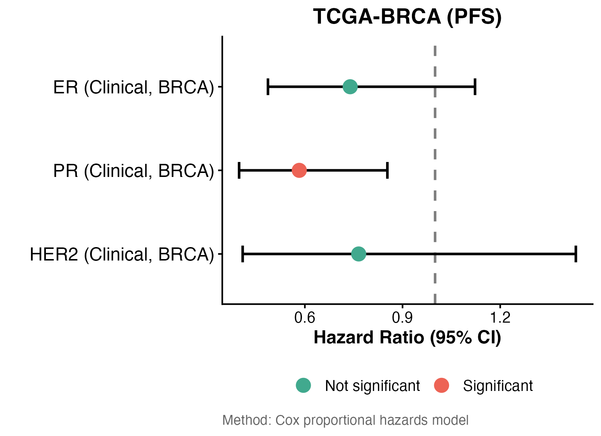

*Figure 184. Hormone receptor status predicts disease progression*

**Example 185: Pan-cancer TP53 mutation forest plot**
```r
result <- tcga_survival(
  var1 = "TP53",
  var1_modal = "Mutation",
  var1_cancers = c("BRCA", "LUAD"),
  surv_type = "OS"
)
```

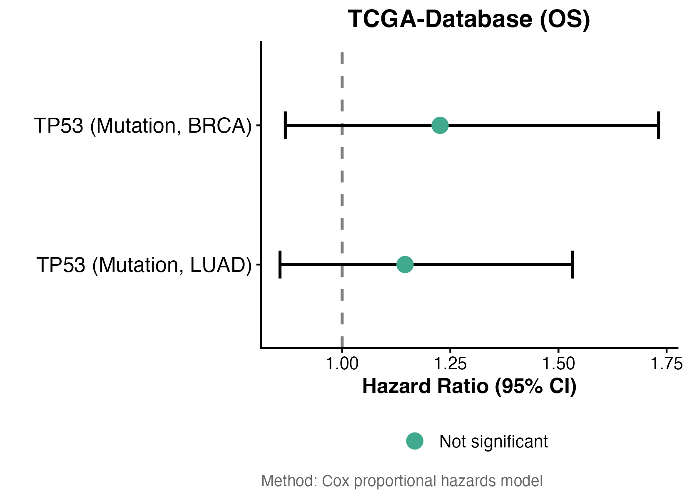

*Figure 185. TP53 mutation shows cancer-specific survival effects*

**Example 186: Pan-cancer TP53 expression forest plot**
```r
result <- tcga_survival(
  var1 = "TP53",
  var1_modal = "RNAseq",
  var1_cancers = c("BRCA", "LUAD"),
  surv_type = "OS",
  cutoff_type = "optimal"
)
```

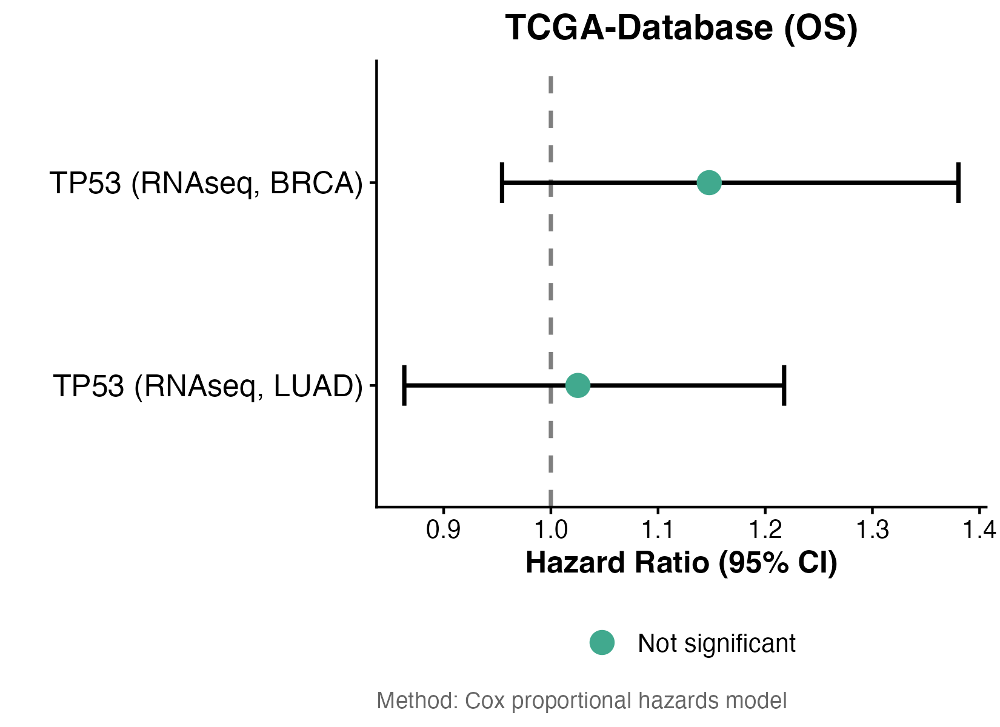

*Figure 186. TP53 expression has opposite effects in different cancers*

---

## Advanced Features

### Data Modality Options

| Modality | Description | Example Variables |
|----------|-------------|-------------------|
| **RNAseq** | mRNA expression (log2 TPM) | TP53, ESR1, MYC, EGFR |
| **Mutation** | Binary mutation status | TP53, KRAS, PIK3CA, BRAF |
| **CNV** | Copy number variation | MYC, ERBB2, CCND1, EGFR |
| **Methylation** | Promoter methylation beta values | TP53, ESR1, MLH1, BRCA1 |
| **miRNA** | microRNA expression | hsa-let-7a-1, hsa-mir-21 |
| **Clinical** | Patient demographics and clinical features | Age, Gender, Stage, ER, PR, HER2 |
| **ImmuneCell** | Immune cell infiltration scores | T_cells_CD8, Macrophages_M1, NK_cells |
| **Signature** | Molecular signatures | TMB, Purity, TIL_Score, Stemness, MSI |

### Immune Cell Algorithms

SLTCGA integrates 7 immune deconvolution algorithms:
- **CIBERSORT**: 22 immune cell types
- **EPIC**: 8 cell types
- **MCPcounter**: 10 cell types
- **quanTIseq**: 11 cell types
- **TIMER**: 6 cell types
- **xCell**: 64 cell types
- **Consensus**: Average across algorithms

### Enrichment Databases

- **MsigDB Hallmark**: 50 curated gene sets (default)
- **MsigDB C2 KEGG**: KEGG pathways
- **MsigDB C2 Reactome**: Reactome pathways
- **MsigDB C5 GO**: Gene Ontology (BP, MF, CC)
- **MsigDB C6**: Oncogenic signatures
- **MsigDB C7**: Immunologic signatures

### Statistical Methods

**Correlation Analysis**:
- Continuous vs Continuous: Pearson/Spearman correlation
- Categorical vs Continuous: Wilcoxon/Kruskal-Wallis test
- Categorical vs Categorical: Chi-square/Fisher's exact test

**Enrichment Analysis**:
- Differential expression: Wilcoxon/limma
- Pathway enrichment: GSEA (fgsea)

**Survival Analysis**:
- Single variable: Kaplan-Meier + Cox regression
- Multiple variables: Multivariate Cox (Forest plot)
- Cutoff selection: Optimal (survminer) or Median

---

## Cancer Types and Subtypes

### 33 Main Cancer Types

TCGA cancer types supported:
- **BRCA**: Breast invasive carcinoma
- **LUAD**: Lung adenocarcinoma
- **LUSC**: Lung squamous cell carcinoma
- **COAD**: Colon adenocarcinoma
- **READ**: Rectum adenocarcinoma
- **KIRC**: Kidney renal clear cell carcinoma
- **KIRP**: Kidney renal papillary cell carcinoma
- **HNSC**: Head and neck squamous cell carcinoma
- **LIHC**: Liver hepatocellular carcinoma
- **THCA**: Thyroid carcinoma
- **PRAD**: Prostate adenocarcinoma
- **STAD**: Stomach adenocarcinoma
- **SKCM**: Skin cutaneous melanoma
- **BLCA**: Bladder urothelial carcinoma
- **UCEC**: Uterine corpus endometrial carcinoma
- **GBM**: Glioblastoma multiforme
- **LGG**: Brain lower grade glioma
- **OV**: Ovarian serous cystadenocarcinoma
- **ESCA**: Esophageal carcinoma
- **PAAD**: Pancreatic adenocarcinoma
- **KICH**: Kidney chromophobe
- **PCPG**: Pheochromocytoma and paraganglioma
- **SARC**: Sarcoma
- **TGCT**: Testicular germ cell tumors
- **THYM**: Thymoma
- **MESO**: Mesothelioma
- **ACC**: Adrenocortical carcinoma
- **UVM**: Uveal melanoma
- **DLBC**: Lymphoid neoplasm diffuse large B-cell lymphoma
- **CESC**: Cervical squamous cell carcinoma
- **CHOL**: Cholangiocarcinoma
- **UCS**: Uterine carcinosarcoma
- **CRC**: Colorectal cancer (COAD+READ)

### 32 Molecular Subtypes

**Breast Cancer (BRCA)**:
- BRCA_IDC: Invasive ductal carcinoma
- BRCA_ILC: Invasive lobular carcinoma
- BRCA_TNBC: Triple-negative breast cancer

**Colon Cancer (COAD)**:
- COAD_LCC: Left-sided colon cancer
- COAD_RCC: Right-sided colon cancer
- COAD_MAC: Mucinous adenocarcinoma
- COAD_TC: Transverse colon

**Lung Cancer**:
- NSCLC: Non-small cell lung cancer (LUAD+LUSC)

**Kidney Cancer**:
- KRCC: Kidney renal cell carcinoma (KIRC+KIRP+KICH)

**Glioma**:
- GLIOMA: Glioma (GBM+LGG)
- LGG_ASTROCYTOMA: Astrocytoma
- LGG_OLIGODENDROGLIOMA: Oligodendroglioma
- LGG_OLIGOASTROCYTOMA: Oligoastrocytoma

**Esophageal Cancer (ESCA)**:
- ESCA_ESCC: Esophageal squamous cell carcinoma
- ESCA_EAC: Esophageal adenocarcinoma

**Head and Neck Cancer (HNSC)**:
- HNSC_OSCC: Oral squamous cell carcinoma
- HNSC_LSCC: Laryngeal squamous cell carcinoma
- HNSC_OPSCC: Oropharyngeal squamous cell carcinoma

**Cervical Cancer (CESC)**:
- CESC_CSCC: Cervical squamous cell carcinoma

**And more...**

---

## Output Files

All analyses automatically save:

1. **Plots** (PNG, 300 DPI): `sltcga_output/[analysis]_[cancer]_[variables]_[modality].png`
2. **Statistics** (TSV): Results tables with p-values, correlations, etc.
3. **Raw Data** (TSV): Merged data matrix for downstream analysis

---

## Citation

If you use SLTCGA in your research, please cite:

```
Liu Z, et al. (2025). SLTCGA: A Comprehensive R Package for Multi-Omics 
Analysis of The Cancer Genome Atlas. [Journal], [Volume]([Issue]), [Pages].
```

---

## Contact

- **Author**: Zaoqu Liu; Yuyao Liu
- **Email**: liuzaoqu@163.com
- **GitHub**: https://github.com/SolvingLab/SLTCGA

---

## License

GPL-3.0 License. See [LICENSE.md](LICENSE.md) for details.

---

## Acknowledgments

- The Cancer Genome Atlas (TCGA) Research Network
- Bioconductor community
- All package dependencies maintainers

---

*Last updated: 2025*
