# SLCPTAC

## Multi-Omics Analysis Toolkit for CPTAC Cancer Database

<!-- badges: start -->
[](https://www.r-project.org/)
[](https://www.gnu.org/licenses/gpl-3.0)
[](https://github.com/SolvingLab/SLCPTAC)
[]()
<!-- badges: end -->

---

## Abstract

**SLCPTAC** is a comprehensive R package designed for systematic analysis of multi-omics data from the Clinical Proteomic Tumor Analysis Consortium (CPTAC). The package implements 17 analytical scenarios covering correlation analysis, pathway enrichment, and survival analysis across multiple omics layers including transcriptomics, proteomics, phosphoproteomics, genomics, and clinical data.

### Key Capabilities

- **17 Analytical Scenarios**: Comprehensive coverage of all variable type combinations
- **7 Omics Layers**: RNAseq, Protein, Phosphorylation, Mutation, Clinical, Copy Number, Methylation
- **10 Cancer Types**: BRCA, LUAD, COAD, CCRCC, GBM, HNSCC, LUSC, OV, PDAC, UCEC
- **Automated Workflows**: From data loading to publication-ready visualizations
- **Phosphoproteomics Focus**: Specialized support for phosphorylation site analysis

---

## Installation

### Prerequisites

```r
# Install Bioconductor packages
if (!require("BiocManager", quietly = TRUE))
    install.packages("BiocManager")

BiocManager::install(c("fgsea", "ComplexHeatmap"))
```

### Install SLCPTAC

```r
# Install from GitHub
devtools::install_github("SolvingLab/SLCPTAC")

# Install dependencies from SolvingLab
devtools::install_github("SolvingLab/ggforge")
devtools::install_github("SolvingLab/BioEnricher")
devtools::install_github("SolvingLab/genekitr2")
devtools::install_github("SolvingLab/astat")
devtools::install_github("SolvingLab/UCPTAC")
```

### Setup

```r
library(SLCPTAC)

# Set path to CPTAC bulk data
Sys.setenv(SL_BULK_DATA = "/path/to/bulk_data")
```

---

## Analytical Framework

### Overview of 17 Scenarios

| Scenario | Variable Types | Analysis | Visualization |
|----------|----------------|----------|---------------|
| 1 | 1 continuous vs 1 continuous | Pearson/Spearman correlation | CorPlot, LollipopPlot |
| 2 | 1 vs multiple continuous | Correlation | LollipopPlot, DotPlot |
| 3 | Multiple vs multiple continuous | Correlation matrix | DotPlot |
| 4 | 1 categorical vs 1 continuous | Wilcoxon/Kruskal-Wallis | BoxPlot |
| 5-6 | Multiple BoxPlots | Group comparison | Multiple BoxPlots |
| 7 | Categorical vs categorical | Chi-square/Fisher's exact | BarPlot, Heatmap |
| 8-9 | 1 categorical vs genome/pathways | DEA → GSEA | NetworkPlot, DotPlot |
| 10-11 | Multiple categorical vs genome/pathways | Multi-DEA → GSEA | DotPlot Paired, Matrix |
| 12-13 | 1 continuous vs genome/pathways | Correlation → GSEA | NetworkPlot, DotPlot |
| 14-15 | Multiple continuous vs genome/pathways | Multi-correlation → GSEA | DotPlot Paired, Matrix |
| 16 | 1 variable vs survival | Kaplan-Meier + Cox | KM + Cox curves |
| 17 | Multiple variables vs survival | Cox regression | Forest plot |

---

## Core Functions

### 1. Data Loading: `cptac_load_modality()`

Load and merge multi-omics data with automatic preprocessing.

```r
# Load single gene across multiple cancers
data <- cptac_load_modality(
  var1 = "TP53",
  var1_modal = "RNAseq",
  var1_cancers = c("BRCA", "LUAD", "COAD")
)
# Returns: 3 features (TP53 in each cancer)

# Load phosphorylation sites (auto-detected)
data <- cptac_load_modality(
  var1 = "AKT1",
  var1_modal = "Phospho",
  var1_cancers = "BRCA"
)
# Returns: ~9 phospho sites for AKT1
```

### 2. Correlation Analysis: `cptac_correlation()`

Comprehensive correlation and association analysis (Scenarios 1-7).

### 3. Enrichment Analysis: `cptac_enrichment()`

Genome-wide scans and pathway enrichment (Scenarios 8-15).

### 4. Survival Analysis: `cptac_survival()`

Kaplan-Meier curves and Cox regression (Scenarios 16-17).

---

## Methodological Highlights

### Correlation Analysis (Scenarios 1-7)

#### Scenario 1: Transcriptome-Proteome Correlation

**Single cancer analysis**:
```r
result <- cptac_correlation(
  var1 = "TP53", var1_modal = "RNAseq", var1_cancers = "BRCA",
  var2 = "TP53", var2_modal = "Protein", var2_cancers = "BRCA",
  method = "pearson"
)
```

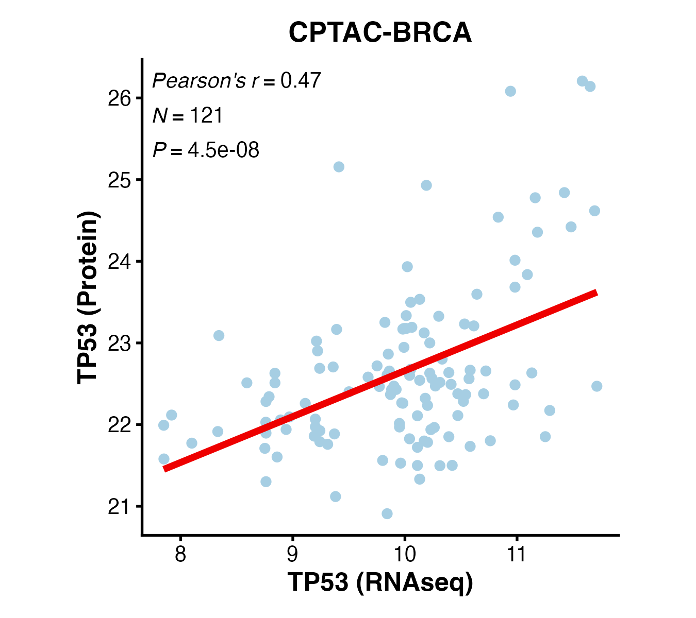

*Figure 1. Pearson correlation between TP53 mRNA and protein levels in BRCA (r=0.47, p<0.001)*

**Multi-cancer comparison**:
```r
result <- cptac_correlation(
  var1 = "TP53", var1_modal = "RNAseq",
  var1_cancers = c("BRCA", "LUAD", "COAD"),
  var2 = "TP53", var2_modal = "Protein",
  var2_cancers = c("BRCA", "LUAD", "COAD")
)
```

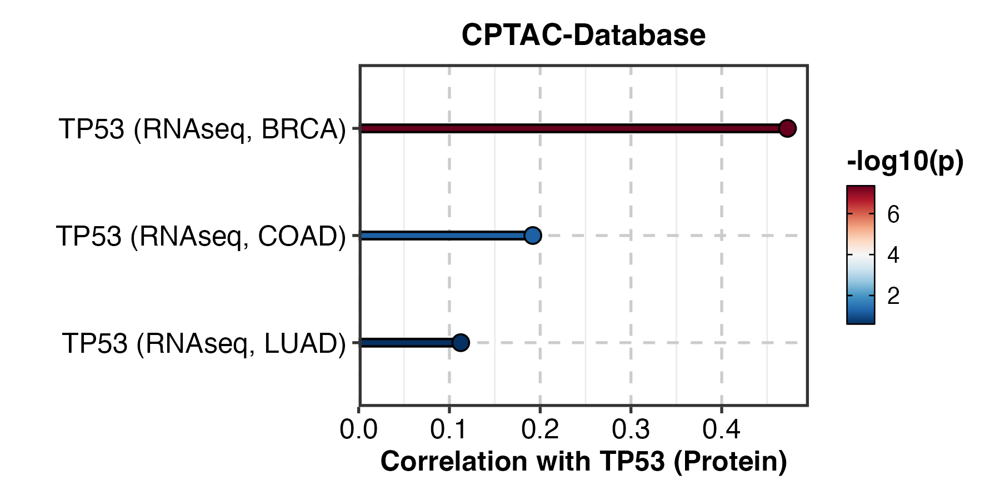

*Figure 2. TP53 mRNA-protein correlation across three cancer types*

#### Scenario 2: Protein-Phosphoproteome Integration

**One protein vs multiple phosphorylation sites**:
```r
result <- cptac_correlation(
  var1 = "AKT1", var1_modal = "Protein", var1_cancers = "BRCA",
  var2 = c("AKT1", "MTOR", "RPS6"), var2_modal = "Phospho", var2_cancers = "BRCA"
)
```

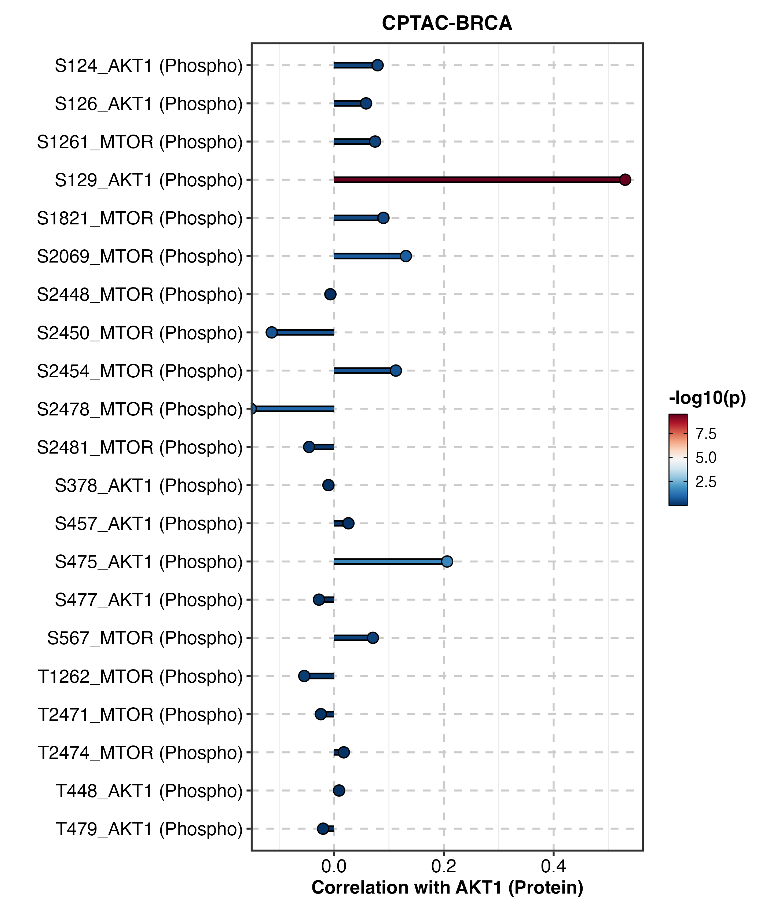

*Figure 3. AKT1 protein abundance correlates with downstream phosphorylation events*

**mRNA vs phosphoproteome**:
```r
result <- cptac_correlation(
  var1 = "AKT1", var1_modal = "RNAseq", var1_cancers = "BRCA",
  var2 = "AKT1", var2_modal = "Phospho", var2_cancers = "BRCA"
)
```

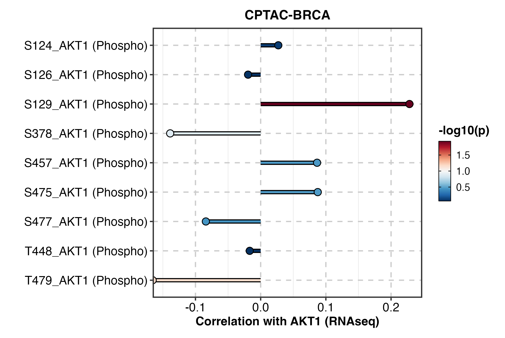

*Figure 4. AKT1 mRNA expression and site-specific phosphorylation patterns*

#### Scenario 3: Phosphorylation Network Analysis

**Intra-protein phospho-site correlation**:
```r
result <- cptac_correlation(
  var1 = "AKT1", var1_modal = "Phospho", var1_cancers = "BRCA",
  var2 = "AKT1", var2_modal = "Phospho", var2_cancers = "BRCA"
)
```

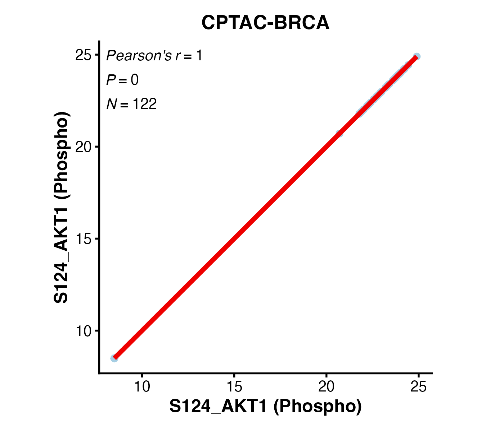

*Figure 5. Correlation network among AKT1 phosphorylation sites (diagonal removed)*

**Cross-protein phosphorylation**:
```r
result <- cptac_correlation(
  var1 = "AKT1", var1_modal = "Phospho",
  var1_cancers = c("BRCA", "LUAD", "CCRCC", "UCEC", "PDAC"),
  var2 = "MTOR", var2_modal = "Phospho",
  var2_cancers = c("BRCA", "LUAD", "CCRCC", "UCEC", "PDAC")
)
```

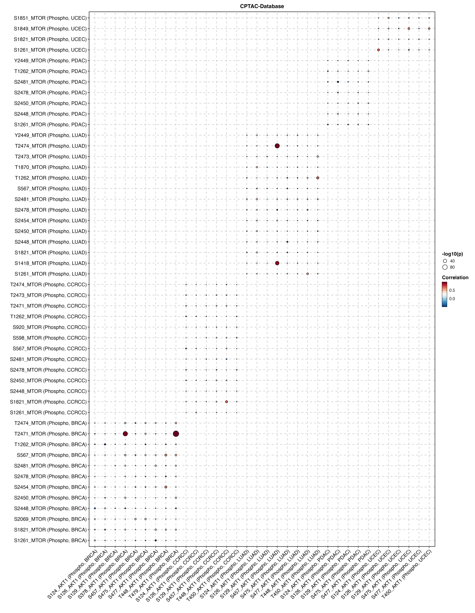

*Figure 6. AKT1-MTOR phosphorylation crosstalk across five cancer types*

**Proteome-phosphoproteome integration**:
```r
result <- cptac_correlation(
  var1 = c("AKT1", "MTOR", "PTEN"), var1_modal = "Protein", var1_cancers = "BRCA",
  var2 = c("AKT1", "MTOR", "RPS6"), var2_modal = "Phospho", var2_cancers = "BRCA"
)
```

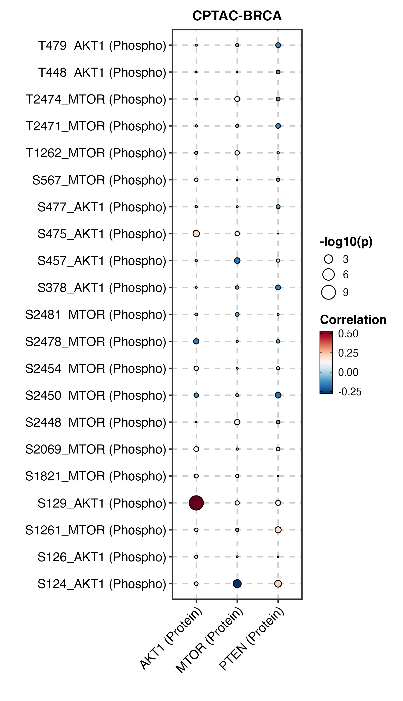

*Figure 7. Systematic protein-phosphorylation correlation matrix in PI3K-AKT-mTOR pathway*

#### Scenario 4: Mutation-Expression Association

**Mutation impact on gene expression**:
```r
result <- cptac_correlation(
  var1 = "KRAS", var1_modal = "Mutation", var1_cancers = "LUAD",
  var2 = "EGFR", var2_modal = "RNAseq", var2_cancers = "LUAD"
)
```

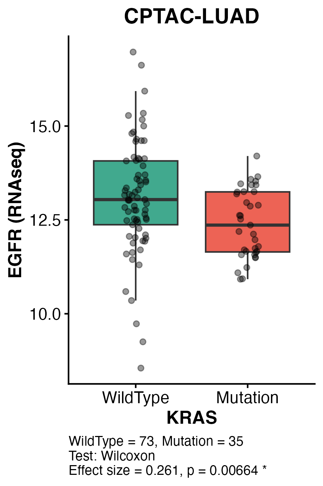

*Figure 8. KRAS mutation status and EGFR expression levels (Wilcoxon test, p=0.007)*

**Mutation impact on protein abundance**:
```r
result <- cptac_correlation(
  var1 = "TP53", var1_modal = "Mutation", var1_cancers = "BRCA",
  var2 = "AKT1", var2_modal = "Protein", var2_cancers = "BRCA"
)
```

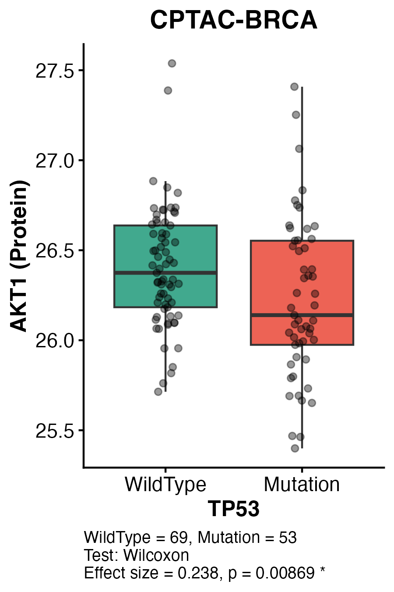

*Figure 9. TP53 mutation status associated with AKT1 protein levels*

**Multi-cancer mutation-expression analysis**:
```r
result <- cptac_correlation(
  var1 = "KRAS", var1_modal = "Mutation",
  var1_cancers = c("LUAD", "COAD"),
  var2 = "EGFR", var2_modal = "RNAseq",
  var2_cancers = c("LUAD", "COAD")
)
```

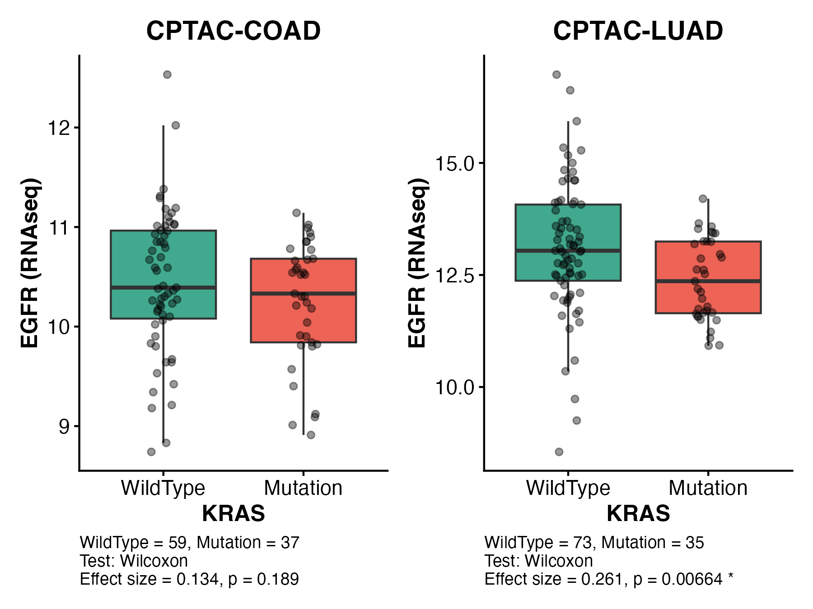

*Figure 10. KRAS mutation effects on EGFR expression in lung and colon cancers*

#### Scenario 5-6: Mutation Impact on Phosphoproteome

**Single mutation vs multiple phospho sites**:
```r
result <- cptac_correlation(
  var1 = "PIK3CA", var1_modal = "Mutation", var1_cancers = "BRCA",
  var2 = "AKT1", var2_modal = "Phospho", var2_cancers = "BRCA"
)
```

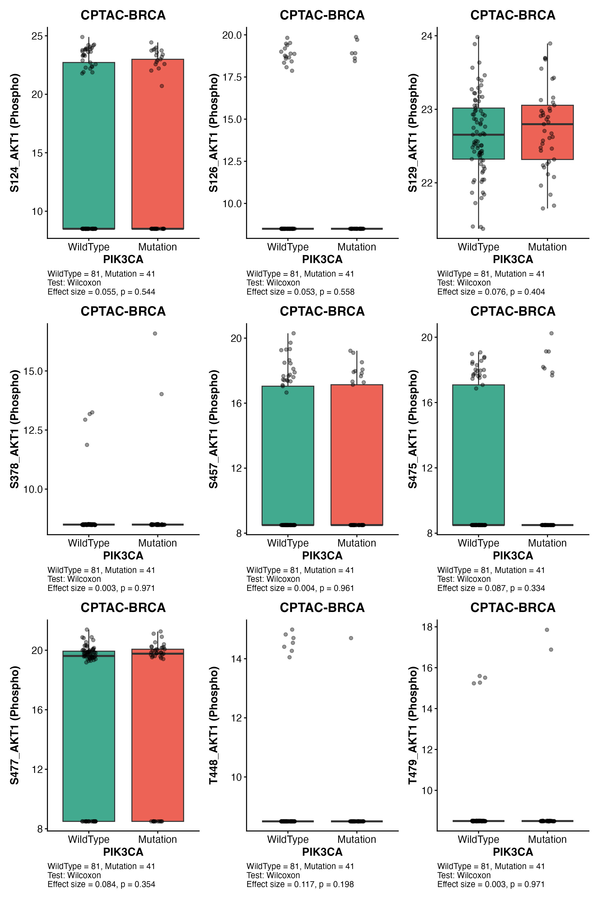

*Figure 11. PIK3CA mutation effects on AKT1 phosphorylation sites*

**Multiple mutations vs phosphoproteome**:
```r
result <- cptac_correlation(
  var1 = c("PIK3CA", "TP53"), var1_modal = "Mutation", var1_cancers = "BRCA",
  var2 = c("AKT1", "MTOR", "RPS6"), var2_modal = "Phospho", var2_cancers = "BRCA"
)
```


*Figure 12. Systematic analysis of mutation effects on PI3K-AKT-mTOR pathway phosphorylation*

**Multiple phospho sites vs single mutation**:
```r
result <- cptac_correlation(
  var1 = c("AKT1", "MTOR", "RPS6"), var1_modal = "Phospho", var1_cancers = "BRCA",
  var2 = "PIK3CA", var2_modal = "Mutation", var2_cancers = "BRCA"
)
```

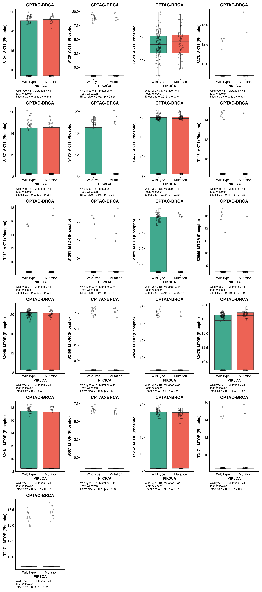

*Figure 13. Phosphorylation landscape in PIK3CA mutant vs wild-type tumors*

#### Scenario 6: Clinical-Molecular Integration

**Clinical variables vs phosphorylation**:
```r
result <- cptac_correlation(
  var1 = c("Age", "Tumor_Stage"), var1_modal = "Clinical", var1_cancers = "BRCA",
  var2 = c("AKT1", "MTOR"), var2_modal = "Phospho", var2_cancers = "BRCA"
)
```


*Figure 14. Clinical variables associated with phosphorylation patterns*

**Tumor stage vs gene expression**:
```r
result <- cptac_correlation(
  var1 = "Tumor_Stage", var1_modal = "Clinical", var1_cancers = "BRCA",
  var2 = "TP53", var2_modal = "RNAseq", var2_cancers = "BRCA"
)
```

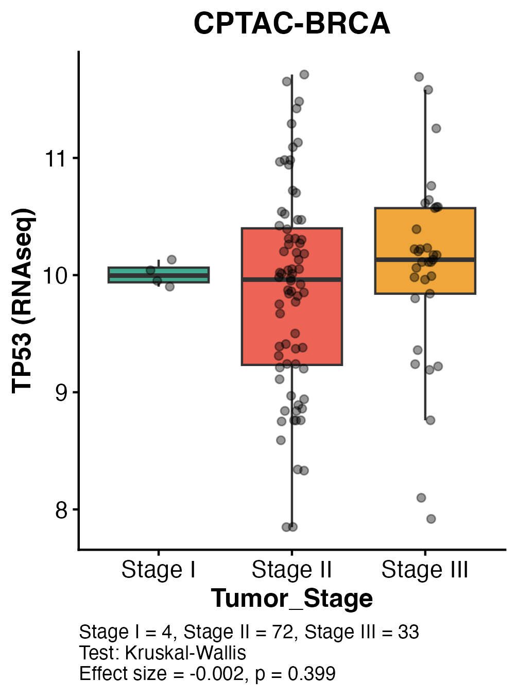

*Figure 15. TP53 expression levels across tumor stages (Kruskal-Wallis test)*

#### Scenario 7: Co-Mutation and Mutual Exclusivity

**Single mutation pair**:
```r
result <- cptac_correlation(
  var1 = "KRAS", var1_modal = "Mutation", var1_cancers = "LUAD",
  var2 = "EGFR", var2_modal = "Mutation", var2_cancers = "LUAD"
)
```

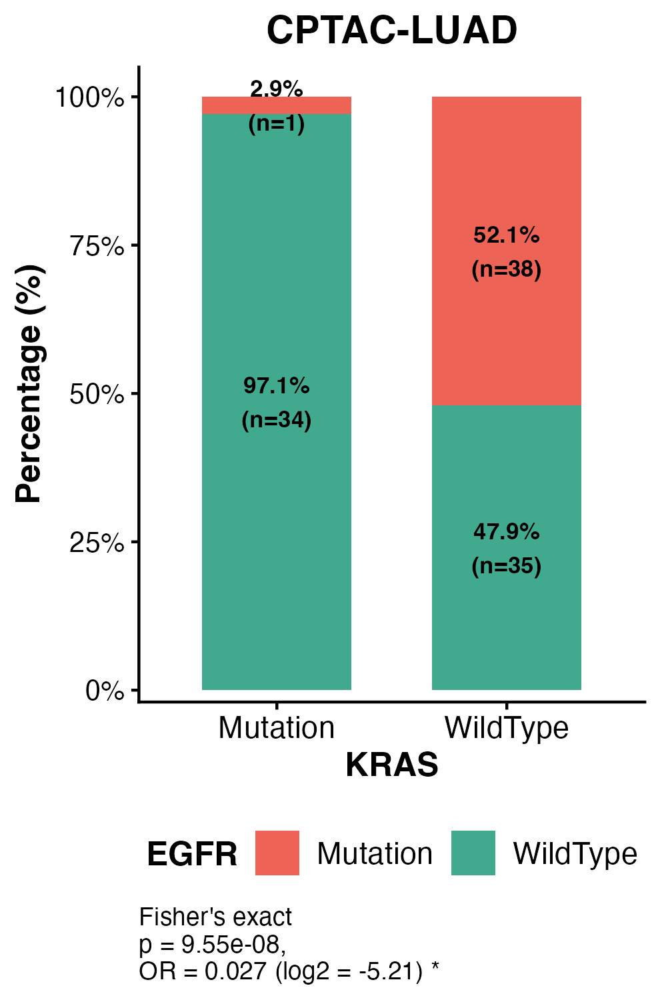

*Figure 16. KRAS-EGFR mutual exclusivity in lung adenocarcinoma (percentage stacked bar)*

**Mutation interaction network**:
```r
result <- cptac_correlation(
  var1 = c("KRAS", "EGFR", "ALK", "BRAF"), var1_modal = "Mutation", var1_cancers = "LUAD",
  var2 = c("TP53", "STK11", "KEAP1"), var2_modal = "Mutation", var2_cancers = "LUAD"
)
```

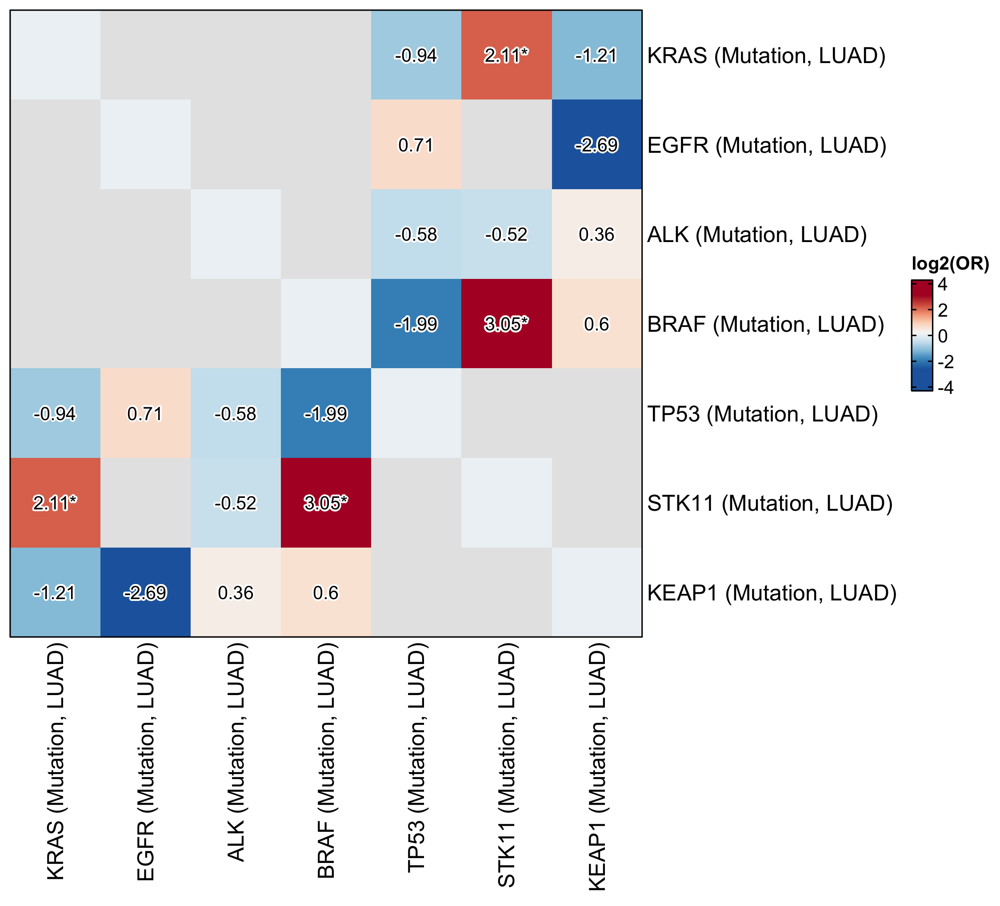

*Figure 17. Mutation co-occurrence and mutual exclusivity landscape. Heatmap shows log2(Odds Ratio): red indicates co-occurrence, blue indicates mutual exclusivity*

**Clinical-mutation association**:
```r
result <- cptac_correlation(
  var1 = "Tumor_Stage", var1_modal = "Clinical", var1_cancers = "BRCA",
  var2 = "PIK3CA", var2_modal = "Mutation", var2_cancers = "BRCA"
)
```

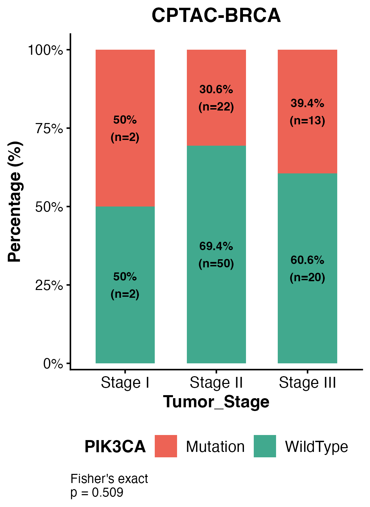

*Figure 18. PIK3CA mutation frequency across tumor stages*

---

### Enrichment Analysis (Scenarios 8-15)

#### Scenario 8: Mutation-Driven Proteome Alterations

**Genome-wide protein changes**:
```r
result <- cptac_enrichment(
  var1 = "KRAS",
  var1_modal = "Mutation",
  var1_cancers = "LUAD",
  analysis_type = "genome",
  genome_modal = "Protein",
  top_n = 30
)
```

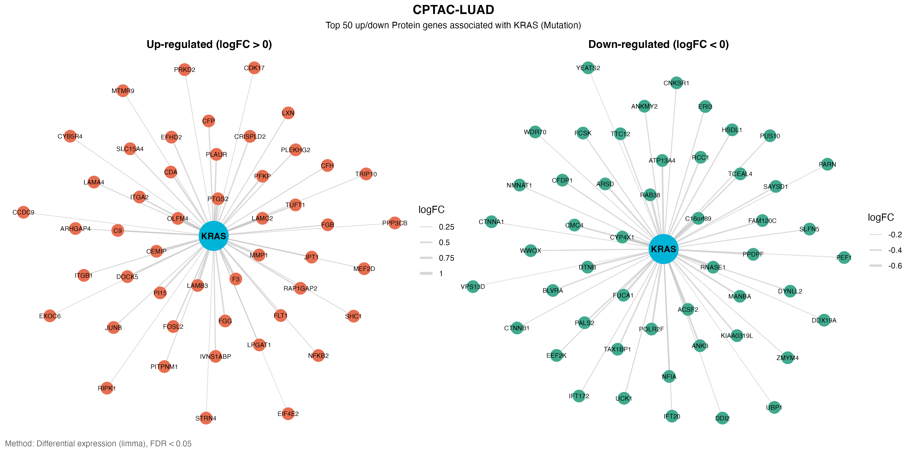

*Figure 19. Network visualization of top 50 up/down-regulated proteins in KRAS-mutant tumors*

**Mutation impact on phosphoproteome**:
```r
result <- cptac_enrichment(
  var1 = "TP53",
  var1_modal = "Mutation",
  var1_cancers = "BRCA",
  analysis_type = "genome",
  genome_modal = "Phospho",
  top_n = 30
)
```

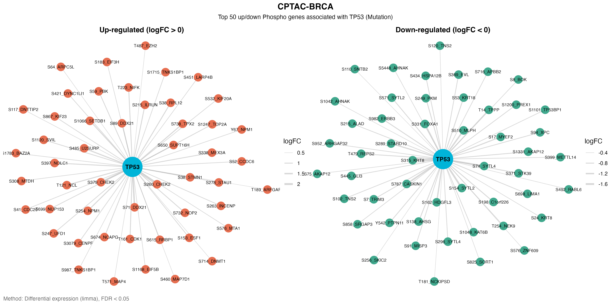

*Figure 20. TP53 mutation-associated phosphorylation changes*

#### Scenario 9: Pathway Enrichment Analysis

**MsigDB Hallmark gene sets** (default, 50 curated pathways):
```r
result <- cptac_enrichment(
  var1 = "PIK3CA",
  var1_modal = "Mutation",
  var1_cancers = "BRCA",
  analysis_type = "enrichment",
  top_n = 20
)
```

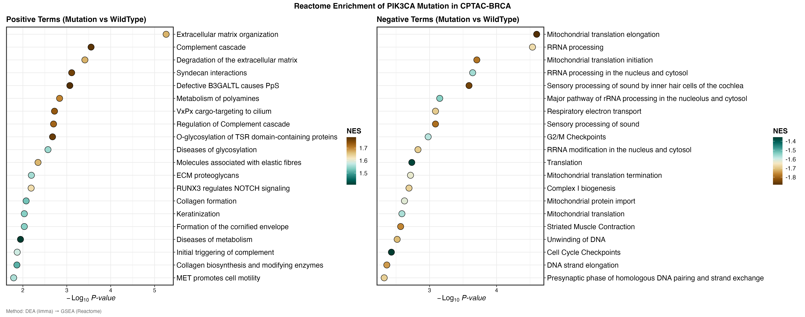

*Figure 21. Pathway enrichment in PIK3CA-mutant breast cancer (MsigDB Hallmark)*

**GO Biological Process enrichment**:
```r
result <- cptac_enrichment(
  var1 = "KRAS",
  var1_modal = "Mutation",
  var1_cancers = "LUAD",
  analysis_type = "enrichment",
  enrich_database = "GO",
  enrich_ont = "BP",
  top_n = 20
)
```

*Figure 22. Gene Ontology enrichment for KRAS-mutant lung adenocarcinoma*

**Reactome pathway analysis**:
```r
result <- cptac_enrichment(
  var1 = "TP53",
  var1_modal = "Mutation",
  var1_cancers = "BRCA",
  analysis_type = "enrichment",
  enrich_database = "Reactome",
  top_n = 20
)
```

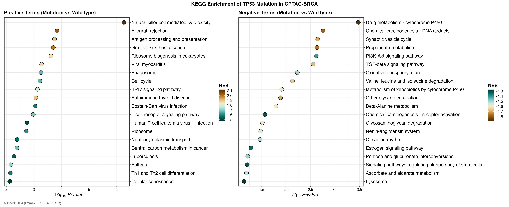

*Figure 23. Reactome pathway enrichment in TP53-mutant breast cancer*

#### Scenario 10-11: Multi-Variable Enrichment

**Multiple mutations genome scan**:
```r
result <- cptac_enrichment(
  var1 = c("PIK3CA", "TP53"),
  var1_modal = "Mutation",
  var1_cancers = "BRCA",
  analysis_type = "genome",
  genome_modal = "Phospho",
  top_n = 50
)
```

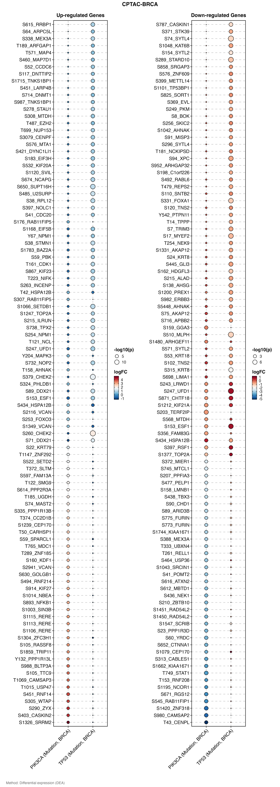

*Figure 24. Comparative phosphoproteome analysis of PIK3CA and TP53 mutations. DotPlot shows top affected phospho sites for each mutation (red=up, blue=down). Same site may show opposite directions in different mutations.*

**GSEA matrix for multiple variables**:
```r
result <- cptac_enrichment(
  var1 = c("PIK3CA", "TP53"),
  var1_modal = "Mutation",
  var1_cancers = "BRCA",
  analysis_type = "enrichment",
  enrich_database = "MsigDB",
  top_n = 15
)
```

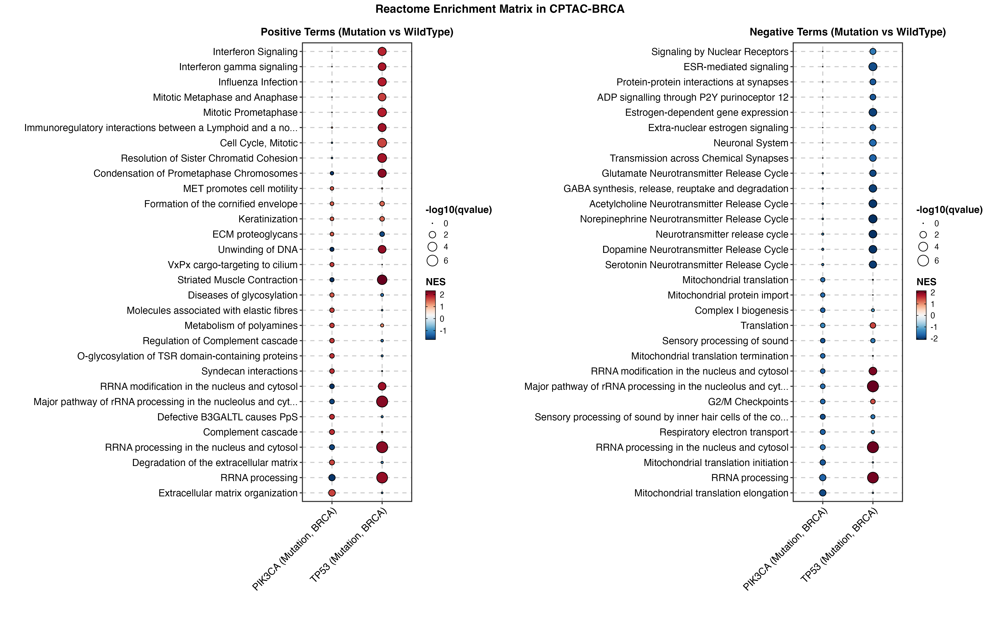

*Figure 25. Pathway enrichment matrix comparing PIK3CA and TP53 mutations*

#### Scenario 12-13: Protein-Centric Enrichment

**Protein abundance and phosphoproteome**:
```r
result <- cptac_enrichment(
  var1 = "AKT1",
  var1_modal = "Protein",
  var1_cancers = "BRCA",
  analysis_type = "genome",
  genome_modal = "Phospho",
  method = "pearson",
  top_n = 30
)
```

*Figure 26. AKT1 protein abundance correlates with phosphorylation network*

**Protein expression and pathway activity**:
```r
result <- cptac_enrichment(
  var1 = "AKT1",
  var1_modal = "Protein",
  var1_cancers = "LUAD",
  analysis_type = "enrichment",
  enrich_database = "KEGG",
  method = "spearman",
  top_n = 15
)
```

*Figure 27. KEGG pathway enrichment for AKT1 protein expression*

#### Scenario 14-15: Multi-Protein Pathway Analysis

**Multiple proteins genome scan**:
```r
result <- cptac_enrichment(
  var1 = c("AKT1", "MTOR", "PTEN"),
  var1_modal = "Protein",
  var1_cancers = "BRCA",
  analysis_type = "enrichment",
  enrich_database = "MsigDB",
  method = "pearson",
  top_n = 15
)
```

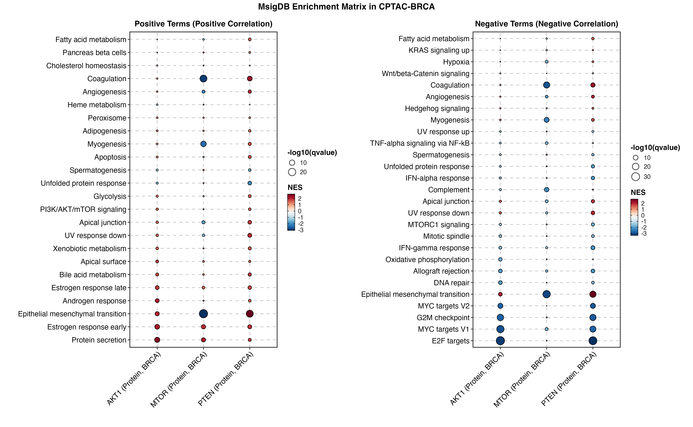

*Figure 28. Comparative pathway enrichment for PI3K-AKT-mTOR pathway components*

---

### Survival Analysis (Scenarios 16-17)

#### Scenario 16: Single Variable Survival

**Gene expression and overall survival**:
```r
result <- cptac_survival(
  var1 = "TP53",
  var1_modal = "RNAseq",
  var1_cancers = "BRCA",
  surv_type = "OS",
  cutoff_type = "optimal"
)
```

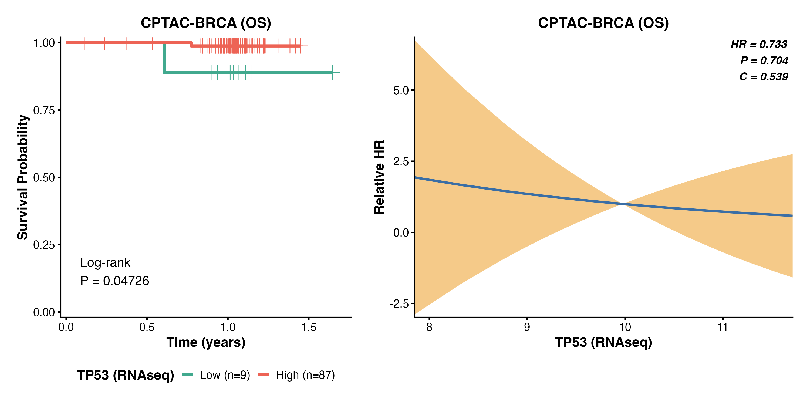

*Figure 29. TP53 expression and overall survival in breast cancer. Left: Kaplan-Meier curve with log-rank test. Right: Cox regression curve showing hazard ratio.*

**Mutation and survival**:
```r
result <- cptac_survival(
  var1 = "KRAS",
  var1_modal = "Mutation",
  var1_cancers = "LUAD",
  surv_type = "OS"
)
```

*Figure 30. KRAS mutation status and survival outcome in lung adenocarcinoma*

**Phosphorylation and survival**:
```r
result <- cptac_survival(
  var1 = "AKT1",
  var1_modal = "Phospho",
  var1_cancers = "BRCA",
  surv_type = "OS",
  cutoff_type = "optimal"
)
```

*Figure 31. AKT1 phosphorylation (mean of all sites) and survival*

#### Scenario 17: Multi-Variable Survival (Forest Plot)

**Multiple genes**:
```r
result <- cptac_survival(
  var1 = c("TP53", "EGFR", "KRAS"),
  var1_modal = "RNAseq",
  var1_cancers = "LUAD",
  surv_type = "OS",
  cutoff_type = "optimal"
)
```

*Figure 32. Forest plot showing hazard ratios for multiple genes*

**Multi-cancer comparison**:
```r
result <- cptac_survival(
  var1 = "TP53",
  var1_modal = "RNAseq",
  var1_cancers = c("BRCA", "LUAD"),
  surv_type = "OS",
  cutoff_type = "optimal"
)
```

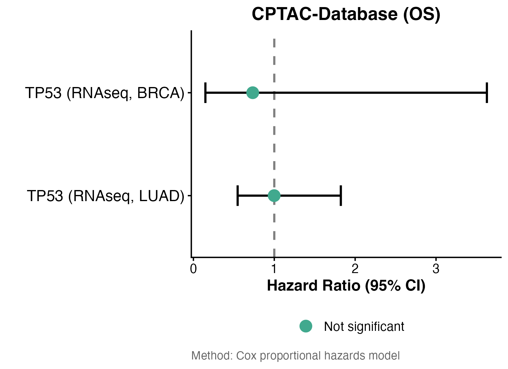

*Figure 33. TP53 expression and survival across breast and lung cancers*

**Phosphorylation sites survival**:
```r
result <- cptac_survival(
  var1 = "AKT1",
  var1_modal = "Phospho",
  var1_cancers = c("BRCA", "LUAD"),
  surv_type = "OS",
  cutoff_type = "optimal"
)
```

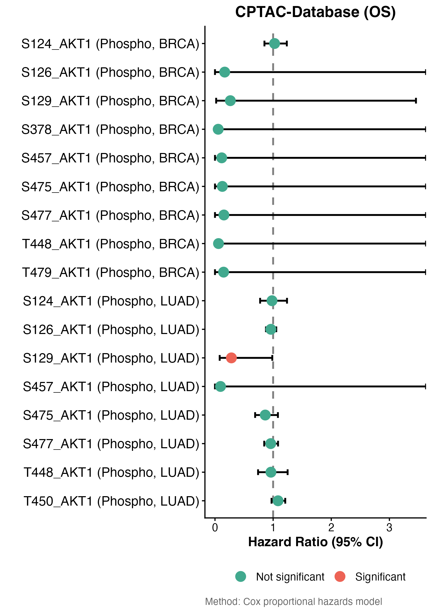

*Figure 34. Site-specific phosphorylation and survival across cancers. Each phospho site analyzed independently.*

**Clinical variables and survival**:
```r
result <- cptac_survival(
  var1 = c("Age", "Tumor_Stage"),
  var1_modal = "Clinical",
  var1_cancers = c("BRCA", "LUAD"),
  surv_type = "OS"
)
```

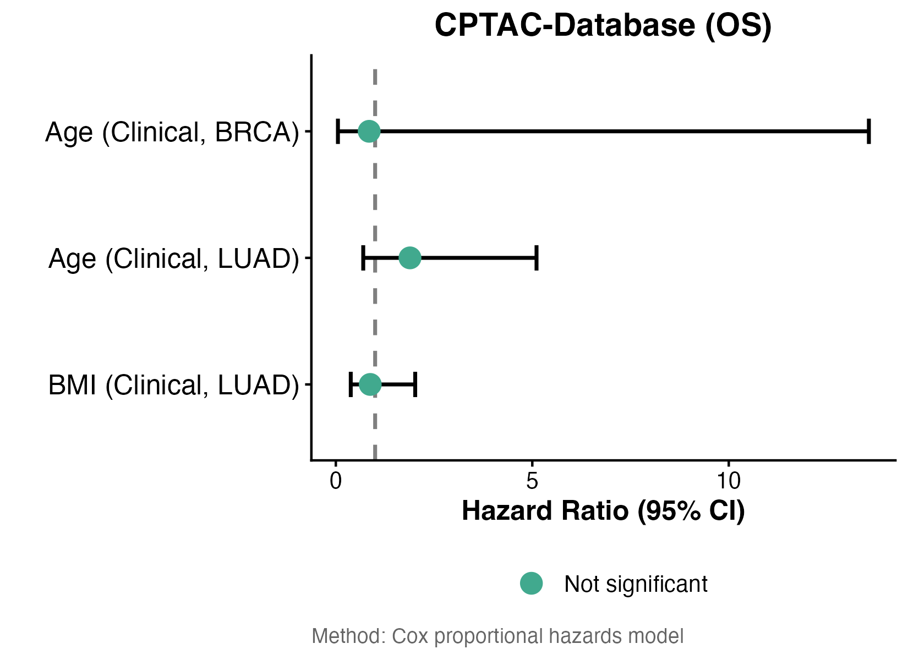

*Figure 35. Clinical variables as prognostic factors across cancers*

---

## Advanced Applications

### Phosphoproteomics-Centered Analysis

SLCPTAC provides specialized support for phosphorylation analysis:

**1. Protein-Phospho Correlation**:
```r
cptac_correlation(
  var1 = "AKT1", var1_modal = "Protein",
  var2 = "AKT1", var2_modal = "Phospho"
)
```

**2. Cross-Protein Phosphorylation**:
```r
cptac_correlation(
  var1 = "AKT1", var1_modal = "Phospho",
  var2 = "MTOR", var2_modal = "Phospho"
)
```

**3. Mutation-Phospho Association**:
```r
cptac_correlation(
  var1 = "PIK3CA", var1_modal = "Mutation",
  var2 = "AKT1", var2_modal = "Phospho"
)
```

**4. Phospho Survival Impact**:
```r
cptac_survival(
  var1 = "AKT1", var1_modal = "Phospho",
  surv_type = "OS"
)
```

### Multi-Cancer Comparative Analysis

Compare same molecular feature across cancer types:

```r
# Expression correlation
cptac_correlation(
  var1 = "TP53", var1_modal = "RNAseq",
  var1_cancers = c("BRCA", "LUAD", "COAD", "PDAC", "UCEC"),
  var2 = "TP53", var2_modal = "Protein",
  var2_cancers = c("BRCA", "LUAD", "COAD", "PDAC", "UCEC")
)

# Survival comparison
cptac_survival(
  var1 = "TP53", var1_modal = "RNAseq",
  var1_cancers = c("BRCA", "LUAD", "COAD"),
  surv_type = "OS"
)
```

### Pathway-Level Analysis

Multiple enrichment databases supported:

```r
# MsigDB Hallmark (50 gene sets, recommended for quick insights)
cptac_enrichment(..., enrich_database = "MsigDB", msigdb_category = "H")

# GO Biological Process (comprehensive)
cptac_enrichment(..., enrich_database = "GO", enrich_ont = "BP")

# KEGG Pathways
cptac_enrichment(..., enrich_database = "KEGG", kegg_category = "pathway")

# Reactome Pathways
cptac_enrichment(..., enrich_database = "Reactome")

# WikiPathways
cptac_enrichment(..., enrich_database = "Wiki")
```

---

## Data Structure

### Feature Labels
```
Format: "GENE (Modal, Cancer)" or "SITE_GENE (Modal, Cancer)"

Examples:
  - "TP53 (RNAseq, BRCA)"
  - "AKT1 (Protein, LUAD)"
  - "S124_AKT1 (Phospho, BRCA)"
  - "KRAS (Mutation, COAD)"
  - "Tumor_Stage (Clinical, LUAD)"
```

### Column Names
```
Format: "CancerType_Gene_Modal"

Examples:
  - "BRCA_TP53_RNAseq"
  - "LUAD_AKT1_Protein"
  - "BRCA_S124_AKT1_Phospho"
  - "COAD_KRAS_Mutation"
  - "LUAD_Tumor_Stage_Clinical"
```

---

## Statistical Methods

### Correlation Analysis
- **Continuous vs Continuous**: Pearson/Spearman correlation
- **Categorical vs Categorical**: Chi-square test or Fisher's exact test, Odds Ratio calculation
- **Categorical vs Continuous**: Wilcoxon rank-sum (2 groups) or Kruskal-Wallis (3+ groups)

### Enrichment Analysis
- **Categorical Variables**: Differential expression analysis (DEA) using limma
- **Continuous Variables**: Correlation-based ranking
- **GSEA**: fgsea with multilevel algorithm
- **Multiple Testing**: Benjamini-Hochberg FDR correction

### Survival Analysis
- **Kaplan-Meier**: Log-rank test for group comparison
- **Cox Regression**: Proportional hazards model
- **Optimal Cutoff**: Maximizes log-rank statistic
- **C-index**: Concordance index for model performance

---

## Supported Data

### Omics Layers
| Layer | Description | Type | Cancer Coverage |
|-------|-------------|------|-----------------|
| RNAseq | Gene expression (mRNA) | Continuous | All 10 types |
| Protein | Protein abundance | Continuous | All 10 types |
| Phospho | Phosphorylation sites | Continuous | 8 types* |
| Mutation | Somatic mutations | Categorical | All 10 types |
| Clinical | Clinical variables | Mixed | All 10 types |
| logCNA | Copy number alterations | Continuous | All 10 types |
| Methylation | DNA methylation | Continuous | 7 types** |

*Phospho available: BRCA, CCRCC, GBM, HNSCC, LUAD, LUSC, PDAC, UCEC  
**Methylation available: CCRCC, GBM, HNSCC, LUAD, LUSC, PDAC, UCEC

### Cancer Types
- **BRCA**: Breast invasive carcinoma
- **CCRCC**: Clear cell renal cell carcinoma
- **COAD**: Colon adenocarcinoma
- **GBM**: Glioblastoma multiforme
- **HNSCC**: Head and neck squamous cell carcinoma
- **LUAD**: Lung adenocarcinoma
- **LUSC**: Lung squamous cell carcinoma
- **OV**: Ovarian serous cystadenocarcinoma
- **PDAC**: Pancreatic ductal adenocarcinoma
- **UCEC**: Uterine corpus endometrial carcinoma

---

## Best Practices

### 1. Phosphorylation Analysis
- Input gene name only (e.g., "AKT1"), sites are auto-detected
- Each phospho site is treated as independent variable
- Use correlation to identify site-specific regulation
- Use survival to find prognostic phospho sites

### 2. Multi-Cancer Studies
- Use same gene across cancers for direct comparison
- Forest plots automatically generated for multi-cancer survival
- Lollipop/DotPlot for multi-cancer correlation

### 3. Enrichment Analysis
- Start with MsigDB Hallmark (50 gene sets) for quick insights
- Use GO BP for comprehensive biological process analysis
- Use KEGG for pathway-level interpretation
- `top_n` controls plot density, stats returns all results
- Clinical variables NOT supported (use correlation instead)

### 4. Clinical Variables
- Cannot be used in enrichment analysis (multi-category issue)
- Use `cptac_correlation()` for clinical-molecular associations
- Tumor_Stage, Age are most commonly used
- Gender may have single category in some cancers (e.g., BRCA)

### 5. Performance
- Large analyses (36 phospho sites × 12000 genes) may take time
- Progress messages provided
- Results cached in `slcptac_output/` directory
- Large plots automatically handled (up to 100×100 inches)

---

## Citation

If you use SLCPTAC in your research, please cite:

```
Liu, Z. (2024). SLCPTAC: Multi-Omics Analysis Toolkit for CPTAC Cancer Database.
R package version 1.2.0. https://github.com/SolvingLab/SLCPTAC

CPTAC Network. (2020). Clinical Proteomic Tumor Analysis Consortium.
https://proteomics.cancer.gov/programs/cptac
```

---

## Contact and Support

- **Author**: Zaoqu Liu, MD, PhD
- **Email**: liuzaoqu@163.com
- **ORCID**: [0000-0002-0452-742X](https://orcid.org/0000-0002-0452-742X)
- **GitHub**: https://github.com/SolvingLab/SLCPTAC
- **Issues**: https://github.com/SolvingLab/SLCPTAC/issues

## License

GPL (>= 3)

## Acknowledgments

This work is built upon data generated by the Clinical Proteomic Tumor Analysis Consortium (CPTAC) and The Cancer Genome Atlas (TCGA). We thank all patients, clinicians, and researchers who contributed to these invaluable resources.

---

**For detailed tutorials and examples, see**: `tutorials/Comprehensive_Tutorial.R`

**Last updated**: December 2024

